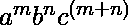
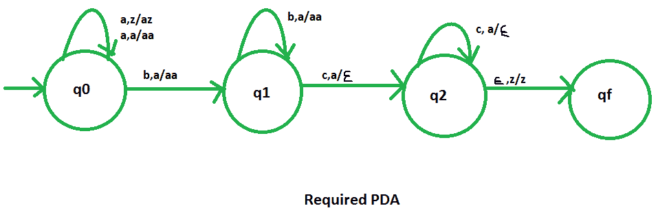

# NPDA 接受语言 L = {ambnc(m+n) | m，n ≥ 1}

> 原文:[https://www . geesforgeks . org/npda-for-accepting-language-l-ambncmn-Mn-% E2 % 89% a5-1/](https://www.geeksforgeeks.org/npda-for-accepting-the-language-l-ambncmn-mn-%e2%89%a5-1/)

先决条件–[下推自动机](https://www.geeksforgeeks.org/theory-of-computation-pushdown-automata/)、[按最终状态接受下推自动机](https://www.geeksforgeeks.org/pushdown-automata-acceptance-final-state/)、
、**问题–**设计一个接受语言 L = {  | m，n ≥ 1}的非确定性 PDA，即，

```
L = {abcc, aabccc, abbbcccc, aaabbccccc, ......} 
```

在每个字符串中，“a”和“b”的总数等于“c”的数量。所有的 c 都在 a 和 b 之后。

**解释–**
在这里，我们需要维持 a、b、c 的顺序，也就是说，所有的 a 都是先来的，然后所有的 b 都是后来的，然后所有的 c 都是。因此，我们需要一个堆栈和状态图。a、b 和 c 的计数由堆栈维护。
我们取 2 叠字母:

```
 = { a, z } 
```

其中， =所有堆栈字母表的集合
z =堆栈开始符号

**PDA 建设中使用的方法–**
由于我们想设计一个 NPDA，因此每次“a”都在“b”之前，“b”在“c”之前。当“a”出现时，将它推入堆栈，如果“a”再次出现，也将它推入堆栈。之后，当“b”出现时，将“a”推入堆栈，如果“b”再次出现，也将其推入堆栈。然后当“c”出现时，每次从堆栈中弹出一个“a”。
所以，最后如果堆栈变空，那么我们可以说字符串被 PDA 接受了。

**堆栈转换功能–**

```
(q0, a, z)  (q0, az)
(q0, a, a) (q0, aa)
(q0, b, a)  (q1, aa)
(q1, b, a) (q1, aa)  
(q1, c, a)  (q2, )
(q2, c, a)  (q2, )
(q2, , z)  (qf, z) 
```

其中，q0 =初始状态
qf =最终状态
 =表示弹出操作

