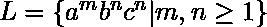
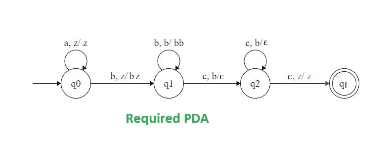

# NPDA 接受语言 L = {ambncn | m，n ≥ 1}

> 原文:[https://www . geesforgeks . org/npda-for-accepting-language-l-ambn cn-Mn-1/](https://www.geeksforgeeks.org/npda-for-accepting-the-language-l-ambncn-mn-1/)

先决条件–[下推自动机](https://www.geeksforgeeks.org/theory-of-computation-pushdown-automata/)、[下推自动机最终状态接受](https://www.geeksforgeeks.org/pushdown-automata-acceptance-final-state/)
**问题:**设计一个非确定性的 PDA 接受语言，即，

```
L = {abc, aabc, aabbcc, abbbccc, aabbbccc ...... } 
```

以下 DFA 必须包含:

1.  a 的个数等于 c 的个数。
2.  b 的数目与 a 和 c 的数目无关。
3.  必须保持 a、b 和 c 的顺序。

**说明:**
a、b、c 的顺序保持如下，即 a 的都是先来，然后 b 的都来，然后 c 的都来。因为 b 的数量正好等于 c 的数量，所以 b 和 c 的数量将由堆栈保持。使用的堆栈将有一个开始符号和额外的 b 和 c 计数符号。

```
 = { a, z }

```

其中， =所有栈字母表的集合。
z =堆栈开始符号。
PDA 建设中使用的方法–

*   **第一步:**每当‘a’出现时，将它推入堆栈，如果‘a’再次出现，也将它推入堆栈。
*   **步骤 2:** 当“c”出现时，每次从堆栈中弹出一个“a”。
*   **步骤 3:** 当‘b’出现时，忽略它，改变状态图中的状态。
*   **步骤-4:** 如果在结束时，堆栈变空，则停止执行。因此，该字符串被 PDA 接受。

注意，总是保持 a、b 和 c 的顺序。

**堆栈转换功能:**

```
(q0, a, z)  (q0, z)
(q0, b, z)  (q1, bz)
(q1, b, b)  (q1, bb)
(q1, c, b)  (q2, )
(q2, c, b)  (q2, )
(q2, , z)  (qf, z)

```

**状态转移图:**



这里，q0 =初始状态
qf =最终状态
 =表示弹出操作
，q1，q2=中间状态