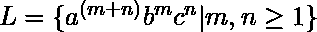
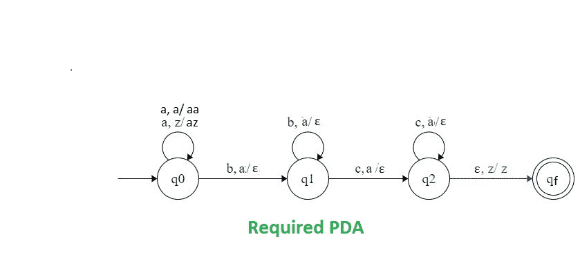
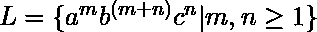
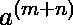
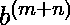

# NPDA 接受语言 L = {a(m+n)bmcn | m，n ≥ 1}

> 原文:[https://www . geesforgeks . org/npda-for-accept-language-l-amnbmcn-Mn-1/](https://www.geeksforgeeks.org/npda-for-accepting-the-language-l-amnbmcn-mn-1/)

先决条件–[下推自动机](https://www.geeksforgeeks.org/theory-of-computation-pushdown-automata/)、[下推自动机按最终状态接受](https://www.geeksforgeeks.org/pushdown-automata-acceptance-final-state/)
**问题–**设计一个非确定性的 PDA 来接受语言
给定语言的字符串将是:

```
L = {aabc, aaabcc, aaabbc, aaaabbcc, ......} 
```

在每个字符串中,“b”和“c”的总数等于“a”的数量。所有的 c 都在 a 和 b 之后。

**解释–**
在这里，我们需要维持 a、b、c 的顺序。也就是说，所有的 a 是先来的，然后所有的 b 是后来的。因此，我们需要一个堆栈和状态图。a、b 和 c 的计数由堆栈维护。我们将取两叠字母:

```
 = { a, z }
```

其中， =所有堆栈字母表的集合
z =堆栈开始符号。

**PDA 建设中使用的方法–**
由于我们想设计一个 NPDA，因此每次“a”都在“b”之前，“b”在“c”之前。首先我们要计算 a 的个数，这个数应该等于 b 的个数。当所有的 b 都完成后，计算 a 的个数，这应该等于 c 的个数。

对于所有的“a”，我们每次都会将“a”推入堆栈，然后在“b”到来时开始弹出它们。在完成“b”的弹出后，在“c”到来后，我们将每次从堆栈中弹出这些“a”。最后，如果堆栈变空，那么我们可以说字符串被 PDA 接受了。

**堆栈转换功能–**

```
(q0, a, z)  (q0, az)
(q0, a, a)  (q0, aa)
(q0, b, a)  (q1, )
(q1, b, a)  (q1, )
(q1, c, a)  (q2, )
(q2, c, a)  (q2, )
(q2,,  z)  (qf, z)

```

其中，q0 =初始状态
qf =最终状态
 =表示弹出操作。
**状态转移图**


**注:**此语与[语](https://www.geeksforgeeks.org/npda-for-accepting-the-language-l-ambmncn-mn-%E2%89%A5-1/) 相似，但我们用代替。