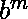
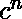
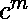
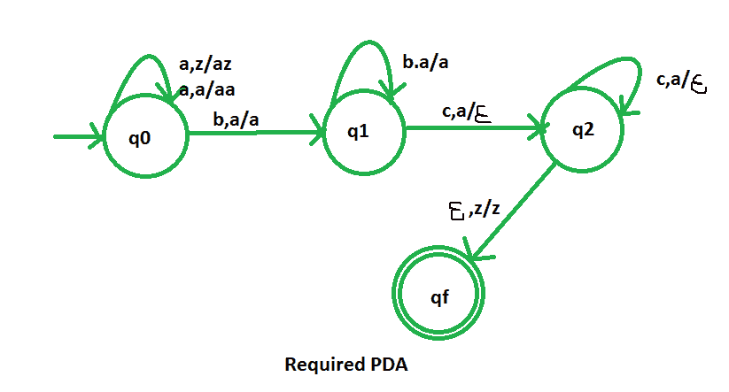

# NPDA 接受语言 L = {an bm cn | m，n > =1}

> 原文:[https://www . geesforgeks . org/npda-for-accepting-language-l-an-BM-cn-mn1/](https://www.geeksforgeeks.org/npda-for-accepting-the-language-l-an-bm-cn-mn1/)

先决条件–[下推自动机](https://www.geeksforgeeks.org/theory-of-computation-pushdown-automata/)、[下推自动机按最终状态接受](https://www.geeksforgeeks.org/pushdown-automata-acceptance-final-state/)
**问题–**–设计一个非确定性的 PDA 接受语言 L = {    | m，n > =1}，即，

```
 L = { abc, abbc, abbbc,  aabbcc, aaabccc, aaaabbbcccc, ...... } 
```

在每个字符串中，a 的数目等于 c 的数目。b 的数量与 a 和 c 的数量无关。这个问题相当类似于 NPDA 对于语言的接受 L = {    | m，n > =1}。唯一不同的是，这里我们用代替。

**解释–**
在这里，我们需要维持 a、b、c 的顺序，也就是所有的 a 都是先来，然后所有的 b 然后 c 都来。因此，我们需要一个堆栈和状态图。a 和 c 的计数由堆栈维护。a 的数量正好等于 c 的数量我们将取 2 个堆叠字母:

```
 = { a, z }

```

其中， =所有堆栈字母表的集合
z =堆栈开始符号

**PDA 建设中采用的手法–**
由于我们要设计一个 NPDA，因此每次‘a’都排在‘b’之前。当“a”出现时，将它推入堆栈，如果“a”再次出现，也将它推入堆栈。当 c 出现时，每次从堆栈中弹出一个 a。而对于‘b’，我们在栈中什么也不做，只改变状态图中的状态。
所以，最后如果堆栈变空，那么我们可以说字符串被 PDA 接受了。

**堆栈转换功能–**

```
(q0, a, z)  (q0, az)
(q0, a, a)  (q0, aa)
(q0, b, a)  (q1, a)
(q1, b, a)  (q1, a)
(q1, c, a)  (q2,  )
(q2, c, a)  (q2,  )
(q2, , z)  (qf, z )

```

其中，q0 =初始状态
qf =最终状态
 =表示弹出操作



所以，这就是我们所要求的非确定性 PDA 对于接受语言 L = {    | m，n > =1 }。