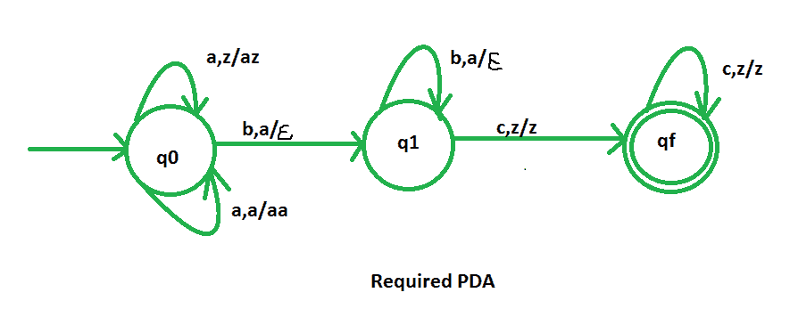

# NPDA 接受语言 L = {an bn cm | m，n > =1}

> 原文:[https://www . geesforgeks . org/npda-for-accept-language-l-an-bn-cm-mn1/](https://www.geeksforgeeks.org/npda-for-accepting-the-language-l-an-bn-cm-mn1/)

先决条件–[下推自动机](https://www.geeksforgeeks.org/theory-of-computation-pushdown-automata/)、[最终状态下的下推自动机验收](https://www.geeksforgeeks.org/pushdown-automata-acceptance-final-state/)

**问题**–设计一个接受语言 L = {    | m，n > =1}的非确定性 PDA，即，

```
L = { abc, abcc, abccc,  aabbc, aaabbbcc, aaaabbbbccccc, ...... }

```

在每个字符串中，a 的数量等于 b 的数量。c 的数目与 a 和 b 的数目无关。这个问题和 NPDA 接受语言 L = {   | n > =1 }很相似。唯一不同的是，这里我们加上。

**解释–**
在这里，我们需要维持 a、b、c 的顺序，也就是所有的 a 先来，然后所有的 b 再来 c。因此，我们需要一个堆栈和状态图。a 和 b 的计数由堆栈维护。我们将取两叠字母:

```
 = { a, z }

```

其中， =所有堆栈字母表的集合
z =堆栈开始符号

**PDA 建设中采用的手法–**
由于我们要设计一个 NPDA，因此每次‘a’都排在‘b’之前。当“a”出现时，将它推入堆栈，如果“a”再次出现，也将它推入堆栈。之后，当“b”出现时，每次从堆栈中弹出一个“a”。那么对于 c，我们什么也不做。
所以，最后如果堆栈变空，那么我们可以说字符串被 PDA 接受了。

**堆栈转换功能–**

```
(q0, a, z)  (q0, az)
(q0, a, a)  (q0, aa)
(q0, b, a)  (q1,  )
(q1, b, a)  (q1,  )
(q1, c, z)  (qf, z )
(qf, c, z)  (qf, z )

```

其中，q0 =初始状态
qf =最终状态
 =表示弹出操作



所以，这就是我们所要求的非确定性 PDA 对于接受语言 L = {    | m，n > =1 }