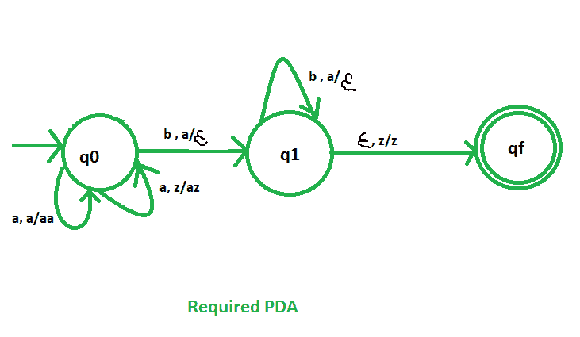

# NPDA 接受语言 L = {an bn | n > =1}

> 原文:[https://www . geesforgeks . org/npda-for-accepting-language-l-an-bn-n1/](https://www.geeksforgeeks.org/npda-for-accepting-the-language-l-an-bn-n1/)

先决条件–[下推自动机](https://www.geeksforgeeks.org/theory-of-computation-pushdown-automata/)、[最终状态下的下推自动机验收](https://www.geeksforgeeks.org/pushdown-automata-acceptance-final-state/)

**问题–**设计一个接受语言 L = {   | n > =1}的非确定性 PDA，即，

```
L = {ab, aabb, aaabbb, aaaabbbb, ......} 
```

在每一个字符串中，a 后面都跟有相同数量的 b。

**解释–**
这里需要维持 a 和 b 的顺序。也就是说，所有的 a 都先来，然后所有的 b 都来。因此，我们需要一个堆栈和状态图。a 和 b 的计数由堆栈维护。我们将取两叠字母:

```
 = { a, z }
```

其中，
 =所有堆叠字母表的集合
z =堆叠开始符号

**PDA 建设中采用的手法–**
由于我们要设计一个 NPDA，因此每次‘a’都排在‘b’之前。当“a”出现时，将它推入堆栈，如果“a”再次出现，也将它推入堆栈。之后，当“b”出现时，每次从堆栈中弹出一个“a”。最后，如果堆栈变空，那么我们可以说字符串被 PDA 接受了。

**堆栈转换功能–**

```
(q0, a, z)  (q0, az)
(q0, a, a)  (q0, aa)
(q0, b, a)  (q1,  )
(q1, b, a)  (q1,  )
(q1, , z)  (qf, z)     

```

其中，q0 =初始状态
qf =最终状态
 =表示弹出操作



所以，这是我们接受语言 L = {   : n > =1}所需的非确定性 PDA。