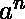
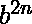
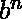
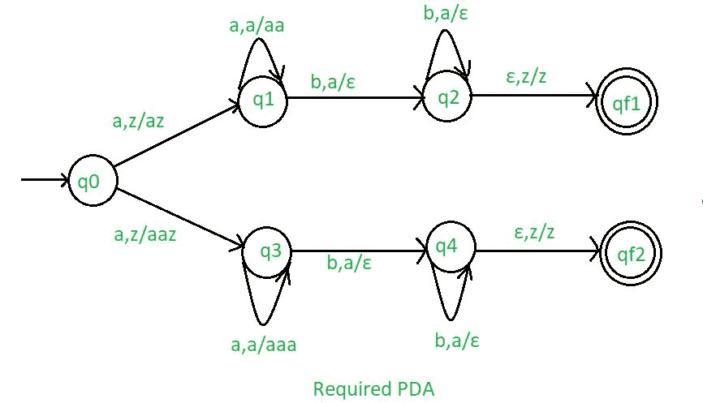

# NPDA 接受语言 L = { anb(2n)| n>= 1 } U { anbn | n>= 1 }

> 原文:[https://www . geeksforgeeks . org/npda-for-accepting-language-l-anb 2n-n1-u-anbn-n1/](https://www.geeksforgeeks.org/npda-for-accepting-the-language-l-anb2n-n1-u-anbn-n1/)

先决条件–[下推自动机](https://www.geeksforgeeks.org/theory-of-computation-pushdown-automata/)、[下推自动机按最终状态接受](https://www.geeksforgeeks.org/pushdown-automata-acceptance-final-state/)
**问题–**设计一个非确定性的 PDA 接受语言 L = {:n>= 1 } U {:n>= 1 }，即，

```
L = {abb, aabbbb, aaabbbbbb, aaaabbbbbbbb, ......} 
          U {ab, aabb, aaabbb, aaaabbbb, ......} 
```

在每个字符串中，a 的数字后面跟有双倍数量的 b，或者 a 的数字后面跟有相等数量的 b。

**解释–**
在这里，我们需要维持 a 和 b 的顺序，也就是所有的 a 都先来，然后所有的 b 都来。因此，我们需要一个堆栈和状态图。a 和 b 的计数由堆栈维护。我们将取两叠字母:

```
 = { a, z } 
```

其中，
 =所有堆叠字母表的集合
z =堆叠开始符号

**PDA 建设中使用的方法–**
在设计 NPDA 时，因为每个‘a’都在‘b’之前。如果 b 来了

*   对于 :每当‘a’出现时，将其推入堆栈，如果‘a’再次出现，则也将其推入堆栈。
*   对于 :每当‘a’出现时，在堆栈中按‘a’两次，如果‘a’再次出现，则按同样的操作。
    当“b”出现时(记住 b 在“a”之后)，每次从堆栈中弹出一个“a”。

这样堆栈就变成空的了。如果 stack 是空的，那么我们可以说这个字符串被 PDA 接受了。

**堆栈转换功能–**

```
(q0, a, z)  (q1, az)
(q0, a, z)  (q3, aaz)
(q1, a, a)  (q1, aa)
(q1, b, a)  (q2, ) 
(q2, b, a)  (q2, ) 
(q2, , z)  (qf1, z)   
(q3 a, a)  (q3, aaa)
(q3, b, a)  (q4, ) 
(q4, b, a)  (q4, ) 
(q4, , z)  (qf2, z)   

```

其中，q0 =初始状态
qf1，qf2 =最终状态
 =表示弹出操作



所以，这就是我们接受语言 L = {:n>= 1 } U {:n>= 1 }所需的非确定性 PDA。