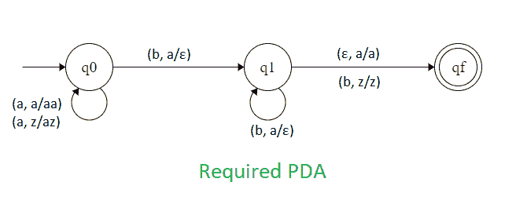

# NPDA 接受语言 L = {anbm | n，m ≥ 1 且 n ≠ m}

> 原文:[https://www . geesforgeks . org/npda-for-accept-language-l-anbm-nm-1-and-n-m/](https://www.geeksforgeeks.org/npda-for-accepting-the-language-l-anbm-nm-1-and-n-m/)

先决条件–[下推自动机](https://www.geeksforgeeks.org/theory-of-computation-pushdown-automata/)、[最终状态下的下推自动机验收](https://www.geeksforgeeks.org/pushdown-automata-acceptance-final-state/)

**问题–**为接受语言设计一个非确定性的 PDA，即，

```
L = {aab, abb, aaab, abbb, aaaab, aaabb, aabbb, abbbb ......} 
```

在每一个字符串中，a 后面都跟有不等数量的 b。

**解释–**
这里需要维持 a 和 b 的顺序。也就是说，所有的 a 都先来，然后所有的 b 都来。因此，我们需要一个堆栈和状态图。a 和 b 的计数由堆栈维护。我们将取两叠字母:

```
 = { a, z }
```

哪里，

 =所有堆栈字母表的集合
z =堆栈开始符号

**PDA 建设中采用的手法–**
由于我们要设计一个 NPDA，因此每次‘a’都排在‘b’之前。当“a”出现时，将它推入堆栈，如果“a”再次出现，也将它推入堆栈。之后，当“b”出现时，每次从堆栈中弹出一个“a”。所以，在最后，如果栈变空了，b 来了，或者字符串结束了，栈不是空的，那么我们可以说字符串被 PDA 接受了。

**堆栈转换功能–**

```
(q0, a, z)  (q0, az)
(q0, a, a)  (q0, aa)
(q0, b, a)  (q1,  )
(q1, b, a)  (q1,  )
(q1, , a)  (qf, a)   
(q1, b, z)  (qf, z)   

```

其中，q0 =初始状态
qf =最终状态
 =表示弹出操作

**状态转换图–**



所以，这是我们接受语言所需要的非决定性的 PDA。