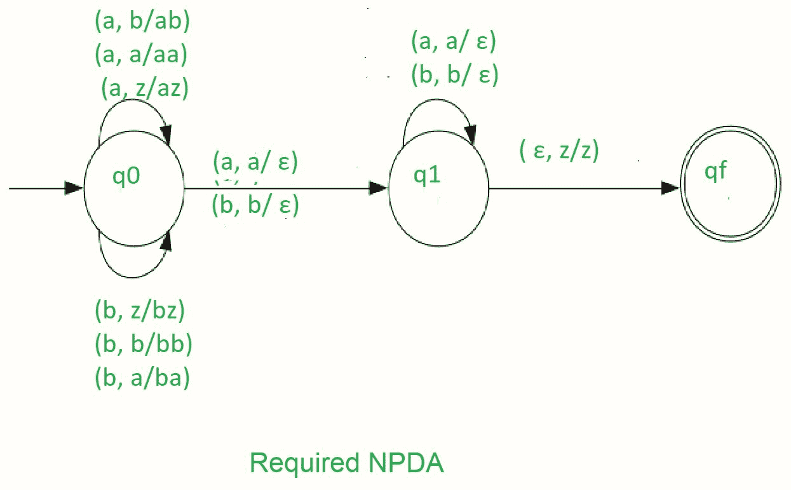

# NPDA 接受语言 L = { wwR | w∑(a，b)*}

> 原文:[https://www . geesforgeks . org/npda-for-accepting-language-l-wwr-w-ab/](https://www.geeksforgeeks.org/npda-for-accepting-the-language-l-wwr-w-ab/)

先决条件–[下推自动机](https://www.geeksforgeeks.org/theory-of-computation-pushdown-automata/)、[按最终状态接受下推自动机](https://www.geeksforgeeks.org/pushdown-automata-acceptance-final-state/)
**问题:**设计一个接受语言 L = { wwR w∞(a，b)*}的非确定性 PDA，即，

```
L = {aa, bb, abba, aabbaa, abaaba, ......} 
```

**解释:**
在这种类型的输入字符串中，在一个输入端有多个转换状态，因此被称为非确定性 PDA，输入字符串包含任意顺序的‘a’和‘b’。每个输入字母都有不止一种移动到下一个状态的可能性。最后，当堆栈为空时，字符串被 NPDA 接受。在这个 NPDA 中，我们使用了一些符号，如下所示:

```
Γ = { a, b, z }
```

其中，γ=所有堆栈字母表的集合
z =堆栈开始符号
a =输入字母表
b =输入字母表

**建造 PDA 时使用的方法–**
当我们想要设计一个 NPDA 时，因此每次‘a’或‘b’出现时，要么推进堆栈，要么进入下一个状态。它依赖于一个字符串。当我们看到等于堆栈顶部的输入字母时，时间弹出操作将应用于堆栈并进入下一步。
所以，最后如果堆栈变空，那么我们可以说字符串被 PDA 接受了。

**堆栈过渡功能**

```
(q0, a, z)  (q0, az)

(q0, a, a)  (q0, aa)

(q0, b, z)  (q0, bz)

(q0, b, b)  (q0, bb)

(q0, a, b)  (q0, ab)

(q0, b, a)  (q0, ba)

(q0, a, a)  (q1, ∈)

(q0, b, b)  (q1, ∈)

(q1, a, a)  (q1, ∈)

(q1, b, b)  (q1, ∈)

(q1, ∈, z)  (qf, z)
```

其中，q0 =初始状态
qf =最终状态
∑=表示弹出操作


所以，这是我们接受语言 L = { wwR w∞(a，b)*}所需的非确定性 PDA

**例:**
我们取一个输入字符串:“abbbba”。

*   从左到右扫描字符串
*   第一个输入是“a ”,并遵循以下规则:
*   在输入“a”和 STACK 字母 Z 时，将两个“a”按如下方式推入 STACK:(a，Z/aZ)，状态将为 q0
*   在输入“b”和 STACK 字母“a”时，将“b”按如下方式推入 STACK:(b，a/ba)，状态将为 q0
*   在输入“b”和 STACK 字母“b”时，将“b”按如下方式推入 STACK:(b，b/bb)，状态将为 q0
*   在输入“b”和 STACK 字母“b”(状态为 q1)时，从 STACK 弹出一个“b”作为:(b，b/∑)，状态为 q1
*   在输入“b”和 STACK 字母“b”(状态为 q1)时，从 STACK 弹出一个“b”作为:(b，b/∑)，状态为 q1
*   在输入“a”和 STACK 字母表“a”以及状态 q1 时，从 STACK 弹出一个“a”作为:(a，a/∑)，状态将保持 q1
*   在输入∈和 STACK 字母表 Z 时，进入最终状态(qf)如下:(∈，Z/Z)

所以，最后堆栈变成空的，那么我们可以说字符串被 PDA 接受了。

**问题:**
设计一个确定性的 PDA 来接受语言 L = { wcwR w ∈ (a，b)*}，即

```
{aca, bcb, abcba, abacaba, aacaa, bbcbb, .......}
```

在每个字符串中，出现在 c 左侧的子字符串与出现在 c 右侧的子字符串相反。

**解释:**
这里我们需要这样维护字符串，c 左边的子串正好是 c 右边的反向子串。在字符串中，a 和 b 以任何顺序出现，c 只出现一次。当“c”出现时，弹出操作开始后进入堆栈。当堆栈为空时，语言被接受。

```
Γ = {a, b, z} 
```

其中，γ=所有堆栈字母表的集合
z =堆栈开始符号
a =输入字母表
b =输入字母表

**建造 PDA 时使用的方法:**
当我们想要设计 PDA 时，每次当‘a’或‘b’出现时，我们都会推进堆栈并保持相同的状态 q0。当“c”出现时，我们进入下一个状态 q1，而不会将“c”推入堆栈。之后，当一个与堆栈顶部相同的输入出现时，它会从堆栈中弹出，并保持相同的状态。执行 POP 操作，直到输入字符串结束。最后，当输入为∈时，进入最终状态 qf。
如果堆栈将变为空，则语言被接受。

其中，q0 =初始状态
qf =最终状态
z =堆栈开始符号
∑=表示弹出操作

**堆栈转换功能:**

```
(q0, a, z)  (q0, az)

(q0, a, a)  (q0, aa)

(q0, b, z)  (q0, bz)

(q0, b, b)  (q0, bb)

(q0, a, b)  (q0, ab)

(q0, b, a)  (q0, ba)

(q0, c, a)  (q1, a)

(q0, c, b)  (q1, b)

(q1, a, a)  (q1, ∈)

(q1, b, b)  (q1, ∈)

(q1, ∈, z)  (qf, z) 
```

其中，q0 =初始状态
qf =最终状态
∑=表示弹出操作



所以，这是我们接受语言所需要的决定性的 PDA，

```
L = { wcwR w ∈ (a, b)*} 
```