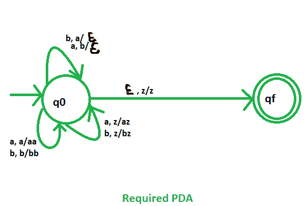

# NPDA 对于语言 L = { w∑{ a，b}*| w 包含相等数量的 a 和 b }

> 原文:[https://www . geesforgeks . org/npda-for-the-language-l-w % cf % b5ab-w-contains-equal-no-of-as-and-bs/](https://www.geeksforgeeks.org/npda-for-the-language-l-w%cf%b5ab-w-contains-equal-no-of-as-and-bs/)

先决条件–[下推自动机](https://www.geeksforgeeks.org/theory-of-computation-pushdown-automata/)、[下推自动机按最终状态接受](https://www.geeksforgeeks.org/pushdown-automata-acceptance-final-state/)
问题–设计一个非确定性的 PDA 接受语言 L ={w？{a，b}* | w 包含相等数量的 a 和 b}，即，

```
L = {ab, aabb, abba, aababb, bbabaa, baaababb, .......}
```

在所有的字符串中，a 和 b 的数目都是相同的。

**解释–**
在这里，我们不需要维护 a 和 b 的任何顺序。因此，我们的状态图将只包含一个初始状态和一个最终状态。a 和 b 的计数由堆栈维护。我们将采用 3 个堆叠字母:

```
 = {a, b, z}
```

其中， =所有堆栈字母表的集合
z =堆栈开始符号

**建造 PDA 时使用的方法–**
如果‘a’先出现，然后将其推入堆栈，如果‘a’再次出现，则也将其推入堆栈。类似地，如果“b”最先出现(“a”还没有出现)，则将其推入堆栈，如果“b”再次出现，则也将其推入堆栈。

现在，如果“a”出现在堆栈顶部，而“b”出现，则从堆栈中弹出“a”。如果“b”出现在堆栈顶部，而“a”出现，则从堆栈中弹出“b”。

最后，如果堆栈变空，那么我们可以说字符串被 PDA 接受了。

**堆栈转换功能–**

```
(q0, a, z)    (q0, az)
(q0, a, a)    (q0, aa)
(q0, b, z)    (q0, bz)
(q0, b, b)    (q0, bb)
(q0, a, b)    (q0, )
(q0, b, a)    (q0, )
(q0, , z)    (qf, z)

```

其中，q0 =初始状态
qf =最终状态
 =表示弹出操作


所以，这是我们接受包含相等数量的 a 和 b 的字符串所需的非确定性 PDA。
**例:**我们取一个输入字符串:“aabbba”PDA 接受不接受？。
**解:**
1。从左到右扫描字符串。
2 .在输入“a”和 STACK 字母 Z 时，将“a”作为:(a，Z/aZ)推入 STACK，状态将为 q0。
3 .第二次输入“a”和 STACK 字母“a”，将“a”按如下方式推入 STACK:(a，a/aa)，状态为 q0。
4。第三个输入“b”和 STACK 字母表“a”，从 STACK 弹出为:(b，a/∞)，状态为 q0。
5 .在输入“b”和 STACK 字母“a”时，从 STACK 弹出为:(b，a/∑)，状态为 q0。
6 .在输入“b”和 STACK 字母 Z 时，将“b”按如下方式推入 STACK:(b，Z/bZ)，状态将为 q0。
7 .在输入“a”和 STACK 字母“b”时，从 STACK 弹出为:(a，b/∑)，状态为 q0。
8 .在输入∈和 STACK 字母 Z 时，进入最终状态(qf)为:(∈，Z/Z)。

所以，最后堆栈变成空的，那么我们可以说字符串被 PDA 接受了。