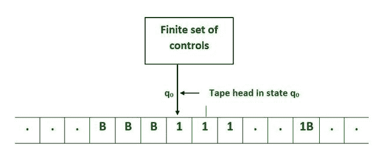
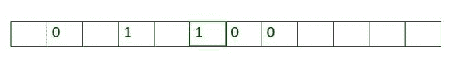
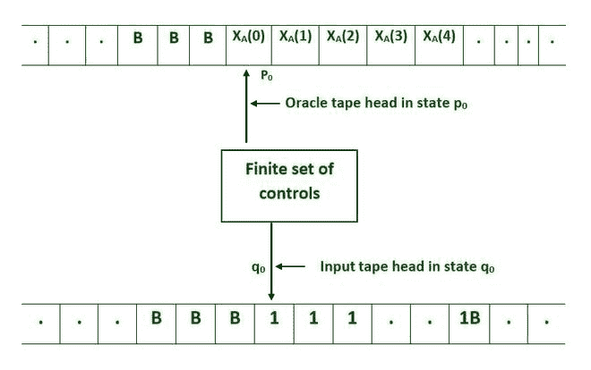
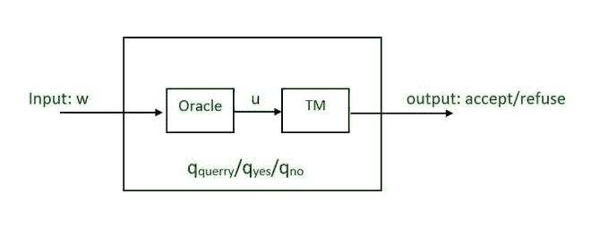
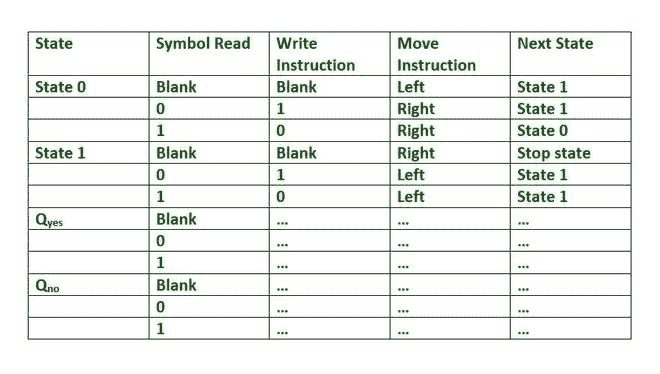

# Oracle 图灵机器

> 哎哎哎:# t0]https://www . geeksforgeeks . org/Oracle-turing-machine/

**图灵机:**

阿兰·麦席森·图灵在 1936 年提出了图灵机，这是一种能够模拟所有计算行为的计算机模型。图灵机是一个虚构的机器。图灵机在现代计算机的发展中起了重要作用。

*   图灵机是一个虚构的机器。
*   尽管简单，机器能够模拟任何计算机算法，无论多么复杂。
*   为了简单起见，我们将假设这台机器只能处理 0、1 和空白。
*   这台机器的磁头位于磁带的一个方块上。
*   负责人可以执行下列三项基本操作:

1.**读取**头部正方形的符号。

2.**通过用新符号替换或擦除符号来编辑符号**。

3.**将**磁带向左或向右移动一个方块，以便机器可以读取和编辑下一个方块上的符号

处于状态 q0 的图灵机，第一个输入符号为 0

*   图灵机的一个非常基本的表现是一个无限长的磁带(内存)
*   磁带上的每个方块最初都是空白的，可以在上面写符号。

**暂停问题:**

*   艾伦·图灵在 1936 年证明，不可能预测一个任意的程序最终会终止还是无限期运行。
*   马丁·戴维斯后来称之为“停顿问题”。
*   这是决策问题的第一个例子。

暂停问题是根据程序的描述和输入来确定任意计算机程序是将结束运行还是无限期继续运行的问题。

例如:

*   而(真)继续；

它不会停止；相反，它在无限循环中无限持续。

*   打印“你好世界！”；

它会停止。

为什么停顿问题很重要？

*   我们经常想知道一个程序是否收敛(停止)，但是没有一个单一的算法可以回答所有程序的这个问题。
*   许多问题被证明是无法解决的，通过把它们简化为停止的问题。

**Oracle 图灵机器:**

甲骨文图灵机类似于标准图灵机，但增加了第二盘磁带，称为甲骨文磁带。在甲骨文磁带的单元格中可以找到空格(B)、0 或 1。给定集合 A，带有集合 A 的甲骨文图灵机将集合 A 的特征函数写到磁带上。甲骨文磁头在单元上以字母 X A (0)开始。X A (1)在这个右边的单元格中，依次递增。Oracle 磁带磁头开始的单元格左侧只有空白。

甲骨文图灵机

预言图灵机计算的执行方式与标准图灵机计算相同。尽管甲骨文磁头的起始状态为 p0，但如果读/写磁头进入重音状态，图灵机就会停止。带有甲骨文 A 的图灵机和普通图灵机的关键区别在于，甲骨文图灵机的暂停计算可以确定 A 是否包含有限数量的数字。

Oracle 机器可能偶尔会进入 QUERY 状态。出现这种情况时，以下操作将在一个计算步骤中执行:

*   甲骨文磁带的内容被读取。
*   oracle 将被查询，oracle 磁带的内容将被替换为该特定问题实例的解决方案。
*   甲骨文机的状态变为响应，可以是 Q 是也可以是 Q 否

因此，更改为 QUERY 状态会导致在一个步骤中收到写在 oracle 磁带上的问题实例的解决方案。

**甲骨文图灵机的重要性:**

*   otm 可以被认为是利用子程序的计算。不管复杂程度如何，花在这些子程序上的时间只算一步。因此，OTMs 是一个虚拟的计算模型。
*   在计算机科学理论中广泛用于研究各种问题的相对难度。
*   它们有助于图灵约简概念的编码。
*   它们有助于识别复杂性理论中证明结果的一些障碍。
*   它对密码学也很重要。