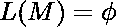

# 多倍多人还原:团到 E-TM

> 原文:[https://www . geesforgeks . org/polytime-many one-reduction-clique-to-e-TM/](https://www.geeksforgeeks.org/polytime-manyone-reduction-clique-to-e-tm/)

先决条件–[团是 NP](https://www.geeksforgeeks.org/proof-that-clique-decision-problem-is-np-complete/)
多项式时间约简是用另一个问题来解决一个问题的方法。
E-TM = { < M > : M 是 TM， }
CLIQUE = { < G，k >:图 G 有一个至少有 k 个顶点的 CLIQUE }。

**注–**
由于 CLIET 是 NP = >一些 NDTM<sub>CLIET</sub>接受 CLIET。

```
Reduction(<G, k>)
    construct the following machine M
    M(x):
        1\. Run NDTMCLIQUE on input <G, k>.
    2\. If NDTMCLIQUE accepts; M rejects x.
    3\. Else; M accepts x.
    return <M>
```

我们将实例 <g k=""> CLIQUE 转换为 TM < M >  E-TM。和< G，k>T3】CLIQUE 来个 TM<M>T4【E-TM。</g>

**正确性:**

```
i. <G, k>  CLIQUE => M rejects all input x => L(M)=  => <M>  E-TM.
ii. <G, k>  CLIQUE => M accepts all input x => L(M) => <M>  E-TM.
```

因此，减少是正确的。

**多时间–**
简化包括描述一个新的[图灵机](https://www.geeksforgeeks.org/turing-machine-in-toc/) M 的构造，用于输入< G，k >。我们不根据输入运行机器。因此，还原是多时间的。