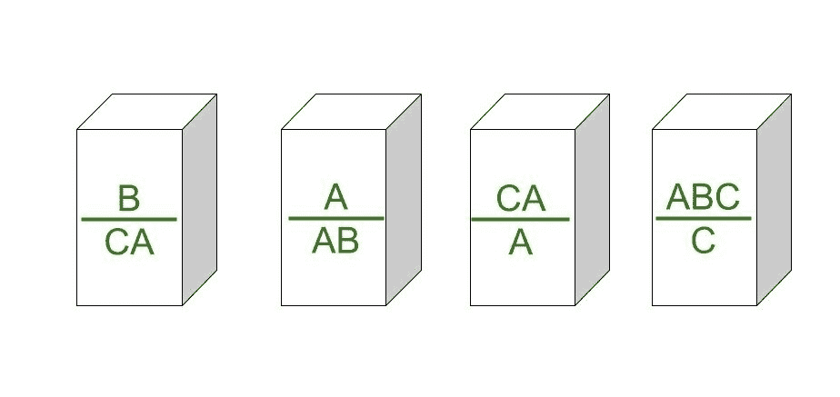
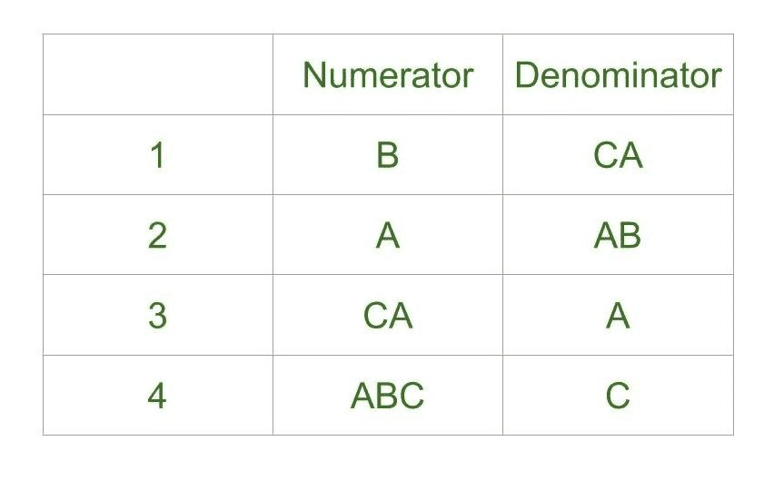
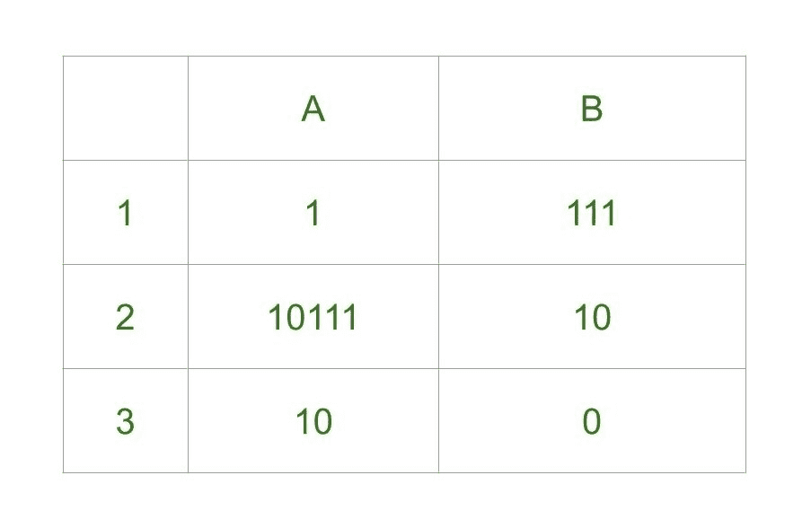
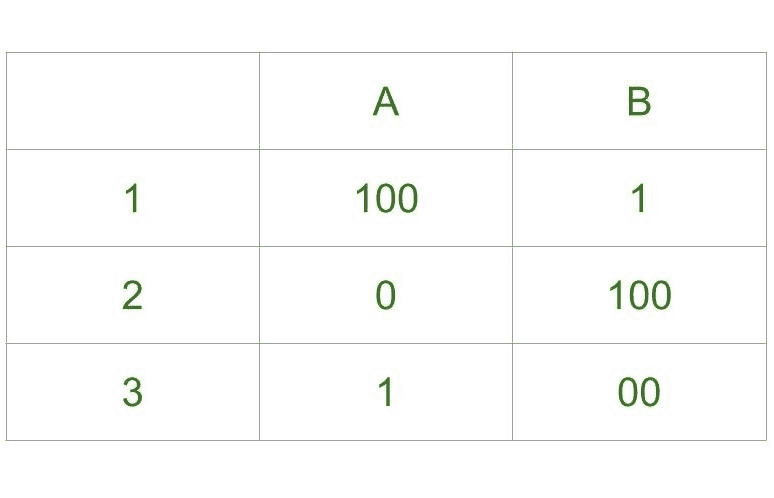
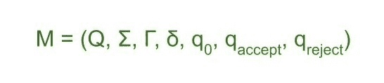

# 发文对应问题

> 原文:[https://www.geeksforgeeks.org/post-correspondence-problem/](https://www.geeksforgeeks.org/post-correspondence-problem/)

**邮政通信问题**是一个流行的[不可判定的问题](https://www.geeksforgeeks.org/decidable-and-undecidable-problems-in-theory-of-computation/)，由埃米尔·莱昂·波斯特在 1946 年提出。这比停止问题更简单。

在这个问题中，我们有 N 个**多米诺骨牌**(牌)。其目的是按照这样的顺序排列图块，即由记数器生成的字符串与由分母生成的字符串相同。
简单来说，假设我们有两个列表，都包含 N 个单词，目的是找出这些单词在某个序列中的串联，这样两个列表产生相同的结果。

让我们通过两个**列表** **A** 和 **B** 来尝试理解这一点

```
A=[aa, bb, abb] and B=[aab, ba, b] 
```

现在对于序列 1，2，1，3，第一个列表将产生 aabbaabb，第二个列表将产生相同的字符串 aabbaabb。
所以这个五氯苯酚的解变成了 1，2，1，3。

邮政通信问题可以用两种方式表示:

**1。多米诺的形式:**



**2。表格形式:**



我们来考虑以下例子。

**示例-1:**



**解释–**

*   **Step-1:**
    我们将从分子和分母都以相同数字开头的图块开始，因此我们可以从 1 或 2 开始。
    先说**第二个**瓷砖，分子做的串- 10111，分母做的串是 10。
*   **步骤-2:**
    我们需要分母中的 1 来匹配分子中的 1，所以我们将首先使用**平铺，分子构成的字符串是 10111 1，分母构成的字符串是 10111。**
*   ****Step-3:**
    分子中有额外的 1 来匹配这个 1 我们先依次加上**第一个**平铺，分子做的字符串现在是 10111 1 1，分母做的字符串是 10 111 111。**
*   ****Step-4:**
    Now there is extra 1 in denominator to match it we will add **third** tile, string made by numerator is 10111 1 1 10, string made by denominator is 10 111 111 0.

    ```
    Final Solution - 2 1 1 3
    String made by numerators: 101111110
    String made by denominators: 101111110 
    ```

    如你所见，字符串是相同的。** 

 ****例-2:****

****

****解释–****

*   ****Step-1:**
    我们从平铺 **1** 开始，因为这是我们唯一的选择，分子做的字符串是 100，分母做的字符串是 1。**
*   ****Step-2:**
    我们在分子中有额外的 00，要平衡这个唯一的方法就是给序列加上 tile **3** ，分子做的字符串是 100 1，分母做的字符串是 100。**

*   ****第三步:**
    分子中有额外的 1 来平衡我们可以添加平铺 **1** 或平铺 **2** 。我们先试着加 1，分子构成的字符串是 100 1 100，分母构成的字符串是 100 1。***   ****Step-4:**
    There is extra 100 in numerator, to balance this we can add **1st tile** again, string made by numerator is 100 1 100 100, string made by denominator is 1 00 1 1 1\. The 6th digit in numerator string is 0 which is different from 6th digit in string made by denominator which is 1.

    我们可以尝试像上面这样的无限组合，但没有一个组合会引导我们找到解决方案，因此这个问题没有解决方案。

    **邮政通信的不可判定性问题:**
    正如定理所说，五氯苯酚是不可判定的。也就是说，没有特定的算法来确定任何邮政通信系统是否有解决方案。

    **证明–**
    我们已经知道图灵机的不确定性。如果我们能够将[图灵机](https://www.geeksforgeeks.org/turing-machine-in-toc/)简化为五氯苯酚，那么我们将证明五氯苯酚也是不可判定的。

    考虑图灵机 M 来模拟 PCP 的输入字符串 w 可以表示为。

    

    如果在输入字符串 w 中有匹配，那么图灵机 M 在接受状态停止。图灵机的这个暂停状态就是验收问题 A <sub>TM</sub> 。
    我们知道验收问题 A <sub>TM</sub> 是不可判定的。因此五氯苯酚问题也是不可决定的。

    为了强制模拟 M，我们对图灵机 M 进行了两次修改，对我们的 PCP 问题进行了一次修改。

    1.  输入 w 上的 m 不能试图将磁头移出输入磁带的左端。
    2.  如果输入是空字符串€，我们使用 _。
    3.  五氯苯酚问题从第一张多米诺骨牌[u1/v1]开始匹配。这被称为修改后的五氯苯酚问题。

        ```
        MPCP = {[D] | D is instance of PCP starts with first domino} 
        ```

    **施工步骤–**

    1.  放[# / (#q0w1w2..作为第一张多米诺骨牌，其中 D 的实例是 MPCP。在第一张多米诺骨牌中，一个面上的符号#与另一个面上的符号#相同。
    2.  图灵机 M 的转换函数可以有左 L，右 r 的移动，对于磁带字母表中的每一个 x，y z 和 Q 中的 Q，r，其中 Q 不等于 q <sub>拒绝</sub>。如果跃迁(q，x) = (r，y，R)将 domino [qx / by]放入 D，跃迁(q，x) =(r，y，L)将 domino [zqx / rzy]放入 D。
    3.  对于每个磁带字母表，x 将[x / x]放入 D。要标记每个配置的分隔，请将[# / #]和[# / _#]放入 D。
    4.  要在图灵机处于接受状态后读取输入字母 x，请将[xqa / qa]和[qax/QA]以及[qa# / #]放入 d 中。这些步骤结束了 d 的构造

    由于这是 MPCP 的例子，我们需要将其转换为五氯苯酚。所以要转换成 D，我们考虑下面的 domino 和字符串匹配。

    **将 MPCP 转换为五氯苯酚:**
    让 u = u1，u2，…，un 为输入长度为 n 的任意字符串，并将这些字符串修改为

    ```
    $u = *u1*u2*u3* …*un
    u$ = u1* u2* u3* … un*
    $u$ = * u1* u2* u3* ... un* 
    ```

    假设 D 是一组双面多米诺骨牌，

    ```
    D = {[u1 / v1], [u2 / v2], [u3 / v3], ..., [un / vn]} and {[$u1 / $v1$], [$u2 / v2$], ..., [*_ / _]} 
    ```

    从上面的多米诺骨牌集合中，我们可以看到只有多米诺骨牌的部分匹配以[$u1 / $v1$]开始，并放置输入的结束标记[*_ / _]。
    这样我们就可以避免陈述多米诺骨牌的明确要求应该从第一个多米诺骨牌开始。
    如果图灵机的配置数量不在 qng <sup>n</sup> 的值内，则图灵机处于循环状态。它不会停止。**