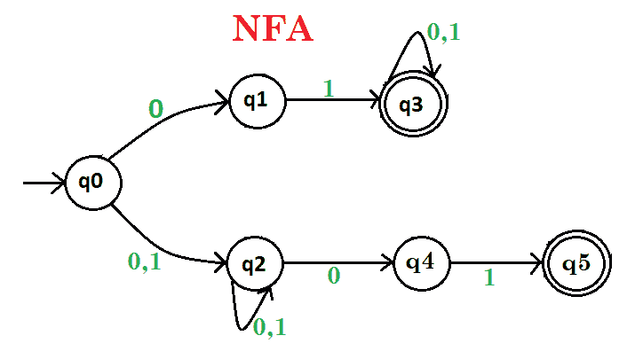
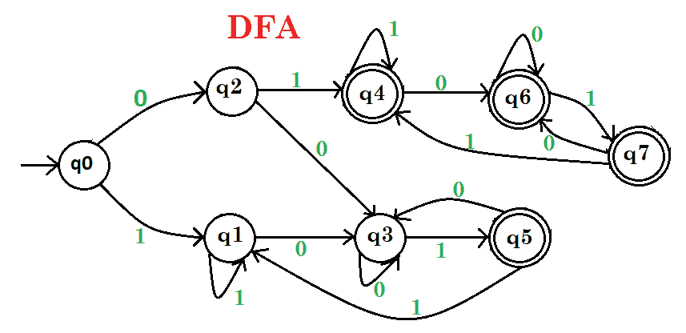
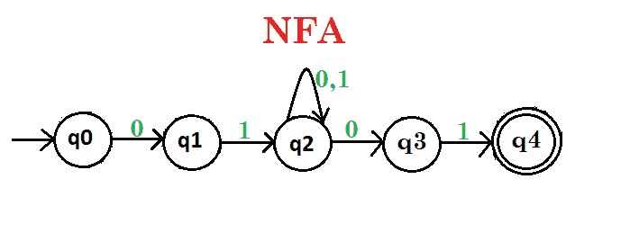
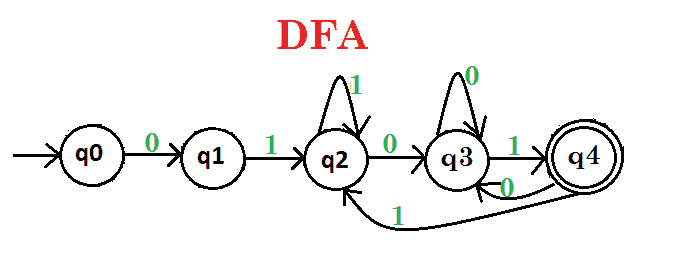
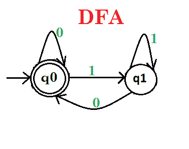
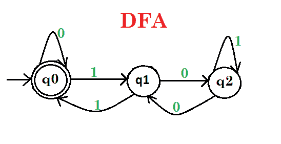

# 有限自动机上的练习题|第二集

> 原文:[https://www . geesforgeks . org/practice-problems-有限-自动机-set-2/](https://www.geeksforgeeks.org/practice-problems-finite-automata-set-2/)

**Que-1:** 绘制一个确定性和非确定性的有限自动机，它要么以 01 开始，要么以 01 结束，其中包含 0，1 的字符串，例如 01010100，但不是 000111010。

**解释–**画一个 DFA 和 NFA 的同语言，其字符串只到达最后状态，在开始或结束时包含 01。如果有任何其他东西出现，那么它就不接受。
NFA 的给定字符串如下:

给定字符串的 DFA 如下:

这里 **q0** 表示初始状态， **q1、q2** 为过渡状态， **q3、q4、q5、q6、q7** 为过渡和最终状态。

**Que-2:** 画一个确定性和非确定性的有限自动机，以 01 开始，以包含 0，1 的字符串的 01 结束，例如 01000101，但不是 000111001。

**解释–**画一个 DFA 和 NFA 的同语言，其字符串只到达开始和结束时包含 01 的最终状态。如果有任何其他东西出现，那么它就不接受。
NFA 的给定字符串如下:

给定字符串的 DFA 如下:

这里 **q0** 表示初始状态， **q1、q2、q3** 为过渡状态， **q4、q5** 为过渡和最终状态。

**Que-3:** 画一个确定性有限自动机，它识别包含以倍数 2 形式的二进制表示 0，1 的字符串，例如 1010 但不是 01101。

**解释–**画一个 DFA，其字符串只到达最后包含 0 的状态，这意味着数字是 2 的倍数。如果有任何其他东西出现，那么它就不接受。
给定字符串的 DFA 如下:

这里， **q0** 表示初始和最终状态， **q1** 是过渡状态。

**Que-4:** 画一个确定性有限自动机，它识别包含以倍数 3 形式的二进制表示 0，1 的字符串，例如 1001 但不是 1000。

**解释–**画一个 DFA，其字符串只到达包含二进制数为 3 的倍数的最终状态。如果有任何其他东西出现，那么它就不接受。
给定字符串的 DFA 如下:

这里， **q0** 表示初始和最终状态， **q1，q2** 是过渡状态。

阅读–[在有限自动机上练习问题](https://www.geeksforgeeks.org/practice-problems-finite-automata/)