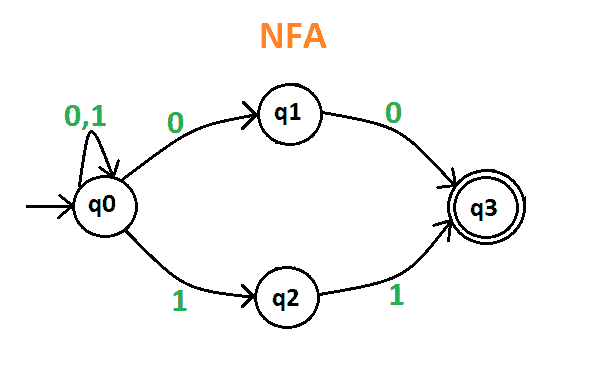
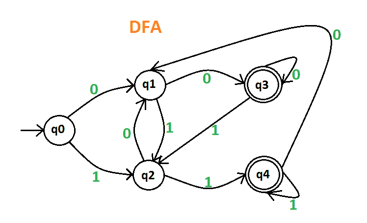
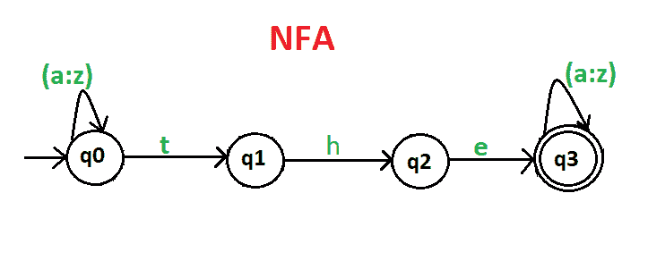
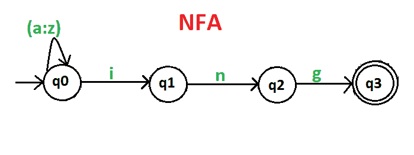
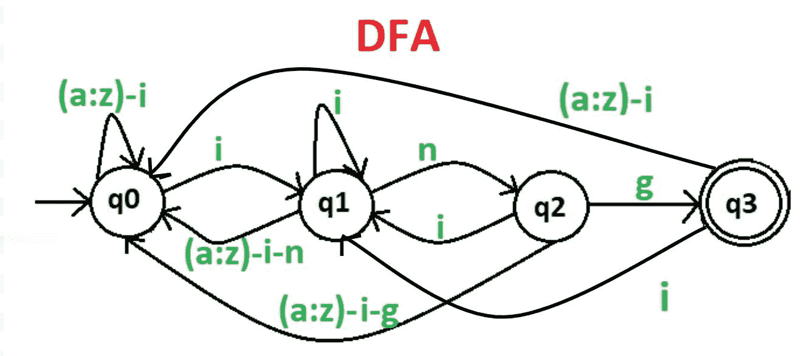

# 有限自动机上的练习题

> 原文:[https://www . geesforgeks . org/practice-problems-有限自动机/](https://www.geeksforgeeks.org/practice-problems-finite-automata/)

**Que-1:** 画一个确定性和非确定性的有限自动机，在包含 0，1 的字符串末尾接受 00 和 11，例如 01010100 但不接受 000111010。

**解释–**设计一个相同字符串的 DFA 和 NFA 如果输入值达到最终状态，那么它是可接受的，否则它是不可接受的。
NFA 的给定字符串如下:

给定字符串的 DFA 如下:

这里 **q0** 为初始状态， **q1** 和 **q2** 为过渡状态， **q3** 和 **q4** 为最终状态。

**注意–**NFA 和 DFA 都有相同的能力，这意味着如果 NFA 可以识别语言 L，那么 DFA 也可以被定义为这样做，如果 DFA 可以识别语言 L，那么 NFA 也可以被定义为这样做。

**Que-2:** 画一个确定性和非确定性的有限自动机，它接受一个包含{a-z}字符串中任意位置的“the”的字符串，例如“有”，但不接受“那些”。

**解释–**设计一个相同字符串的 DFA 和 NFA 如果输入值达到最终状态，那么它是可接受的，否则它是不可接受的。它适用于所有 DFA 和 NFA。既然，NFA 比 DFA 更容易退出，那么就先做它的 NFA，然后再走 DFA。
NFA 的给定字符串如下:

给定字符串的 DFA 如下:

这里 **q0** 为初始状态， **q1** 和 **q2** 为过渡状态， **q3** 为最终状态。

**Que-3:** 画一个确定性的和非确定性的有限自动机，它接受{a-z}串中一个串的末尾包含“ing”的串，例如“任何东西”，但不接受“任何地方”。

**解释–**设计一个相同字符串的 DFA 和 NFA 如果输入值达到最终状态，那么它是可接受的，否则它是不可接受的。它适用于所有 DFA 和 NFA。
NFA 的给定字符串如下:

给定字符串的 DFA 如下:

这里 **q0** 为初始状态， **q1** 和 **q2** 为过渡状态， **q3** 为最终状态。