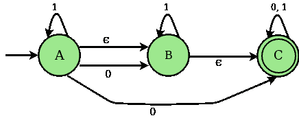
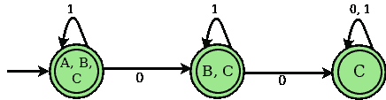

# 使用ε移动到 DFA 转换实现 NFA 的程序

> 原文:[https://www . geesforgeks . org/program-implement-NFA-epsilon-move-DFA-conversion/](https://www.geeksforgeeks.org/program-implement-nfa-epsilon-move-dfa-conversion/)

**非确定性有限自动机(NFA) :** NFA 是一个有限自动机，在某些情况下，当单个输入被赋予单个状态时，机器会进入 1 个以上的状态，即某些移动不能由当前状态和当前输入符号唯一确定。

```
An NFA can be represented as M = { Q, ∑, ∂, q0, F}
```

> Q →有限非空状态集。
> ∞→输入符号的有限非空集合。
> ∂ →过渡功能。
> q0 →开始状态。
> F →最终状态

**具有(空)或∈移动的 NFA:**如果任何有限自动机包含ε(空)移动或事务，那么该有限自动机被称为具有∈移动的 NFA

**例:**
考虑下图 NFA 带∈动:


**过渡状态表为上述 NFA**

| 州 | Zero | one | 希腊语字母之第五字 |
| A | 乙、丙 | A | B |
| B | – | B | C |
| C | C | C | – |

**ε(≘)–闭包:**给定状态 X 的ε闭包是一组状态，只需要(空)或ε移动(包括状态 X 本身)就可以从状态 X 到达。换句话说，状态的ε-闭包可以通过状态的ε-闭包的并集运算来获得，状态的ε-闭包可以用递归方式通过单个ε移动从 X 到达。

对于上面的例子∈闭包如下:

```
∈ closure(A) : {A, B, C}
∈ closure(B) : {B, C}
∈ closure(C) : {C}
```

**确定性有限自动机(DFA) :** DFA 是一种有限自动机，在所有情况下，当单个输入被赋予单个状态时，机器进入单个状态，即机器的所有移动都可以由当前状态和当前输入符号唯一确定。

#### 用ε转换 NFA 的步骤-移动到 DFA:

> **第一步:**将 NFA 起始状态的∈闭包作为 DFA 的起始状态。
> **第二步:**找到每个输入符号
> 从现在开始可以遍历的状态(当前状态的 DFA 中 NFA 的每个状态的转换值及其闭包的并集)。
> 
> **步骤 3 :** 如果发现任何新状态，将其作为当前状态，重复步骤 2。
> **步骤 4 :** 重复步骤 2 和步骤 3，直到 DFA 转换表中没有新状态。
> **步骤 5 :** 将包含 NFA 最终状态的 DFA 状态标记为 DFA 最终状态。

**对应上述 NFA 的 DFA 过渡状态表**

| 州 | Zero | one |
| 甲、乙、丙 | 乙、丙 | 甲、乙、丙 |
| 乙、丙 | C | 乙、丙 |
| C | C | C |

**DFA 状态图**


示例:

```
Input : 6
        2
        FC - BF
        - C -
        - - D
        E A -
        A - BF
        - - -

Output :
 STATES OF NFA :        A, B, C, D, E, F,

 GIVEN SYMBOLS FOR NFA:     0, 1, eps

 NFA STATE TRANSITION TABLE 

STATES    |0    |1    eps
--------+------------------------------------
A    |FC     |-     |BF     
B    |-     |C     |-     
C    |-     |-     |D     
D    |E     |A     |-     
E    |A     |-     |BF     
F    |-     |-     |-     

 e-Closure (A) :    ABF

 e-Closure (B) :    B

 e-Closure (C) :    CD

 e-Closure (D) :    D

 e-Closure (E) :    BEF

 e-Closure (F) :    F

********************************************************

         DFA TRANSITION STATE TABLE          

 STATES OF DFA :        ABF, CDF, CD, BEF,

 GIVEN SYMBOLS FOR DFA:     0, 1,

STATES    |0    |1    
--------+-----------------------
ABF    |CDF     |CD     
CDF    |BEF     |ABF     
CD    |BEF     |ABF     
BEF    |ABF     |CD     

Input :
9
2
- - BH
- - CE
D - -
- - G
- F -
- - G
- - BH
I - -
- -  -

Output :

STATES OF NFA :        A, B, C, D, E, F, G, H, I,

 GIVEN SYMBOLS FOR NFA:     0, 1, eps

 NFA STATE TRANSITION TABLE 

STATES    |0    |1    eps
--------+------------------------------------
A    |-     |-     |BH     
B    |-     |-     |CE     
C    |D     |-     |-     
D    |-     |-     |G     
E    |-     |F     |-     
F    |-     |-     |G     
G    |-     |-     |BH     
H    |I     |-     |-     
I    |-     |-     |-     

 e-Closure (A) :    ABCEH

 e-Closure (B) :    BCE

 e-Closure (C) :    C

 e-Closure (D) :    BCDEGH

 e-Closure (E) :    E

 e-Closure (F) :    BCEFGH

 e-Closure (G) :    BCEGH

 e-Closure (H) :    H

 e-Closure (I) :    I

********************************************************

         DFA TRANSITION STATE TABLE          

 STATES OF DFA :        ABCEH, BCDEGHI, BCEFGH,

 GIVEN SYMBOLS FOR DFA:     0, 1,

STATES    |0    |1    
--------+-----------------------
ABCEH    |BCDEGHI     |BCEFGH     
BCDEGHI    |BCDEGHI     |BCEFGH     
BCEFGH    |BCDEGHI     |BCEFGH     

```

**说明:**
输入的第一行包含 NFA 的州数( **N** )。输入的第二行表示输入符号的数量( **S** )。在示例 1 中，NFA 的状态数为 6(即 **A、B、C、D、E、F** )和 2 个输入符号(即 **0、1** )。由于我们正在使用∈ move 处理 NFA，因此将添加 **∈** 作为额外的输入符号。下一个 **N** 行包含 NFA 每个州的过渡值。第 I 行第 I 列的值表示第 I 个输入符号上第 I 个状态的转换值。在示例 1 中**转换(A，0) : FC** 。

输出包含通过转换输入 NFA 获得的对应 NFA 和 DFA 的每个状态的 DFA 闭包。还规定了 DFA 的状态和输入符号。

下面是上述方法的实现:

```
// C Program to illustrate how to convert e-nfa to DFA

#include <stdio.h>
#include <stdlib.h>
#include <string.h>
#define MAX_LEN 100

char NFA_FILE[MAX_LEN];
char buffer[MAX_LEN];
int zz = 0;

// Structure to store DFA states and their
// status ( i.e new entry or already present)
struct DFA {
  char *states;
  int count;
} dfa;

int last_index = 0;
FILE *fp;
int symbols;

/* reset the hash map*/
void reset(int ar[], int size) {
  int i;

  // reset all the values of
  // the mapping array to zero
  for (i = 0; i < size; i++) {
    ar[i] = 0;
  }
}

// Check which States are present in the e-closure

/* map the states of NFA to a hash set*/
void check(int ar[], char S[]) {
  int i, j;

  // To parse the individual states of NFA
  int len = strlen(S);
  for (i = 0; i < len; i++) {

    // Set hash map for the position
    // of the states which is found
    j = ((int)(S[i]) - 65);
    ar[j]++;
  }
}

// To find new Closure States
void state(int ar[], int size, char S[]) {
  int j, k = 0;

  // Combine multiple states of NFA
  // to create new states of DFA
  for (j = 0; j < size; j++) {
    if (ar[j] != 0)
      S[k++] = (char)(65 + j);
  }

  // mark the end of the state
  S[k] = '\0';
}

// To pick the next closure from closure set
int closure(int ar[], int size) {
  int i;

  // check new closure is present or not
  for (i = 0; i < size; i++) {
    if (ar[i] == 1)
      return i;
  }
  return (100);
}

// Check new DFA states can be
// entered in DFA table or not
int indexing(struct DFA *dfa) {
  int i;

  for (i = 0; i < last_index; i++) {
    if (dfa[i].count == 0)
      return 1;
  }
  return -1;
}

/* To Display epsilon closure*/
void Display_closure(int states, int closure_ar[],
                     char *closure_table[],
                     char *NFA_TABLE[][symbols + 1],
                     char *DFA_TABLE[][symbols]) {
  int i;
  for (i = 0; i < states; i++) {
    reset(closure_ar, states);
    closure_ar[i] = 2;

    // to neglect blank entry
    if (strcmp(&NFA_TABLE[i][symbols], "-") != 0) {

      // copy the NFA transition state to buffer
      strcpy(buffer, &NFA_TABLE[i][symbols]);
      check(closure_ar, buffer);
      int z = closure(closure_ar, states);

      // till closure get completely saturated
      while (z != 100)
      {
        if (strcmp(&NFA_TABLE[z][symbols], "-") != 0) {
          strcpy(buffer, &NFA_TABLE[z][symbols]);

          // call the check function
          check(closure_ar, buffer);
        }
        closure_ar[z]++;
        z = closure(closure_ar, states);
      }
    }

    // print the e closure for every states of NFA
    printf("\n e-Closure (%c) :\t", (char)(65 + i));

    bzero((void *)buffer, MAX_LEN);
    state(closure_ar, states, buffer);
    strcpy(&closure_table[i], buffer);
    printf("%s\n", &closure_table[i]);
  }
}

/* To check New States in DFA */
int new_states(struct DFA *dfa, char S[]) {

  int i;

  // To check the current state is already
  // being used as a DFA state or not in
  // DFA transition table
  for (i = 0; i < last_index; i++) {
    if (strcmp(&dfa[i].states, S) == 0)
      return 0;
  }

  // push the new
  strcpy(&dfa[last_index++].states, S);

  // set the count for new states entered
  // to zero
  dfa[last_index - 1].count = 0;
  return 1;
}

// Transition function from NFA to DFA
// (generally union of closure operation )
void trans(char S[], int M, char *clsr_t[], int st,
               char *NFT[][symbols + 1], char TB[]) {
  int len = strlen(S);
  int i, j, k, g;
  int arr[st];
  int sz;
  reset(arr, st);
  char temp[MAX_LEN], temp2[MAX_LEN];
  char *buff;

  // Transition function from NFA to DFA
  for (i = 0; i < len; i++) {

    j = ((int)(S[i] - 65));
    strcpy(temp, &NFT[j][M]);

    if (strcmp(temp, "-") != 0) {
      sz = strlen(temp);
      g = 0;

      while (g < sz) {
        k = ((int)(temp[g] - 65));
        strcpy(temp2, &clsr_t[k]);
        check(arr, temp2);
        g++;
      }
    }
  }

  bzero((void *)temp, MAX_LEN);
  state(arr, st, temp);
  if (temp[0] != '\0') {
    strcpy(TB, temp);
  } else
    strcpy(TB, "-");
}

/* Display DFA transition state table*/
void Display_DFA(int last_index, struct DFA *dfa_states,
                 char *DFA_TABLE[][symbols]) {
  int i, j;
  printf("\n\n********************************************************\n\n");
  printf("\t\t DFA TRANSITION STATE TABLE \t\t \n\n");
  printf("\n STATES OF DFA :\t\t");

  for (i = 1; i < last_index; i++)
    printf("%s, ", &dfa_states[i].states);
  printf("\n");
  printf("\n GIVEN SYMBOLS FOR DFA: \t");

  for (i = 0; i < symbols; i++)
    printf("%d, ", i);
  printf("\n\n");
  printf("STATES\t");

  for (i = 0; i < symbols; i++)
    printf("|%d\t", i);
  printf("\n");

  // display the DFA transition state table
  printf("--------+-----------------------\n");
  for (i = 0; i < zz; i++) {
    printf("%s\t", &dfa_states[i + 1].states);
    for (j = 0; j < symbols; j++) {
      printf("|%s \t", &DFA_TABLE[i][j]);
    }
    printf("\n");
  }
}

// Driver Code
int main() {
  int i, j, states;
  char T_buf[MAX_LEN];

  // creating an array dfa structures
  struct DFA *dfa_states = malloc(MAX_LEN * (sizeof(dfa)));
  states = 6, symbols = 2;

  printf("\n STATES OF NFA :\t\t");
  for (i = 0; i < states; i++)

    printf("%c, ", (char)(65 + i));
  printf("\n");
  printf("\n GIVEN SYMBOLS FOR NFA: \t");

  for (i = 0; i < symbols; i++)

    printf("%d, ", i);
  printf("eps");
  printf("\n\n");
  char *NFA_TABLE[states][symbols + 1];

  // Hard coded input for NFA table
  char *DFA_TABLE[MAX_LEN][symbols];
  strcpy(&NFA_TABLE[0][0], "FC");
  strcpy(&NFA_TABLE[0][1], "-");
  strcpy(&NFA_TABLE[0][2], "BF");
  strcpy(&NFA_TABLE[1][0], "-");
  strcpy(&NFA_TABLE[1][1], "C");
  strcpy(&NFA_TABLE[1][2], "-");
  strcpy(&NFA_TABLE[2][0], "-");
  strcpy(&NFA_TABLE[2][1], "-");
  strcpy(&NFA_TABLE[2][2], "D");
  strcpy(&NFA_TABLE[3][0], "E");
  strcpy(&NFA_TABLE[3][1], "A");
  strcpy(&NFA_TABLE[3][2], "-");
  strcpy(&NFA_TABLE[4][0], "A");
  strcpy(&NFA_TABLE[4][1], "-");
  strcpy(&NFA_TABLE[4][2], "BF");
  strcpy(&NFA_TABLE[5][0], "-");
  strcpy(&NFA_TABLE[5][1], "-");
  strcpy(&NFA_TABLE[5][2], "-");
  printf("\n NFA STATE TRANSITION TABLE \n\n\n");
  printf("STATES\t");

  for (i = 0; i < symbols; i++)
    printf("|%d\t", i);
  printf("eps\n");

  // Displaying the matrix of NFA transition table
  printf("--------+------------------------------------\n");
  for (i = 0; i < states; i++) {
    printf("%c\t", (char)(65 + i));

    for (j = 0; j <= symbols; j++) {
      printf("|%s \t", &NFA_TABLE[i][j]);
    }
    printf("\n");
  }
  int closure_ar[states];
  char *closure_table[states];

  Display_closure(states, closure_ar, closure_table, NFA_TABLE, DFA_TABLE);
  strcpy(&dfa_states[last_index++].states, "-");

  dfa_states[last_index - 1].count = 1;
  bzero((void *)buffer, MAX_LEN);

  strcpy(buffer, &closure_table[0]);
  strcpy(&dfa_states[last_index++].states, buffer);

  int Sm = 1, ind = 1;
  int start_index = 1;

  // Filling up the DFA table with transition values
  // Till new states can be entered in DFA table
  while (ind != -1) {
    dfa_states[start_index].count = 1;
    Sm = 0;
    for (i = 0; i < symbols; i++) {

      trans(buffer, i, closure_table, states, NFA_TABLE, T_buf);

      // storing the new DFA state in buffer
      strcpy(&DFA_TABLE[zz][i], T_buf);

      // parameter to control new states
      Sm = Sm + new_states(dfa_states, T_buf);
    }
    ind = indexing(dfa_states);
    if (ind != -1)
      strcpy(buffer, &dfa_states[++start_index].states);
    zz++;
  }
  // display the DFA TABLE
  Display_DFA(last_index, dfa_states, DFA_TABLE);

  return 0;
}
```

**使用 n FA 搭配∈ move :** 如果我们想要构建一个接受一种语言的 FA，有时构建一个直接的 NFA 或 DFA 会变得非常困难或者似乎是不可能的。但是如果使用具有∈移动的 NFA，那么可以容易地构造和描述过渡图。