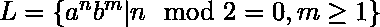
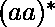
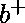
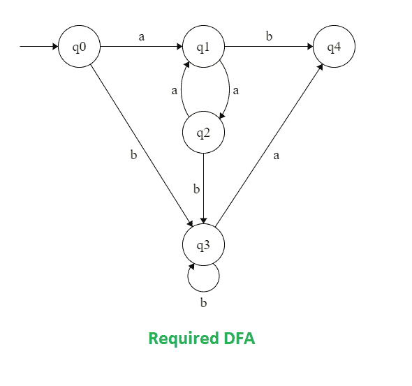

# 构造接受语言 L = {anbm | n mod 2=0，m≥1}的 DFA 的程序

> 原文:[https://www . geesforgeks . org/program-to-construction-a-DFA-哪些接受语言-l-anbm-n-mod-20-m1/](https://www.geeksforgeeks.org/program-to-construct-a-dfa-which-accept-the-language-l-anbm-n-mod-20-m1/)

先决条件–[有限自动机简介](https://www.geeksforgeeks.org/toc-finite-automata-introduction/)
**问题:**设计一个接受语言的确定性有限自动机(DFA)

以上语言 L 正则表达式为，

```
L = (aa)*.b+
```

**示例:**

```
Input:  a a b b b           
Output:  ACCEPTED
// n = 2 (even) m=3 (>=1)

Input:  a a a b b b         
Output:  NOT ACCEPTED
 // n = 3 (odd), m = 3

Input:  a a a a        
Output:  NOT ACCEPTED
// n = 4, m = 0( must be >=1)

```

**方法:**
有 3 个步骤导致接受字符串:

1.  为构造 FA 意味着有偶数个 a。
2.  的构造 FA 是指具有大于 1 的任意数量的 b。
3.  Concatenate the two FA and make single DFA.

    任何其他组合结果都是拒绝输入字符串。

    **Description:**

    **DFA 状态转移图:**

    

    **我们来看看演示的代码:**

    ## C/C++

    ```
    // C program to implement DFS that accepts
    // all string which follow the language
    // L = { a^n b^m ; (n)mod 2=0, m>=1 }
    #include <stdio.h>
    #include <string.h>

    // dfa tells the number associated
    // string end in which state.
    int dfa = 0;

    // This function is for
    // the starting state (Q0)of DFA
    void start(char c)
    {
        if (c == 'a') {
            dfa = 1;
        }
        else if (c == 'b') {
            dfa = 3;
        }

        // -1 is used to check for any invalid symbol
        else {
            dfa = -1;
        }
    }

    // This function is for the first state (Q1) of DFA
    void state1(char c)
    {
        if (c == 'a') {
            dfa = 2;
        }
        else if (c == 'b') {
            dfa = 4;
        }
        else {
            dfa = -1;
        }
    }

    // This function is for the second state (Q2) of DFA
    void state2(char c)
    {
        if (c == 'b') {
            dfa = 3;
        }
        else if (c == 'a') {
            dfa = 1;
        }
        else {
            dfa = -1;
        }
    }

    // This function is for the third state (Q3)of DFA
    void state3(char c)
    {
        if (c == 'b') {
            dfa = 3;
        }
        else if (c == 'a') {
            dfa = 4;
        }
        else {
            dfa = -1;
        }
    }

    // This function is for the fourth state (Q4) of DFA
    void state4(char c)
    {
        dfa = -1;
    }

    int isAccepted(char str[])
    {
        // store length of string
        int i, len = strlen(str);

        for (i = 0; i < len; i++) {
            if (dfa == 0)
                start(str[i]);

            else if (dfa == 1)
                state1(str[i]);

            else if (dfa == 2)
                state2(str[i]);

            else if (dfa == 3)
                state3(str[i]);

            else if (dfa == 4)
                state4(str[i]);
            else
                return 0;
        }
        if (dfa == 3)
            return 1;
        else
            return 0;
    }

    // driver code
    int main()
    {
        char str[] = "aaaaaabbbb";
        if (isAccepted(str))
            printf("ACCEPTED");
        else
            printf("NOT ACCEPTED");
        return 0;
    }

    // This code is contributed by SHUBHAMSINGH10.
    ```

    ## Java 语言(一种计算机语言，尤用于创建网站)

    ```
    // Java program to implement DFS that accepts
    // all string which follow the language
    // L = { a^n b^m ; (n)mod 2=0, m>=1 }
    class GFG
    {

    // dfa tells the number associated
    // string end in which state.
    static int dfa = 0;

    // This function is for
    // the starting state (Q0)of DFA
    static void start(char c)
    {
        if (c == 'a')
        {
            dfa = 1;
        }
        else if (c == 'b') 
        {
            dfa = 3;
        }

        // -1 is used to check for
        // any invalid symbol
        else
        {
            dfa = -1;
        }
    }

    // This function is for the
    // first state (Q1) of DFA
    static void state1(char c)
    {
        if (c == 'a') 
        {
            dfa = 2;
        }
        else if (c == 'b')
        {
            dfa = 4;
        }
        else 
        {
            dfa = -1;
        }
    }

    // This function is for the 
    // second state (Q2) of DFA
    static void state2(char c)
    {
        if (c == 'b') 
        {
            dfa = 3;
        }
        else if (c == 'a')
        {
            dfa = 1;
        }
        else 
        {
            dfa = -1;
        }
    }

    // This function is for the
    // third state (Q3)of DFA
    static void state3(char c)
    {
        if (c == 'b') 
        {
            dfa = 3;
        }
        else if (c == 'a')
        {
            dfa = 4;
        }
        else 
        {
            dfa = -1;
        }
    }

    // This function is for the
    // fourth state (Q4) of DFA
    static void state4(char c)
    {
        dfa = -1;
    }

    static int isAccepted(char str[])
    {
        // store length of string
        int i, len = str.length;

        for (i = 0; i < len; i++)
        {
            if (dfa == 0)
                start(str[i]);

            else if (dfa == 1)
                state1(str[i]);

            else if (dfa == 2)
                state2(str[i]);

            else if (dfa == 3)
                state3(str[i]);

            else if (dfa == 4)
                state4(str[i]);
            else
                return 0;
        }
        if (dfa == 3)
            return 1;
        else
            return 0;
    }

    // Driver code
    public static void main(String []args) 
    {
        char str[] = "aaaaaabbbb".toCharArray();
        if (isAccepted(str) == 1)
            System.out.printf("ACCEPTED");
        else
            System.out.printf("NOT ACCEPTED");
    }
    }

    // This code is contributed by 29AjayKumar
    ```

    ## 蟒蛇 3

    ```
    # Python3 program to implement DFS that accepts   
    # all Stringing which follow the language   
    # L = {a ^ n b ^ m (n)mod 2 = 0, m>= 1 }

    # This function is for the dfa = starting  
    # dfa = state (zeroth) of DFA   
    def start(c):  
        if (c == 'a'):  
            dfa = 1
        elif (c == 'b'):  
            dfa = 3

        # -1 is used to check for any  
        # invalid symbol   
        else:  
            dfa = -1
        return dfa  

    # This function is for the first   
    # dfa = state of DFA   
    def state1(c):   
        if (c == 'a'):  
            dfa = 2
        elif (c == 'b'):  
            dfa = 4
        else:  
            dfa = -1
        return dfa  

    # This function is for the second   
    # dfa = state of DFA   
    def state2(c):  
        if (c == 'b'):  
            dfa = 3
        elif (c == 'a'):  
            dfa = 1
        else:  
            dfa = -1
        return dfa  

    # This function is for the third   
    # dfa = state of DFA   
    def state3(c):  
        if (c == 'b'):  
            dfa = 3
        elif (c == 'a'):  
            dfa = 4
        else:  
            dfa = -1
        return dfa  

    # This function is for the fourth  
    # dfa = state of DFA   
    def state4(c):  
        dfa = -1
        return dfa  

    def isAccepted(String):  

        # store length of Stringing   
        l = len(String)  

        # dfa tells the number associated  
        # with the present dfa = state  
        dfa = 0
        for i in range(l):   
            if (dfa == 0):   
                dfa = start(String[i])   

            elif (dfa == 1):   
                dfa = state1(String[i])   

            elif (dfa == 2) :  
                dfa = state2(String[i])   

            elif (dfa == 3) :  
                dfa = state3(String[i])   

            elif (dfa == 4) :  
                dfa = state4(String[i])   
            else:  
                return 0
        if(dfa == 3) :  
            return 1
        else:  
            return 0

    # Driver code   
    if __name__ == "__main__" :  
        String = "aaaaaabbbb"
        if (isAccepted(String)) :  
            print("ACCEPTED")   
        else:  
            print("NOT ACCEPTED")   

    # This code is contributed by SHUBHAMSINGH10.
    ```

    ## C#

    ```
    // C# program to implement DFS that accepts
    // all string which follow the language
    // L = { a^n b^m ; (n)mod 2=0, m>=1 }
    using System;

    class GFG
    {

    // dfa tells the number associated
    // string end in which state.
    static int dfa = 0;

    // This function is for
    // the starting state (Q0)of DFA
    static void start(char c)
    {
        if (c == 'a')
        {
            dfa = 1;
        }
        else if (c == 'b') 
        {
            dfa = 3;
        }

        // -1 is used to check for
        // any invalid symbol
        else
        {
            dfa = -1;
        }
    }

    // This function is for the
    // first state (Q1) of DFA
    static void state1(char c)
    {
        if (c == 'a') 
        {
            dfa = 2;
        }
        else if (c == 'b')
        {
            dfa = 4;
        }
        else
        {
            dfa = -1;
        }
    }

    // This function is for the 
    // second state (Q2) of DFA
    static void state2(char c)
    {
        if (c == 'b') 
        {
            dfa = 3;
        }
        else if (c == 'a')
        {
            dfa = 1;
        }
        else
        {
            dfa = -1;
        }
    }

    // This function is for the
    // third state (Q3)of DFA
    static void state3(char c)
    {
        if (c == 'b') 
        {
            dfa = 3;
        }
        else if (c == 'a')
        {
            dfa = 4;
        }
        else
        {
            dfa = -1;
        }
    }

    // This function is for the
    // fourth state (Q4) of DFA
    static void state4(char c)
    {
        dfa = -1;
    }

    static int isAccepted(char []str)
    {
        // store length of string
        int i, len = str.Length;

        for (i = 0; i < len; i++)
        {
            if (dfa == 0)
                start(str[i]);

            else if (dfa == 1)
                state1(str[i]);

            else if (dfa == 2)
                state2(str[i]);

            else if (dfa == 3)
                state3(str[i]);

            else if (dfa == 4)
                state4(str[i]);
            else
                return 0;
        }
        if (dfa == 3)
            return 1;
        else
            return 0;
    }

    // Driver code
    public static void Main(String []args) 
    {
        char []str = "aaaaaabbbb".ToCharArray();
        if (isAccepted(str) == 1)
            Console.Write("ACCEPTED");
        else
            Console.Write("NOT ACCEPTED");
    }
    }

    // This code is contributed by 29AjayKumar
    ```

    ## 服务器端编程语言（Professional Hypertext Preprocessor 的缩写）

    ```
    <?php
    // PHP program to implement DFS that accepts 
    // all string which follow the language 
    // L = { a^n b^m ;(n)mod 2=0, m>=1 } 

    // This function is for the starting 
    // state (zeroth) of DFA 
    function start($c, &$dfa)
    {
        if($c == 'a') 
            $dfa = 1; 

        elseif ($c == 'b') 
            $dfa = 3; 

        // -1 is used to check for any 
        // invalid symbol 
        else $dfa = -1; 
    }

    // This function is for the first 
    // state of DFA 
    function state1($c, &$dfa)
    {
        if ($c == 'a')
            $dfa = 2; 
        elseif ($c == 'b') 
            $dfa = 4; 
        else
            $dfa = -1; 

    }

    // This function is for the second 
    // state of DFA 
    function state2($c, &$dfa)
    {
        if ($c == 'b') 
            $dfa = 3; 
        elseif ($c == 'a') 
            $dfa = 1; 
        else 
            $dfa = -1; 
    }

    // This function is for the third 
    // state of DFA 
    function state3($c, &$dfa)
    {
        if ($c == 'b') 
            $dfa = 3; 
        elseif ($c == 'a') 
            $dfa = 4; 
        else 
            $dfa = -1; 
    }

    // This function is for the fourth 
    // state of DFA 
    function state4($c, &$dfa)
    {
        $dfa = -1; 
    }

    function isAccepted($str,&$dfa)
    {
        // store length of string 
        $i = 0; $len = sizeof($str); 
        for ($i = 0; $i < $len; $i++) 
        { 
            if ($dfa == 0) 
                start($str[$i], $dfa); 

            elseif ($dfa == 1) 
                state1($str[$i], $dfa); 

            elseif ($dfa == 2) 
                state2($str[$i], $dfa); 

            elseif ($dfa == 3) 
                state3($str[$i], $dfa); 

            elseif ($dfa == 4) 
                state4($str[$i], $dfa); 
            else
                return 0; 

        } 
        if($dfa == 3) 
            return 1; 
        else
        return 0; 
    }

    // Driver Code 

    // dfa tells the number associated 
    // with the present state 
    $dfa = 0;
    $str = array("a", "a", "a", "a", "a", 
                 "a", "b", "b", "b", "b");

    if (isAccepted($str, $dfa) != 0) 
        echo "ACCEPTED"; 
    else
        echo "NOT ACCEPTED"; 

    // This code is contributed 
    // by Adesh Singh
    ?>
    ```

    **Output:**

    ```
    ACCEPTED
    ```