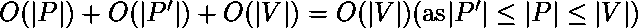
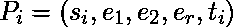

# 路径选择决策问题是 NP 完全的证明

> 原文:[https://www . geesforgeks . org/proof-the-path-selection-decision-problem-is-NP-complete/](https://www.geeksforgeeks.org/proof-that-path-selection-decision-problem-is-np-complete/)

先决条件–[NP-完全性](https://www.geeksforgeeks.org/np-completeness-set-1/)
路径选择问题的决策问题询问是否可能从图的给定路径中选择至少 k 条路径，使得没有两条选择的路径共享任何顶点。

为了证明一个问题是 NP 完全的，我们需要证明它既是 NP 的，也是 NP 难的。我们用 PSP 来表示我们的路径选择决策问题。

**PSP 属于 NP :**
我们通过构造问题的多项式时间验证器来证明这一点。如果有任何问题是在 NP 中，那么，给定问题的‘证书’(解决方案)和问题的实例(在这种情况下是图 G 和正整数 k)，我们将能够在多项式时间内验证(检查给出的解决方案是否正确)证书。

PSP 的证书是一组路径 P’。这些是没有公共边的独立路径。我们可以通过以下方式检查对于给定的图 G(V，E))和路径 P 是否有 k 条独立的路径:

```
Check if P' is a subset of P
If not, the given solution is wrong
The number of paths in P' is at least k
If not, the given solution is wrong

Initialize a list of boolean with length |V|
for each path p in P'
    for each vertex in p
        check if it is marked True in our list
        If so, the given solution is wrong
        Else, marks the vertex as True

Since no vertex was marked twice,
given solution is correct.

```

上述验证器是多时间的，因为:

1.  检查 P '是 P 的子集可以在 O(|P|)中完成。
2.  可以在 O(|P'|)中检查 P '中的路径数
3.  检查所有路径是否不相交可以在 O(|V|)中完成

因此，总时间复杂度:

因此，PSP 具有多项式时间可验证性，因此属于 NP 类。

**团决策问题属于 NP-Hard :**
为了证明 PSP 是 NP-Hard，我们取了一些已经被证明是 NP-Hard 的问题(在我们的例子中是独立集)，并证明了这个问题可以在多项式时间内化为 PSP。既然我们知道独立集是 NP 完全的，那么它也是 NP 难的。

给定一个信息系统实例–

```
G=(V, E) and k 
```

我们以下列方式构建 PSP 实例:

我们创建一个新的图形 G’。对于 G 中的每个顶点 v <sub>i</sub> :

1.  我们用 P <sub>i</sub> 来表示路径，表示 v <sub>i</sub> 。
2.  让 e <sub>1</sub> ，e <sub>2</sub> ，…，e <sub>r</sub> 成为连接到 v <sub>i</sub> 的边。我们在 G’中为每个这样的边引入一个顶点。此外，我们在 G ' s–s<sub>I</sub>，t <sub>i</sub> 中引入一对顶点。

由此可见，


我们可以清楚地看到，上面的约简是多时间的(复杂度= O(|V|+|E|))，因为我们本质上是迭代初始图中的所有顶点和边。

**证明:**
独立集问题化简为路径选择问题的证明。为了证明我们的归约是正确的，我们证明以下两个论点。

**(i)是，实例为 IS = >是的实例为 PSP**
我们有，是的实例为 IS。

1.  对于一个图 G=(V，E)存在一个独立的大小至少为 k 的集合
2.  至少有 k 个顶点不共享任何边。
3.  PSP 实例中至少有 k 条不共享任何节点的路径。因为我们定义了 G 的顶点类似于 PSP 实例中的路径，而 G 的边类似于这些路径中的顶点。这些路径共享节点中的任何一个都意味着独立集合中的两个顶点共享一条公共边，这是不可能的。
4.  是的，例如 PSP。

**(ii)是，例如 PSP = >是，例如 IS**
ETP:没有 IS 的例子= >没有 PSP 的例子。(对位证明。).

我们知道，只要存在大小至少为 k 的独立集合，就存在大小正好为 k 的独立集合(这可以通过从更大的集合中取大小为 k 的子集来实现)。因此，反命题也是正确的。(即，只要不存在大小恰好为 k 的独立集合，就不存在大小至少为 k 的独立集合)。

我们没有信息系统的实例。

1.  对于图 G=(V，E)不可能存在大小为 k 的独立集合。
2.  不可能找到 G 的不共享任何边的 k 个顶点。
3.  每组大小为 k 的 S 个顶点将包含共享一条边的 vi 和 vj。
4.  因为我们定义 G 的顶点类似于 PSP 实例中的路径，G 的边类似于这些路径中的顶点，所以 PSP 实例中的每 k 个大小的路径集将共享一个节点。
5.  PSP 实例中不能存在不共享任何节点的 k 个路径。
6.  PSP 没有实例。

因此，对于一个特定的例子，信息系统问题被简化为 PSP。因此 PSP 是 NP-Hard。

因此，路径选择决策问题是 NP 难的。因此，路径选择决策问题是 NP 完全的。