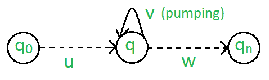

# 计算理论中的泵引理

> 原文:[https://www . geeksforgeeks . org/pumping-lemma in theory of computing/](https://www.geeksforgeeks.org/pumping-lemma-in-theory-of-computation/)

有两个泵浦引理，定义为
1。常规语言和
2。上下文无关语言

**正则语言的泵引理**
对于任意正则语言 L，存在整数 n，使得对于|x| ≥ n 的所有 x ∈ L，存在 u，v，w∈σ∑，使得 x = uvw，并且
(1) |uv| ≤ n
(2) |v| ≥ 1
(3)对于所有 i ≥ 0: uv i w ∈ 这意味着，如果一个字符串 v 被‘泵送’，即如果 v 被插入任何次数，得到的字符串仍然保留在 l 中。

泵送引理被用作语言不规则性的证明。 因此，如果一种语言是正则的，它总是满足泵引理。如果至少存在一根不在 L 中的泵送管柱，那么 L 肯定不是规则的。
与此相反的情况可能并不总是正确的。也就是说，如果 Pumping Lemma 成立，并不意味着语言是正则的。

比如我们证明 L01= { 0n1n| n≥0 }是不规则的。
让我们假设 L 是正则的，然后通过泵引理遵循上面给出的规则。
现在，设 x ∈ L 和|x| ≥ n，所以，通过泵引理，存在 u，v，w，使得(1)–(3)成立。

我们表明，对于所有的 u、v、w，(1)–( 3)都不成立。
如果(1)和(2)保持，则 x = 0 n 1 n = uvw，且|uv| ≤ n 和|v| ≥ 1。
所以，u = 0 a ，v = 0 b ，w = 0 c 1 n 其中:a + b ≤ n，b ≥ 1，c ≥ 0，a + b + c = n
但是， 然后(3)失败为 I = 0
uv0w = uw = 0a0c1n= 0a+c1n∉l，自 a+c≠n .
t39】t40t42】t43
t45】抽引理为上下文无关 对于任何语言 L，我们将其字符串分成五个部分，抽取第二个和第四个子字符串。
Pumping Lemma，在这里也是用来证明一种语言不是 CFL 的工具。因为，如果任何一个字符串不满足它的条件，那么语言就不是 CFL。
因此，如果 L 是 CFL，则存在整数 n，使得对于|x| ≥ n 的所有 x ∈ L，存在 u、v、w、x、y∈σ∑，使得 x = uvwxy，并且
(1)| vwx |≤n
(2)| VX |≥1
(3)对于所有 i ≥ 0: uv i wx i 【T56

上例，0 n 1 n 就是 CFL，因为任何一根弦都可以是两个地方抽的结果，一个为 0，一个为 1。
我们来证明一下，L012= { 0n1n2n| n≥0 }不是上下文无关的。
我们假设 L 是上下文无关的，那么通过泵引理，上面给出的规则就遵循了。
现在，设 x ∈ L 和|x| ≥ n，所以，通过泵引理，存在 u，v，w，x，y，使得(1)–(3)成立。
我们表明，对于所有 u、v、w、x、y(1)–(3)都不成立。

如果(1)和(2)保持，则 x = 0n1n2n= uvwxy，其中|vwx| ≤ n 且|vx| ≥ 1。
(1)告诉我们，vwx 不同时包含 0 和 2。因此，要么 vwx 没有 0，要么 vwx 没有 2。
假设 vx 没有 0，通过(2)，VX 包含 1 或 2。因此 uwy 有‘n’0，uwy 要么有小于‘n’1 的，要么有小于‘n’2 的。
但是(3)告诉我们 uwy = uv0wx0y∈l .
所以，uwy 有相等数量的 0，1 和 2 给了我们一个矛盾。vwx 没有 2 的情况类似，也给了我们一个矛盾。因此，L 不是上下文无关的。

资料来源:约翰·E·霍普克罗夫特，拉杰夫·莫特瓦尼，杰弗里·乌尔曼(2003 年)。自动机理论、语言和计算导论。

本文由**尼鲁帕姆·辛格**供稿。

如果发现有不正确的地方，或者想分享更多关于上述话题的信息，请写评论