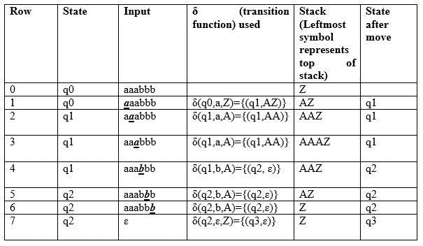
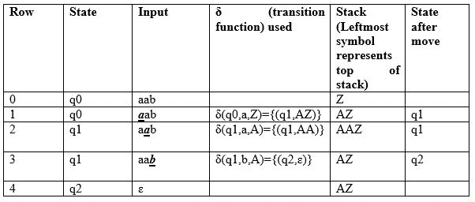
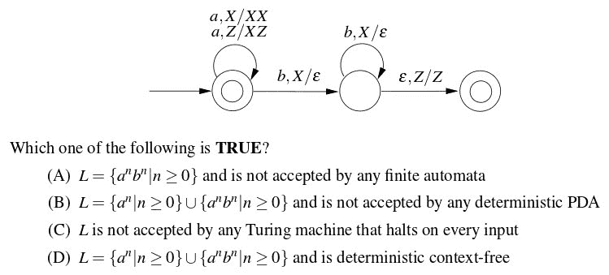
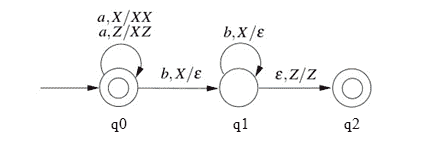

# 按最终状态的下推自动机验收

> 原文:[https://www . geesforgeks . org/下推-自动机-接受-最终-状态/](https://www.geeksforgeeks.org/pushdown-automata-acceptance-final-state/)

我们已经讨论了下推自动机(PDA)及其通过空堆栈接受[的文章。现在，在这篇文章中，我们将讨论 PDA 如何在最终状态的基础上接受 CFL。给定一个 PDA P 作为:](https://www.geeksforgeeks.org/theory-of-computation-pushdown-automata/)

```
P = (Q, Σ, Γ, δ, q0, Z, F)
```

P 所接受的语言是 PDA 可以从初始状态移动到最终状态的所有字符串的集合，而与堆栈上剩余的任何符号无关，可以描述为:

```
L(P) = {w |(q0, w, Z) =>(qf, ɛ, s)}
```

这里，从开始状态 q0 和堆栈符号 z，当输入 w 被消耗时，到达最终状态 qf ɛ F。堆栈可以包含字符串 s，当到达最终状态时，字符串 s 是不相关的，w 将被接受。

**示例:**使用最终状态为语言{a^nb^n | n > 0}定义下推自动机。
**解:** M =其中 Q = {q0，q1，q2，q3}和∑ = {a，b}和γ= { A，Z }和 F={q3}和δ由下式给出:

```
δ( q0, a, Z ) = { ( q1, AZ ) }
δ( q1, a, A) = { ( q1, AA ) }
δ( q1, b, A) = { ( q2, ɛ) }
δ( q2, b, A) = { ( q2, ɛ) }
δ( q2, ɛ, Z) = { ( q3, Z) }
```

让我们看看这个自动机是如何为 aabbb 工作的:



**说明:**最初自动机状态为 q0，栈上符号为 Z，输入为 aaabbb，如第 0 行所示。读取 A 时(第 1 行以粗体显示)，状态将更改为 q1，并将在堆栈上推送符号 A。在下一个 A 上(如第 2 行所示)，它将在堆栈上推动另一个符号 A，并保持状态 q1。读完 3 a 后，堆栈将是 AAAZ，A 在顶部。

读取 b 后(如第 4 行所示)，它将弹出 A 并移动到状态 q2，堆栈将是 AAZ。当读取所有 b 时，状态将是 q2，堆栈将是 z。在第 7 行，输入符号ɛ和堆栈上的 z，它将移动到 q3。由于在处理输入后已经达到最终状态 q3，因此该字符串将被接受。
这种类型的验收被称为最终状态验收。

接下来我们将看到这个自动机如何为 aab 工作:



正如我们在第 4 行看到的，输入已经被处理，PDA 处于状态 q2，这是非最终状态，字符串 aab 将不被接受。

让我们在此基础上讨论问题:

**Que-1。**考虑下面给出的 PDA 的转换图，输入字母表∑ = {a，b }和堆栈字母表γ= { X，Z}。z 是初始堆栈符号。让 L 表示 PDA 人接受的语言。(GATE-CS-2016)



**解决方案:**我们首先将给定 PDA 的状态标记为:


接下来，给定的 PDA P 可以写成:

```
 Q = {q0, q1, q2} and ∑ = {a, b} 
And Γ = {A, Z} and F={q0,q2} and δ is given by :
δ( q0, a, Z ) = {( q0, XZ)}
δ( q0, a, X) = {( q0, XX )}
δ( q0, b, X) = {( q1, ɛ)}
δ( q1, b, X) = {( q1, ɛ)}
δ( q1, ɛ, Z) = {( q2, Z)}
```

我们可以看到，q0 既是初始状态，也是最终状态，ɛ将被接受。对于每一个 a，X 被推到堆栈上，PDA 保持在最终状态。因此，PDA 可以接受任何数量的 a。

如果输入包含 b，则每个 b 从堆栈中弹出 x，然后如果处理输入后堆栈变空(δ( q1，ɛ，Z) = {( q2，Z)})，则 PDA 移动到最终状态。因此，如果存在，b 的个数必须等于 a 的个数。

由于给定的状态和输入只有一次移动，所以 PDA 是确定的。所以，正确的选项是(D)。