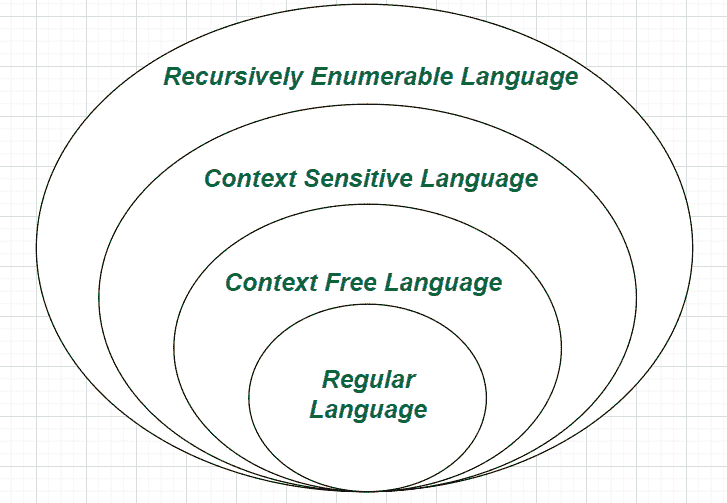
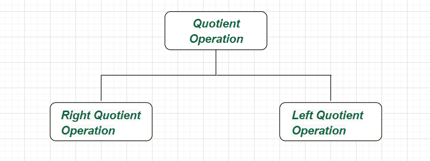

# 自动机中的商运算

> 原文:[https://www . geeksforgeeks . org/商数-运算中的自动机/](https://www.geeksforgeeks.org/quotient-operation-in-automata/)

**概述:**
根据[自动机](https://www.geeksforgeeks.org/introduction-of-finite-automata/)的理论方面，商运算可以定义为识别给定自动化的超集的技术，特别是对于给定的形式语言串(形式语言是从有限字母表中提取的一组符号串。它可以有基于正则表达式或生成/接受语言的上下文无关语法的规则)。因此，商自动机可以通过连接它的一些状态从给定的非确定性有限自动机中获得。

**商运算的闭包性质:**
自动机理论中商运算的一些常见且重要的闭包性质如下。

*   正则语言与任何其他语言的商运算都是正则的。
*   上下文无关语言与常规语言的商运算是上下文无关的。
*   两种递归可枚举语言的商运算都是递归可枚举的。
*   两种上下文无关语言的商运算可以是任何递归可枚举的语言。



**商运算的类型:**
商运算可以分为以下两部分。



**类型-1 :**
**右商(右切)–**

```
 L1/L2 = { a | ab ∈  L1 for some b ∈  L2 }                                
```

这里，∑ (a，b)。给定的表达式陈述了语言 L1 相对于 L2 的正确商运算，是由字符串“b”组成的语言，因此对于 L2 的某些字符串“b”,“ab”在 L1。

**示例-1 :**

```
Let   L1 = { hooray, sunray, defray, ray},  
      L2 = { ray}
so,   L1/L2 = { hoo , sun, def,  ∈ } 
```

**示例-2 :**

```
Let   L1 = {∈, a, ab, aba, abab, ... },  
      L2 = { b, bb, bbb, bbbb, ... }
so,   L1/L2 = { a, aba, ababa, ... } 
```

**类型-2 :**
**左商(左切)–**

```
L1/L2 = { b | ab ∈  L1 for some a ∈  L2 }                                
```

这里，∑ (a，b)。给定的表达式陈述了语言 L1 相对于 L2 的左商运算，是由字符串“a”组成的语言，因此对于 L2 的某个字符串“a”，ab 在 L1。

**示例-1 :**

```
Let   L1 = { match, matter, mat, matzoth },  
      L2 = { mat}
so,   L1/L2 = { tch , ter, ∈ , zoth } 
```

**示例-2 :**

```
Let   L1 = { 10, 100, 1010, 101110},  
      L2 = { 10}
so,   L1/L2 = { ∈ , 0, 10, 1110 } 
```