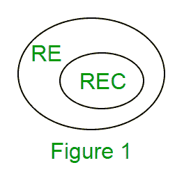

# TOC 中的递归和递归可枚举语言

> 原文:[https://www . geesforgeks . org/递归和递归可枚举语言 in-toc/](https://www.geeksforgeeks.org/recursive-and-recursive-enumerable-languages-in-toc/)

**递归可枚举(RE)或 0 型语言**

RE 语言或 0 型语言是由 0 型语法生成的。一个 RE 语言可以被图灵机接受或识别，这意味着它将进入语言字符串的最终状态，对于不属于该语言的字符串，它可能进入也可能不进入拒绝状态。这意味着 TM 可以对不属于语言的字符串进行永久循环。RE 语言也被称为图灵可识别语言。

**递归语言(REC)**

递归语言(RE 的子集)可以由图灵机决定，这意味着它将进入语言字符串的最终状态和不属于语言的字符串的拒绝状态。例如:l = { a<sup>n</sup>b<sup>n</sup>c<sup>n</sup>| n>= 1 }是递归的，因为我们可以构造一个图灵机，如果字符串是 a<sup>n</sup>b<sup>n</sup>c<sup>n</sup>的形式，它将移动到最终状态，否则将移动到非最终状态。所以在这种情况下 TM 会一直停。REC 语言也被称为图灵可判定语言。RE 和 REC 语言之间的关系如图 1 所示。



**递归语言的闭包属性**

*   **Union** :如果 L1 和 If L2 是两种递归语言，那么它们的 union L1∪L2 也将是递归的，因为如果 TM 为 L1 停顿，为 L2 停顿，那么也将为 L1∪L2 停顿。
*   **串联:**如果 L1 和 L2 是两种递归语言，它们的串联 L1。L2 也是递归的。例如:

```
    L1= {anbncn|n>=0} 
    L2= {dmemfm|m>=0}
    L3= L1.L2
    = {anbncndm emfm|m>=0 and n>=0} is also recursive.
```

*   L1 说 a 的 n 个，然后是 b 的 n 个，然后是 c 的 n 个。L2 说 d 的 m 个，e 的 m 个，f 的 m 个。它们的连接首先匹配 a、b 和 c 的编号，然后匹配 d、e 和 f 的编号。所以可以由 TM 决定。
*   **克莱尼闭包:**如果 L1is 递归，它的 Kleene 闭包 L1*也会递归。例如:

```
         L1= {anbncn|n>=0}
         L1*= { anbncn||n>=0}* is also recursive.
```

*   **交集补语**:如果 L1 和如果 L2 是两种递归语言，那么它们的交集 L1∪L2 也会是递归的。例如:

```
    L1= {anbncndm|n>=0 and m>=0} 
    L2= {anbncndn|n>=0 and m>=0}
    L3=L1 ∩ L2
    = { anbncndn |n>=0} will be recursive.
```

L1 说 a 的 n 个，然后是 b 的 n 个，接着是 c 的 n 个，然后是 d 的任何一个。L2 说任何 a 的数字后面跟着 b 的数字，然后 c 的数字后面跟着 d 的数字。他们的交集表示 a 的 n 个，然后是 b 的 n 个，接着是 c 的 n 个，然后是 d 的 n 个。所以它可以由图灵机决定，因此是递归的。
同样，递归语言 L1 的补语∞*-L1 也将是递归的。

*注意:与 reC 语言相反，RE 语言在互补下不是封闭的，这意味着 RE 语言的补语不一定是 RE。*

**门控问题**

**问题 1:以下哪些说法是/不是？**
1。对于每个非确定性 TM，都存在一个等价的确定性 TM。
2。图灵可识别语言在联合和互补下是封闭的。
3。图灵可判定语言在交叉和互补下是封闭的。
4。图灵可识别语言在并集和交集下是封闭的。

a1 和 4
B1 和 3
C2
D3

**解决方案:**

语句 1 是正确的，因为我们可以将每个非确定性 TM 转换为确定性 TM。
语句 2 为假，因为图灵可识别语言(RE 语言)在互补下不闭合。
陈述 3 是正确的，因为图灵可判定语言(REC 语言)在交叉和互补下是封闭的。
陈述 4 是正确的，因为图灵可识别语言(RE 语言)在并集和交集下是封闭的。

**问题 2:设 L 为语言，L’为其补语。以下哪一项不是可行的可能性？**
A . L 和 L’都不是 RE。
B . L 和 L’中有一个是 RE，但不是递归的；另一个不是 RE。
C . L 和 L’都是 re，但不是递归的。
D . L 和 L’都是递归的。

**解决方案:**

选项 A 是正确的，因为如果 L 不是 RE，它的互补就不是 RE。选项 B 是正确的，因为如果 L 是 RE，则 L’不需要是 RE，反之亦然，因为 RE 语言在互补的情况下不会闭合。
选项 C 为假，因为如果 L 是 RE，L’就不是 RE。但是如果 L 是递归的，L’也是递归的，两者都是 re，因为 REC 语言是 RE 的子集。因为他们已经提到不要被 REC，所以选项是假的。
选项 D 是正确的，因为如果 L 是递归的，L’也将是递归的。

**问题 3:** 设 L1 是递归语言，设 L2 是递归可枚举但不是递归语言。以下哪一项是正确的？

A.L1’是递归的，L2’是递归可枚举的
B . L1’是递归的，L2’不是递归可枚举的
C . L1’和 L2’是递归可枚举的
D . L1’是递归可枚举的，L2’是递归的
T4】解:

选项 A 为假，因为 L2 的不能递归枚举(L2 是 RE，RE 在互补下不闭合)。
选项 B 是正确的，因为 L1 的是 reC (REC 语言在互补下是封闭的)，L2 的是不可递归枚举的(RE 语言在互补下是不封闭的)。
选项 C 为假，因为 L2’不能递归枚举(L2 是 RE，RE 在互补下不闭)。
选项 D 为 False，因为 L2 的不能递归枚举(L2 是 RE，RE 语言在互补下不封闭)。由于 reC 语言是 RE 的子集，L2 的也不可能是 REC。

本文由 **Sonal Tuteja** 供稿。如果您发现任何不正确的地方，或者您想分享更多关于上面讨论的主题的信息，请写评论