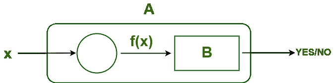
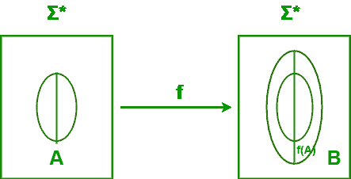

# TOC 中的约简定理

> 原文:[https://www.geeksforgeeks.org/reduction-theorem-in-toc/](https://www.geeksforgeeks.org/reduction-theorem-in-toc/)

**约化定理:**
从 A 到 B 的约化是一个函数

```
                        f : Σ<sub>1* → Σ2* such that For any w ∈ Σ1*, w ∈ A if f(w) ∈ B</sub>
```


如果 R 接受 f(w)如果 f(w)∈ B 如果 w ∈ A，h 接受 w

*   每个 w ∈ A 映射到某个 f(w) ∈ B。
*   每个西∉ A 都映射到某个 f(w) ∉ B。
*   f 不一定是内射或满射的。

**为什么减少很重要？**
如果语言 A 简化为语言 B，我们可以用一个识别器/共识别器/判定器让 B 识别/共识别/判定问题 A。

**如果 A 可约化为 B(A<= B)–**

*   问题 A 很容易简化为问题 B，问题 B 明确指出——问题‘B’至少和问题‘A’一样难。



**或**T2

*   ∀x，x ∈ A，如果 f(x)∈b；其中 f 是从 A 到 B 的多对一的缩减，表示为 **( A < = <sub>m</sub> B )** 。



1.  **A<= B–**问题 A 可简化为问题 B
2.  **A<= m B–**问题 A 是多对一，可简化为问题 B
3.  **A<= m B–**问题 A 可以多项式方式约简为问题 B

**映射约简:**

*   函数 f:σ1 *→σ2 *称为 A 到 B 的映射约简 if 对于任何 w∈σ1 *，w∈A if(w∈B)
*   f 是一个可计算的函数。
*   直觉上，从 A 到 B 的映射约简说，计算机可以将 A 的任何实例转换为 B 的实例，这样 B 的答案就是 A 的答案。

**还原属性:**

*   如果 A<=B，并且 A 是不可判定的，那么 B 也是不可判定的。
*   如果 A<=B，并且 B 是不可判定的，那么 A 不需要是不可判定的。
*   如果 A<=B，并且 A 是可判定的，那么 B 不需要是不可判定的。
*   如果 A<=B，并且 B 是可判定的，那么 A 也是可判定的。
*   如果 A<=B，并且 B 是递归的，那么 A 也是递归的。
*   如果 A<=B，并且 A 是递归的，那么 B 不需要是递归的。
*   如果 A<=B，并且 B 是递归可枚举的，那么 A 也是递归可枚举的。
*   如果 A<=B，并且 A 是递归可枚举的，那么 B 不需要是递归可枚举的。
*   如果 A<=B，B 是 P-问题，那么 A 也是 P-问题。
*   如果 A<=B，并且 A 是 P-问题，那么 B 不需要是 P-问题。
*   如果 A<=B，而 B 是 NP-问题，那么 A 也是 NP-问题。
*   如果 A<=B，并且 A 是 P-问题，那么 B 不需要是 P-问题。
*   如果 A<=B and B<=P，那么 A<=P(传递性)。
*   如果 A<=B and B<=A，那么 A 和 B 是多项式等价的。
*   如果 A<=B 并且 A 不是 REL，那么 B 也不是 REL。
*   如果 A<=B，并且 A 不是 P-问题，那么 B 也不是 P-问题。
*   如果 A<=B 并且 A 不是递归问题，那么 B 也不是递归问题。

**示例–**

1.A:t<sup>4–1——B:T2–1，C : t2 + 1</sup>
在例 1 中，由于 A 是可解的，B、C < A 也是可解的，所以 B 和
C 也是可解的

```
 since, ( t4 - 1 )= ( t2 - 1 ) * ( C : t2 + 1 ) 
```

2.a:L(D)=σ*？——>问题 A 可以归结为 B:L(D1)=σ*–L(D<sub>2)</sub>吗？
在示例中，B 是 A 的子集，因此 A 被简化为问题 B

3.答:L(G) =空吗？——>问题 A 可以化为 B:L(G1)是 L(G2)的子集吗？
如果将上述问题 A 简化为形式更简单的问题 B，那么求解就很容易了。

```
4\. A :  a3 + b3 + 3a2b + 3b2a --------------> A is reduced to B : ( a + b )3 
If A reduces to B and B is “solvable,” then A is “solvable.” 
```

5.将 L <sub>D</sub> 减少至——- > 0* 1*
W <sub>是</sub> =01，W <sub>否</sub> = 10
则减少的 f(w)形式为:f (w)={ 01 如果 w ∈ L <sub>D</sub> ，10 如果 w ∉ L <sub>D</sub>

6.找到等价于语法 G 的简化语法，有产生式规则

```
P : S --> AC | B, A --> a, C --> c | BC, E --> aA | e
```

```
 Phase 1 - T= {a ,c, e},  W1= {A,C,E},   W2= {A,C,E,S},  W3= {A,C,E,S}
           G' = { (A,C,E,S), (A,C,E), P, (s) },  
           P: S --> AC , A --> a, C --> c, E --> aA | e 
 Phase 2 - Y1= {S}  ,  Y2 = {S,A,C}  ,  Y3= {S, A, C, a, c}  ,  YL1 = { S, A, C, a, c }
            G'' = { (A,C,S), (a,c), P, {S} },  
            P: S --> AC , A --> a, C --> c
```

7.**问题 A(难题)–**从新几内亚搬到亚马逊城。
(因为，我们知道从新几内亚到加拿大是一条容易的路)所以，我们将把这个问题简化成一个更容易的问题。

**问题 B(比较容易的问题)–**从加拿大搬到亚马逊城。
所以，很明显，如果我们能找到更容易的问题的解决方案，那么我们就可以用它来解决更难的问题。

8.**给定问题 A : L <sub>1</sub> < =L <sub>2</sub> 和 L<sub>2</sub><= L<sub>3</sub>**–

1.  如果 L <sub>2</sub> 是可判定的，那么–>L<sub>1</sub>是可判定的，L <sub>3</sub> 是可判定的或不可判定的。
2.  如果 L <sub>2</sub> 是不可判定的，那么–>L1 要么是可判定的，要么是不可判定的，L3 是不可判定的。