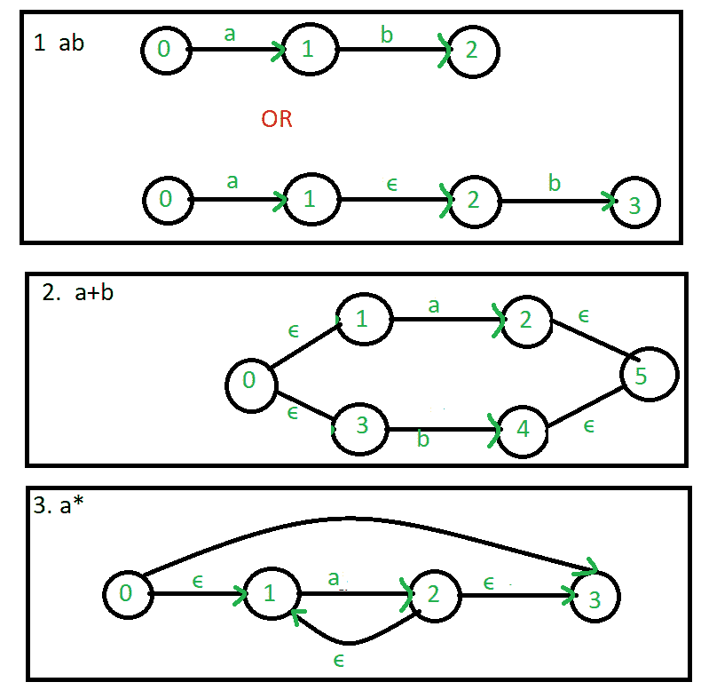
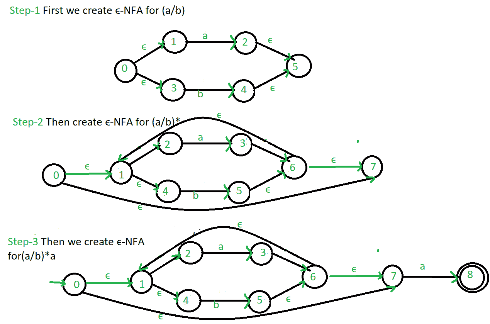

# 正则表达式为∑-NFA

> 原文:[https://www.geeksforgeeks.org/regular-expression-to-nfa/](https://www.geeksforgeeks.org/regular-expression-to-nfa/)

先决条件–[有限自动机简介](https://www.geeksforgeeks.org/toc-finite-automata-introduction/)，[从正则表达式(集合 1)](https://www.geeksforgeeks.org/designing-finite-automata-from-regular-expression/) 设计有限自动机

**∑-NFA**与 NFA 相似，但通过ε移动略有不同。这个自动机用一个允许空字符串∈作为可能输入的函数来代替转换函数。不消耗输入符号的转换称为∑-转换。

在状态图中，它们通常用希腊字母∑标记。∑-transitions 提供了一种对当前状态不精确已知的系统进行建模的方便方法:即，如果我们正在对一个系统进行建模，并且不清楚当前状态(在处理了一些输入字符串之后)应该是 q 还是 q’，那么我们可以在这两个状态之间添加一个∑-transition，从而使自动机同时处于两个状态。

**make∞-NFA 中常用的正则表达式:**

示例:为正则表达式创建∑-NFA:(a/b)* a

参见–[从 NFA 到 DFA 的转换](https://www.geeksforgeeks.org/theory-of-computation-conversion-from-nfa-to-dfa/)、[DFA 的最小化](https://www.geeksforgeeks.org/theory-computation-minimization-dfa/)