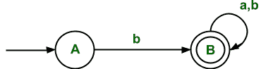
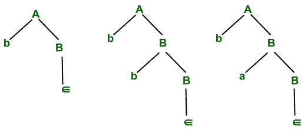
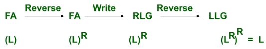
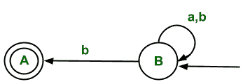
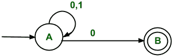
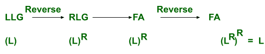
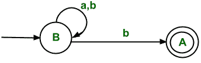
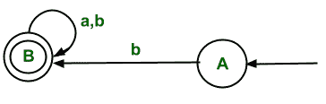
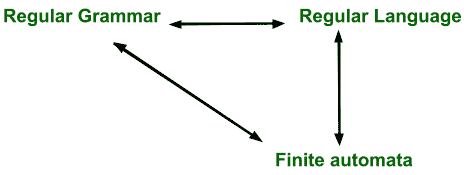

# 常规语法(模型常规语法)

> 原文:[https://www . geesforgeks . org/正则-语法-模型-正则-语法/](https://www.geeksforgeeks.org/regular-grammar-model-regular-grammars/)

**先决条件:** [乔姆斯基层级](https://www.geeksforgeeks.org/chomsky-hierarchy-in-theory-of-computation/)

**Type-3 语法/常规语法:**
常规语法生成常规语言。它们在左侧有一个非终端，在右侧由一个终端或一个终端后跟一个非终端组成。

作品必须采用以下形式–

```
A ⇢ xB 
A ⇢ x
A ⇢ Bx
where A, B ∈ Variable(V) and x ∈ T*  i.e. string of terminals.
```

**常规语法类型:**

*   左线性语法(LLG)
*   右线性语法(RLG)

**1。左线性语法(LLG)–**
在 LLG，如果所有作品都是形式的，那么作品就是形式

```
A ⇢ xB
A ⇢ x
where A,B  ∈ V and x ∈ T*
```

**2。右线性语法(RLG)–**
在 RLG，如果所有作品都是形式的，那么作品就是形式

```
A ⇢ Bx
A ⇢ x
where A,B ∈ V and x ∈ T*
```

由类型 3 语法生成的语言是一种常规语言，可以为其设计一个 FA。FA 也可以转换成类型 3 语法

**示例–**用于接受以 b 开头的字符串的 FA



**。**

```
∑  = {a,b}
Initial state(q0) = A
Final state(F)  = B
```

**FA 对应的 RLG 是**

```
A ⇢ bB 
B ⇢  ∈/aB/bB 
```

上面这个语法是 RLG，可以直接通过 FA 写。



**该语法派生出用 B 表示的字符串**

上面的 RLG 可以导出以 b 开头的字符串，然后任何输入符号(即∑ ={a，b}都可以接受)都可以被接受。

```
The regular language corresponding to RLG is
 L= {b, ba, bb, baa, bab ,bba,bbb ..... }
```

如果我们反转上面 RLG 的上面的生产，那么我们得到

```
A ⇢ Bb  
B ⇢  ∈/Ba/Bb 
It derives the language that contains all the strings which end with b.
i.e. L' = {b, bb, ab, aab, bab, abb, bbb .....}
```

所以我们可以得出结论，如果我们有代表语言 L 的 FA，如果我们把它转换成 RLG，它再次代表语言 L，但是在反转 RLG 之后，我们得到代表语言 L’的 LLG(即 L 的反转)。

**为了将语言 L 的 RLG 转换为 LLG，需要遵循以下程序:**

```
Step 1: Reverse the FA for language L
Step 2: Write the RLG for it.
Step 3: Reverse the right linear grammar.
after this we get the grammar that generates the language that represents the LLG for the same language L.
```



**这表示与上述将 RLG 转换为 LLG 的程序相同**

这里 L 是 FA 的语言，L <sup>R</sup> 是语言 L 的反转
**例–**
上面的 FA 表示语言 L(即输入符号 a 和 b 上以 b 开头的所有字符串的集合)。
我们正在把它改造成 LLG。

**步骤 1–**
FA 的反转是



**表示以 b 开始的所有字符串的 FA 的反转。**

**步骤 2–**
这个反转 FA 对应的 RLG 是

```
B ⇢ aB/bB/bA
A ⇢  ∈
```

**第三步–**
我们得到的是与上面相反的 RLG

```
B ⇢ Ba/Bb/Ab
A ⇢  ∈
```

这是语言 L 的 LLG(代表所有以 b 开头的字符串)。
L= {b，ba，bb，baa，bab，bba，bbb …..}

**RLG 转 FA :**

*   从第一次生产开始。
*   从每一个左字母(或变量)到它后面的符号。
*   **开始状态–**
    将是第一个生产状态。
*   **最终状态–**
    取那些以终端结束而没有其他非终端的状态。

**示例–**
语言的 RLL 语法(L)，表示以 0 结尾的所有字符串的集合。

```
A ⇢ 0A/1B/0B
B ⇢ ∈
```

**所以对应 RLG 的 FA 可以找出**
从变量 A 开始，使用其生产。

*   对于生产 A ⇢ 0A，这意味着在获得输入符号 0 后，转换将保持在相同的状态。
*   对于生产 A ⇢ 1B，这意味着在获得输入符号 1 之后，状态转换将从状态 a 发生到状态 b。
*   对于生产 A ⇢ 0B，这意味着在获得输入符号 1 之后，状态转换将从状态 a 发生到状态 b。
*   对于生产 b⇢∑，这意味着不需要状态转换。这意味着它将是相应 FA 中的最终状态，因为 RHS 是终端。

相应的 RLG 的最终 NFA 是



**以 0 结束的所有字符串的集合**

**LLG 转 FA :**



**说明–**
首先将代表语言(L)的 LLG 转换为代表语言 L 的 RLG(即 L <sup>R</sup> )然后设计与之对应的 FA(即语言 L 的 FA<sup>R</sup>)。然后逆转足总。那么最后的 FA 就是语言 L)的 FA。

**LLG 到 RLG 的转换:**
举个例子，上面的语法代表语言 L(即以 b 开头的所有字符串的集合)
这个语法的 LLG 是

```
B ⇢ Ba/Bb/Ab
A ⇢  ∈
```

**步骤 1–**
将 LLG 转换为 FA(即转换程序同上)



**步骤 2–**
反转 FA(即初始状态转换为最终状态，最终状态转换为初始状态，反转所有边)



**第三步–**
写 RLG 对应逆转 FA。

```
A ⇢  bB
B ⇢ aB/bB/∈
```


**它们可以很容易地转换成其他**



**都有相同的功率，可以转换成其他**