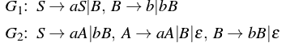
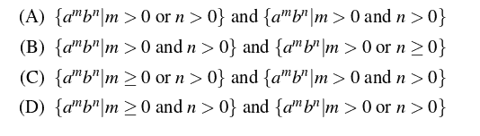
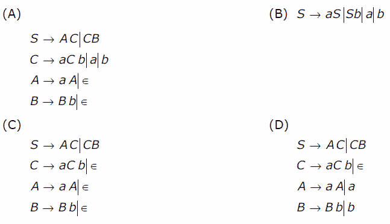

# 计算理论中语法和语言的关系

> 原文:[https://www . geeksforgeeks . org/计算理论中语法和语言之间的关系/](https://www.geeksforgeeks.org/relationship-between-grammar-and-language-in-theory-of-computation/)

语法是一组用于生成语言字符串的生成规则。在本文中，我们讨论了如何找到由语法生成的语言，反之亦然。

### 语法生成的语言–

给定一个语法 G，它对应的语言 L(G)表示从 G 生成的所有字符串的集合。考虑下面的语法，

```
G: S-> aSb|ε
```

在这个语法中，使用 S-> ε，我们可以生成ε。因此，ε是 L(G)的一部分。同样，使用 S=>aSb=>ab，生成 ab。同样，也可以生成 aabb。
因此，

```
L(G) = {anbn, n>=0}
```

在上面讨论的语言 L(G)中，条件 n = 0 被用来接受ε。
**要点–**

*   对于给定的语法 G，其对应的语言 L(G)是唯一的。
*   语法 G 对应的语言 L(G)必须包含所有可以从 G 生成的字符串。
*   语法 G 对应的语言 L(G)不得包含任何不能从 G 生成的字符串。

让我们基于此讨论问题:

**Que-1。**考虑语法:(GATE-CS-2009)

```
S -> aSa|bSb|a|b 
```

以上语法在字母表{a，b}上生成的语言是:
(A)所有回文
(B)所有奇数长度回文的集合。
(丙)以相同符号开始和结束的字符串
(丁)所有偶数长度回文

**解:**使用 S- > a 和 S- > b，可以生成 a 和 b。同样使用 S= > aSa= > aba，可以生成 aba。其他可以从语法中生成的字符串有:a、B、aba、bab、aaa、bbb、abab、…
因此，选项(B)是正确的。

**Que-2。**考虑以下上下文无关语法:(GATE-CS-2016)

以下哪一对语言分别由 G1 和 G2 生成？


**解:**考虑语法 G1:
使用 S= > B= > b，可以生成 B。
使用 S= > B= > bB，可以生成 bB。
使用 S= > aS= > aB= > ab 即可生成。
使用 S =>aS =>aB =>abB =>可以生成 ABb。
我们可以看到，a 的个数可以是零或者更多，但是 b 的个数总是大于零。
因此，

```
L(G1) = {ambn| m>=0 and n>0}
```

考虑语法 G2:
使用 S= > aA= > a，可以生成 a。
使用 S= > bB= > b，可以生成 b。
使用 S= > aA= > aaA= >可以生成 aA。
使用 S= > bB= > bbB= > bb 即可生成。
使用 S =>aA =>Ab =>abB =>可以生成 ABb。

如我们所见，a 或 b 必须大于 0。
因此，

```
L(G2) = {ambn| m>0 or n>0}
```

### 生成给定语言的语法–

给定一种语言 L(G)，它对应的语法 G 代表产生 L(G)的产生规则。考虑语言 L(G):

```
L(G) = {anbn, n>=0}
```

语言 L(G)是一组字符串ε，ab，aabb，aabbb…
对于 L(G)中的ε串，产生规则可以是 S- > ε。
对于 L(G)中的其他字符串，产生式规则可以是 S- > aSb|ε。
因此，语法 G 对应的 L(G)是:

```
S->aSb| ε 
```

**要点–**

*   对于给定的语言 L(G)，可以有多个语法可以产生 L(G)。
*   对应于语言 L(G)的语法 G 必须生成 L(G)的所有可能的字符串。
*   语言 L(G)对应的语法 G 不能生成任何不是 L(G)一部分的字符串。

让我们基于此讨论问题:

**Que-3。**以下哪个语法生成语言 L = {a <sup>i</sup> b <sup>j</sup> | i≠j}？(GATE-CS-2006)


**解决方案:**给定的语言 L 包含以下字符串:

```
{a, b, aa, bb, aaa, bbb, aab, abb…}
```

这意味着字符串必须包含一个或多个数字 a 或一个或多个数字 b 或 a，后跟具有不等数量 a 和 b 的 b。

如果我们考虑选项(A)中的语法，它可以生成 ab 如下:

```
S=>AC=>aAC=>aC=>ab
```

但是 ab 不能由语言 l 生成，因此选项(A)中的语法不正确。

同样，选项(B)中的语法可以生成 ab，如下所示:

```
S=>aS=>ab
```

但是，ab 不能由语言 l 生成，因此，选项(B)中的语法不正确。

同样，选项(C)中的语法可以生成 ab，如下所示:

```
S=>AC=>C=>aCb=>ab
```

但是 ab 不能由语言 l 生成，因此选项(C)中的语法不正确。
因此，采用消去法，选项(D)是正确的。