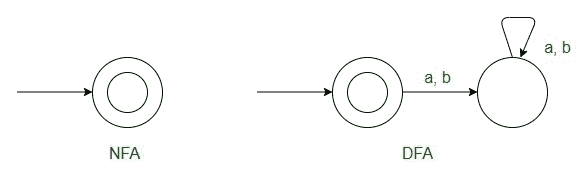
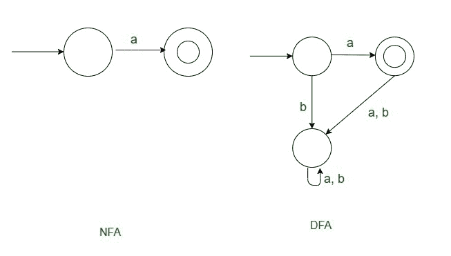
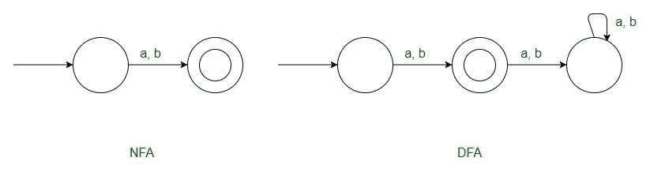
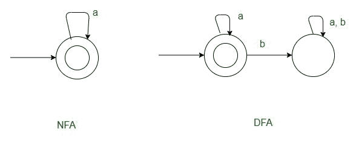
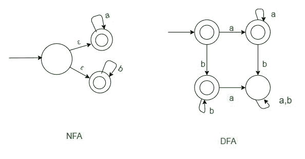
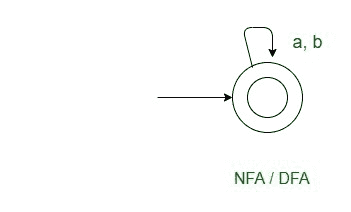

# 语法和语言的关系

> 原文:[https://www . geesforgeks . org/语法和语言之间的关系/](https://www.geeksforgeeks.org/relationship-between-grammar-and-language/)

**先决条件–**[常规语法、常规表达式、](https://www.geeksforgeeks.org/regular-expressions-regular-grammar-and-regular-languages/) [乔姆斯基层次结构](https://www.geeksforgeeks.org/chomsky-hierarchy-in-theory-of-computation/)

**概述:**
在本文中，我们将讨论常规语法的概述可以是右线性的也可以是左线性的，并且主要将重点放在语法和语言的关系上。我们一个一个来讨论。

**类型:**
语法有以下两种类型。

**右线性–**

```
 V->T<sup>*</sup> + T*V , 
 where V - is the variable and T is the set of terminals.
```

**左线性–**

```
 V -> T* + VT* , 
where V - is the variable and T is the set of terminals.
```

**语法与语言的关系:**
有一些模式语法。通过使用它们，我们可以学习为不同的正则语言、正则表达式导出正则语法。

**示例–**
让 r 为正则表达式，对于每个正则表达式，下面给出了对应于特定正则表达式的正则语法。

**Case-1 :**
当 r =φ时，至少我们应该有一个产量。
常规语法–

```
**S→A**
```


**格-2 :**
时时 r = ε，
时常规语法–

```
**S→ε**
```



**Case-3 :**
当 r=a 时，
常规语法–

```
**S→a**
```



**Case-4 :**
当 r=a+b 时，
常规语法–

```
**S→ a | b**
```



**Case-5 :**
当 r = a 时 <sup>*</sup>
右线性语法–

```
**S→aS | ε **
```

左线性语法–

```
**S→Sa | ε**
```



**Case-6 :**
当 r= X 时 <sup>*</sup>
常规语法–

```
S→XS | **ε** 
```

**Case-7 :**
当 r=X×y
右线性语法–

```
 **S→XS | y**
```

**Case-8:**
r = a *+b *
常规语法–

```
 **S → S<sub>1</sub> | S<sub>2</sub>**
 **S1 → aS<sub>1</sub> | ε**
 **S2 → bS<sub>2</sub> | ε**
```

**Case-9 :**
当 r= a*时。b*
**右线性–**

```
 S → aS | S<sub>1</sub>
 S<sub>1</sub> → bS<sub>1</sub> | ε
```

**左线性–**

```
 S → Sb | S<sub>1</sub>
 S<sub>1</sub> → Sa | ε 
```



**Case-10:**
r =(a+b)*

**右线性–**

```
**S→ aS | bS | ε**
```

**左线性–**

```
**S→ Sa | Sb | ε**
```



**病例-11:**T2【r =(a+b)<sup>+</sup>

**右线性–**

```
S→ a | b | aS | bS
```

****左线性–****

```
**S→ a | b | Sa | Sb**
```

******病例-12 :**
r = X*zY*****

```
**Regular grammar : **S→ XS | Sy | z**** 
```

******Case-13:**
r =(X+Y)* z 常规语法:****

```
****S→ XS | YS | z** 
**S → SY | SX | z****
```