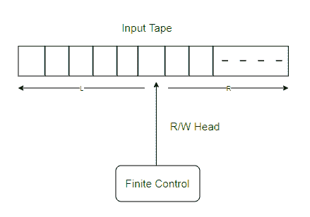

# 受限图灵机

> 原文:[https://www.geeksforgeeks.org/restricted-turing-machines/](https://www.geeksforgeeks.org/restricted-turing-machines/)

在本文中，我们将描述受限图灵机的基本概念，为了基本理解，您可以首先阅读先决条件，这将有助于您清楚地理解主题。

**先决条件–**[图灵机](https://www.geeksforgeeks.org/turing-machine-in-toc/)

*   图灵机接受递归可枚举语言。它比其他任何自动机都更强大，比如 [FA](https://www.geeksforgeeks.org/introduction-of-finite-automata/) 、 [PDA](https://www.geeksforgeeks.org/introduction-of-pushdown-automata/) 和 LBA。它计算部分递归函数。它可以进一步分为确定性图灵机(DTM)或非确定性机器(NTM)。默认情况下，图灵机是 DTM，DTM 和 NTM 的力量是一样的。
*   此计算机充当识别器或接收器以及枚举器。
*   机器被称为接受者，接受或识别输入字母表(∔)上的递归可枚举语言(L)的字符串，机器被称为枚举者，枚举输入字母表上的递归可枚举语言的字符串。

**图–**图灵机

受限制的图灵机可以是以下类型:

1.  **暂停图灵机:**
    如果一个[图灵机](https://www.geeksforgeeks.org/turing-machine-in-toc/)总是为每个输入字符串暂停，那么这个图灵机就是暂停图灵机。它可以接受[递归语言](https://www.geeksforgeeks.org/recursive-and-recursive-enumerable-languages-in-toc/)，功能不如图灵机。

*   **线性有界自动机:**
    它的行为像图灵机，但磁带的存储空间只限于输入字符串的长度。它不如图灵机强大，但比[下推自动机](https://www.geeksforgeeks.org/introduction-of-pushdown-automata/)更强大。*   **单向图灵机:**
    这种类型图灵机的头部只能向一个方向移动。它可以接受唯一的[常规语言](https://www.geeksforgeeks.org/regular-expressions-regular-grammar-and-regular-languages/)。它的威力与[有限自动机](https://www.geeksforgeeks.org/introduction-of-finite-automata/)相当，但不如下推自动机强大。*   **只读图灵机:**
    它相当于有限自动机。它包含一个只读磁头，不具备写入能力。它只接受常规语言。*   **只读单向图灵机:**
    类似于有限自动机。它包含一个只读磁头，只能向一个方向移动。它接受常规语言。