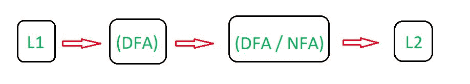
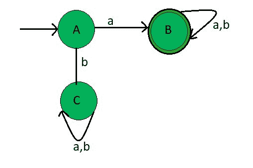
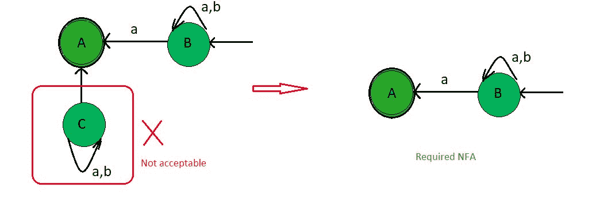
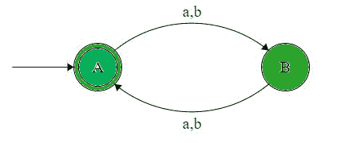
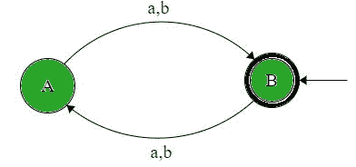

# DFA 中的反转过程

> 原文:[https://www.geeksforgeeks.org/reversal-process-in-dfa/](https://www.geeksforgeeks.org/reversal-process-in-dfa/)

先决条件–[设计有限自动机](https://www.geeksforgeeks.org/designing-finite-automata-from-regular-expression/)
**反转:**反转一种语言意味着反转语言中的每个字符串。

**反转步骤:**

1.  照原样画出各州。
2.  将最终状态作为初始状态，将初始状态作为最终状态
3.  反转边缘
4.  循环将保持不变
5.  移除不适当的转换状态。

**注:**
1。不是每一次 DFA 的反转都会导致 DFA
2。逆转过程是这样的:



让我们借助下面的例子来理解确定性有限自动机中的反转过程。

**示例-1:**
为{a，b}上的字符串集设计一个 DFA，使得语言的字符串以符号“a”开始。将形成所需的语言:

```
L1 = {a, aa, ab, aab, aaabb, aabab, .......} 
```

在 L1，每个字符串都有一个起始元素。L1 语言的状态转换图:



这个 DFA 接受所有以 A 开头的字符串。这里，状态 A 和 C 是正常状态，但是状态 B 是最终状态。现在，颠倒一下 L1 语，它给出了 L2 语的最终结果。

L2 状态转换图(与 L1 相反):



因此，正如我们所看到的，L2 是通过反转过程获得的，这个最终的 NFA 接受了所有包含以符号“a”结尾的字符串的语言。

```
l = {a, ba, bba, ababa, ......}
```

**说明:**

*   与原始状态图中所示的状态相同
*   既然 A 是初始状态，就把它作为最终状态。
*   因为 B 是最终状态，所以把它作为初始状态。
*   反转边，因为以前边指向 A 到 B 和 A 到 C。改变方向，现在边指向 B 到 A 和 C 到 A
*   分配与原始值相同的值。
*   按照原始状态图绘制循环
*   因为在状态 C 上没有入射边缘，所以我们可以减少这个状态 C。
*   因为在状态 A 中‘A’和‘b’没有转换，所以合成的 FA 是 NFA。

**示例-2:**
为{a，b}上的字符串集设计一个 DFA，使得该语言的字符串包含偶数个“a”。将形成所需的语言:

```
L1 = {, aa, aab, aba, aab, aababa, .......}
```

在 L1，每个字符串都有偶数个元素 a。

语言 L1 的状态转换图:



这个 DFA 接受所有包含偶数个元素 A 的字符串，这里，状态 A 是初始状态，状态 A 是最终状态。现在，颠倒一下 L1 语，它给出了 L2 语的最终结果。

L2 状态转换图(与 L1 相反):



因此，正如我们所看到的，L2 是通过反转过程获得的，并且这个最终的 DFA 接受所有包含与原始语言相同的偶数元素 a 的字符串。

```
L2 = {, aa, aab, aba, aab, aababa, .......}
```

**说明:**

*   绘制的状态(A，B)与原始状态图中的状态相同。
*   既然 A 是初始状态，就把它作为最终状态。
*   既然 A 是最终状态，就把它作为初始状态。
*   反转边缘，因为先前的边缘指向 A 到 B 等等。改变方向，现在边指向 B 到 A，以此类推。
*   分配与原始值相同的值。
*   因为“A”和“B”在状态 A 和 B 中有一个转换，所以合成的 FA 是 DFA。
*   因为反转前后的状态图是一样的。因此，L1 = L2