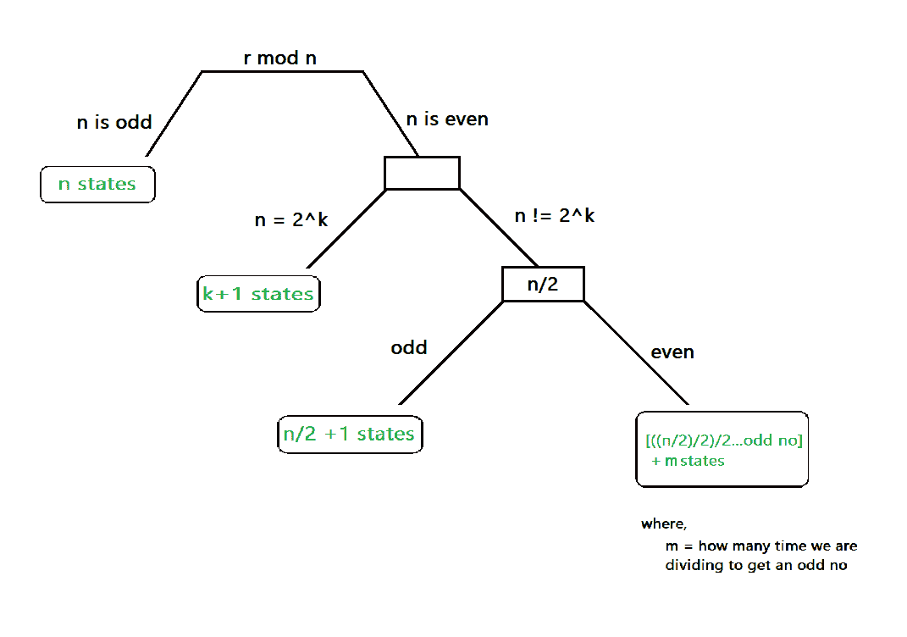

# 在接受所有二进制数集合的 DFA 中查找状态数的小技巧，所有二进制数的模为 n

> 原文:[https://www . geeksforgeeks . org/短技巧查找接受所有二进制数集合的 dfa 中的状态数-n-mod-by-n/](https://www.geeksforgeeks.org/short-trick-to-find-number-of-states-in-dfa-that-accepts-set-of-all-binary-numbers-which-are-mod-by-n/)

假设我们有一个问题:

```
Que: Construct minimal state DFA that accepts set of all binary no. which is 2 mod 5(say)
Ans: 5 states
```

为了解决这些类型的问题，有一种传统的方法来为该问题构建相应的 [DFA](https://www.geeksforgeeks.org/introduction-of-finite-automata/) 。传统方法的问题在于，**耗时**，并非所有人都能**一次性完美构建**[**【DFA】**](https://www.geeksforgeeks.org/introduction-of-finite-automata/)(这将导致错误答案)。

这里有一个技巧可以在几秒钟内解决这类问题。按照下图所示的步骤操作，经过一些练习，它就会出现在你的指尖上。



**步骤:**

1.  如果 n 是奇数，那么状态的最小值就是 n。
2.  如果 n 不是偶数:
    *   检查，如果 n 等于格式 2^k(像 4 = 2^2，8 = 2^3)，其中 k 是任何整数。
    *   如果 n= 2^k.，那么最小状态数将是 k+1。
    *   但是，如果不是 n！= 2^k
        *   检查 n/2 是否为奇数，则最小状态为 n/2+1。
        *   如果 n/2 是偶数，那么就一次又一次地用 2 除 n，直到我们得到一个奇数，然后加上 n 被除的次数，得到奇数[ ((n/2))/2…奇数+ m ]。总和的结果将是最少的状态数。

```
EXAMPLE 1: 2 mod 5 where r=2,n=5
SOLUTION:
1\. 5 is odd 
    Therefore, ans is 5 states (n states)
```

```
EXAMPLE 2: 4 mod 8 where r=4,n=8
SOLUTION:
1\. 8 is even (so it can't be n states)
2\. check n=2^k format
    8=2^3
    Therefore, ans is 4 states(k+1 states)
```

```
EXAMPLE 3: 10 mod 16 where r=10,n=16
SOLUTION:
1\. 16 is even (so it can't be n states)
2\. 16 != 2^k (so it can't be k+1 states)
3\. n/2 is even (16/2=8, so it can't be n/2+1 states)
4\. Divide n by 2 till we get odd no and keep a count on how many times we are dividing
    16/2=8 , m=1
    8/2=4 , m=2
    4/2=2 , m=3
    2/2=1 ,m=4   (odd found)
    Therefore answer is 5 states (odd + m states)
```