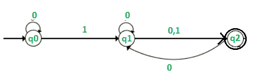
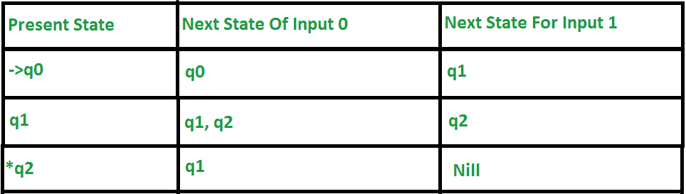
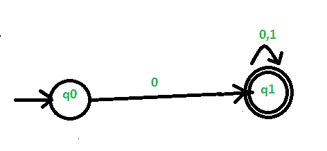
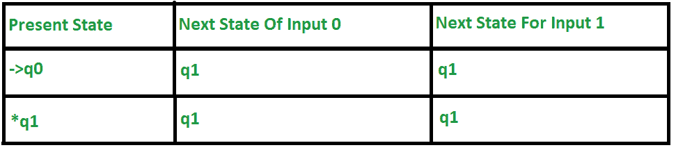
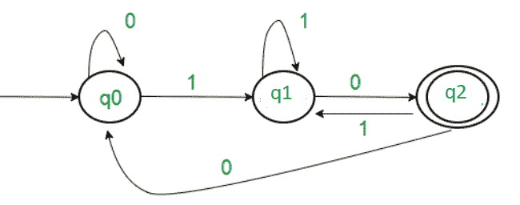
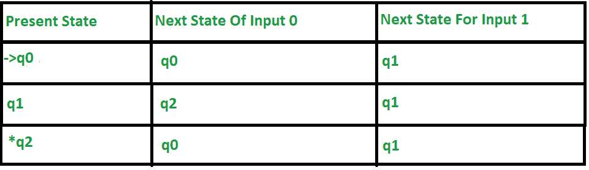
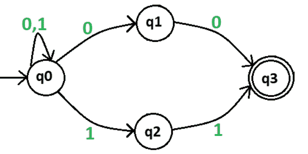
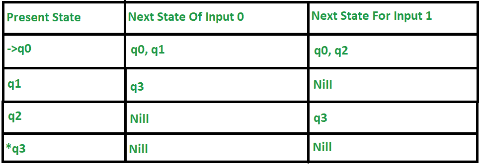

# 自动机中的转换表

> 原文:[https://www.geeksforgeeks.org/transition-table-in-automata/](https://www.geeksforgeeks.org/transition-table-in-automata/)

**转换表:**
转换 function(∂)是一个将 Q * ∑映射为 q 的函数，这里的‘q’是状态集，‘∑’是字母的输入。为了显示这个转换函数，我们使用了称为转换表的表。该表接受两个值一个状态和一个符号，并返回下一个状态。

过渡表提供了以下信息–

1.  行代表不同的状态。
2.  列代表输入符号。
3.  条目代表不同的下一个状态。
4.  最终状态由一个星形或双圆形表示。
5.  开始状态总是用一个小箭头表示。

**示例 1–**
该示例显示了 NFA(非确定性有限自动机)的转换表。

**上表解释–**

1.  第一列表示所有当前状态，下一列分别表示输入 0 和 1。
2.  当前状态为 q0 时，对于输入 0，下一个状态将变为 q0。对于输入 1，下一个状态是 q1。
3.  当前状态为 q1 时，输入 0 的下一个状态为 q1 或 q2，输入 1 的下一个状态为 q2。
4.  当输入 0 的当前状态为 q2 时，下一个状态将变为 q1，对于 1 输入，下一个状态将变为 Nil。
5.  q0 上的小直箭头表示它是开始状态，q3 上的圆圈表示它是最终状态。

**例子 2–**
这个例子展示了 DFA(确定性有限自动机)的转移表。

**上表解释–**

1.  第一列表示所有当前状态，下一列分别表示输入 0 和 1。
2.  当前状态为 q0 时，对于输入 0，下一个状态将变为 q1，对于输入 1，下一个状态为 q1。
3.  当前状态为 q1 时，对于输入 0，下一个状态将变为 q1，对于 1 输入，下一个状态为 q1。
4.  q0 上的小直箭头表示它是开始状态，q3 上的圆圈表示它是最终状态。

**例子 3–**
这个例子展示了 DFA(确定性有限自动机)的转移表

**上表解释–**

1.  第一列表示所有当前状态，下一列分别表示输入 0 和 1。
2.  当前/当前状态为 q0 时，对于输入 0，下一个状态将变为 q0，对于输入 1，下一个状态为 q1。
3.  当前状态为 q1 时，在输入 0 上，下一个状态将变为 q2，对于 1 输入，下一个状态为 q1。
4.  当输入 0 的当前状态为 q2 时，下一个状态将变为 q0，对于 1 输入，下一个状态为 q1。
5.  q0 上的小直箭头表示它是开始状态，q3 上的圆圈表示它是最终状态。

**示例 4–** **此示例显示了 NFA 的过渡表(非确定性有限自动机)。**

**
**

****上表解释–****

1.  **第一列表示所有存在的状态，下一列分别表示输入 0 和 1。**
2.  **当前状态为 q0 时，对于输入 0，下一个状态将变为 q0 或 q1，对于输入 1，下一个状态为 q0 或 q2。**
3.  **当前状态为 q1 时，输入 0 的下一个状态将变为 q3，输入 1 的下一个状态为 Nil，因为输入 1 没有状态。**
4.  **当输入 0 的当前状态为 q2 时，下一个状态将变为 nil，因为输入 0 没有状态，对于 1 输入，下一个状态将变为 q3。**
5.  **当输入 0 的当前状态为 q3 时，下一个状态将变为 nil，因为输入 0 没有状态，对于 1 输入，下一个状态也将变为 nil，因为输入 1 没有状态。**
6.  **q0 上的小直箭头表示它是开始状态，q3 上的圆圈表示它是最终状态。**

****注意–**DFA 和 NFA 都可以有多个最终状态，但初始状态是唯一的。**