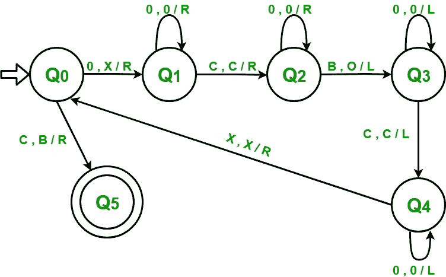

# 加法图灵机

> 原文:[https://www.geeksforgeeks.org/turing-machine-addition/](https://www.geeksforgeeks.org/turing-machine-addition/)

先决条件–[图灵机](https://www.geeksforgeeks.org/turing-machine/)
一个数字在不同的有限自动机中以二进制格式表示，如 5 表示为(101)，但在使用图灵机进行加法的情况下，遵循一元格式。在一元格式中，数字由全 1 或全 0 表示。例如，5 将由五个 0 或五个 1 的序列表示。5 = 1 1 1 1 1 或 0 0 0 0 0。让我们用零来表示。

对于使用图灵机添加 2 个数字，这两个数字都作为图灵机的输入给出，用“c”分隔。

**示例–**(2+3)将显示为 0 0 c 0 0 0:

```
Input  :  0 0 c 0 0 0    // 2 + 3
Output :  0 0 0 0 0      // 5

Input  :  0 0 0 0 c 0 0 0  // 4 + 3
Output :  0 0 0 0 0 0 0    // 7
```

**使用的方法–**
将第一个数字中的 0 转换为 X，然后遍历整个输入，并将遇到的第一个空格转换为 0。然后向左移动，忽略所有的 0 和 c。来到 X 旁边的位置，然后重复同样的过程，直到我们返回时得到一个“c”而不是 X。将 c 转换为空白，加法完成。

**步骤–**

**步骤-1:** 将 0 转换为 X，转到步骤 2。如果符号为“c”，则将其转换为空白(B)，向右移动并转到步骤 6。

**第二步:**继续忽略 0，向右移动。忽略“c”，向右移动并转到步骤 3。

**第三步:**继续忽略 0，向右移动。将一个空白(B)转换为 0，向左移动并转到步骤-4。

**第 4 步:**继续忽略 0，向左移动。忽略“c”，向左移动并转到步骤 3。

**第五步:**继续忽略 0，向左移动。忽略一个 X，向右移动并转到步骤 1。

**第 6 步:**结束。

