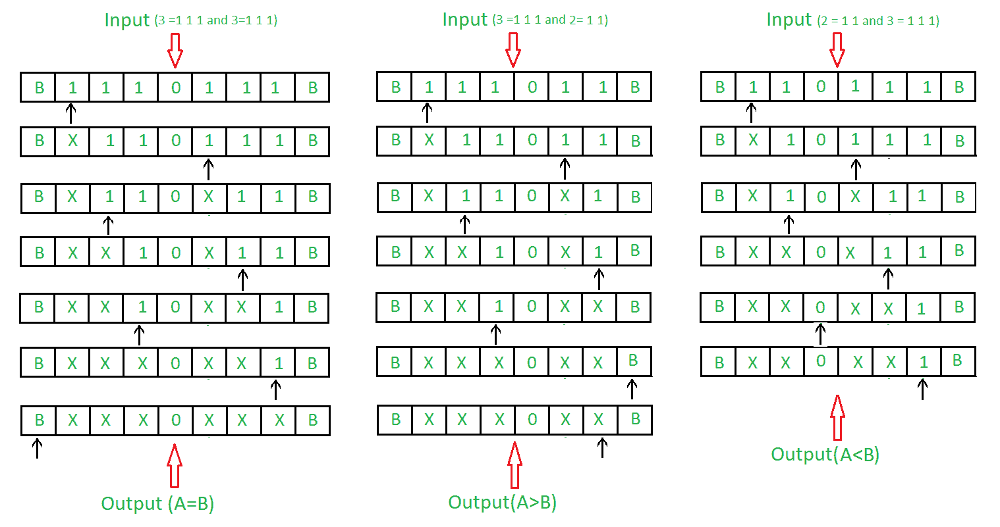
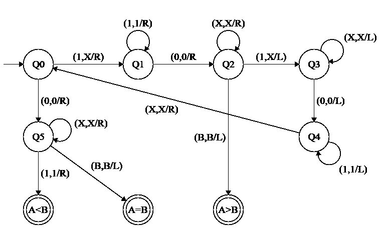

# 图灵机作为比较器

> 原文:[https://www.geeksforgeeks.org/turing-machine-as-comparator/](https://www.geeksforgeeks.org/turing-machine-as-comparator/)

先决条件–[图灵机](https://www.geeksforgeeks.org/turing-machine/)

**问题:**画一个比较两个数的图灵机。使用一元格式表示数字。例如，4 由
代表

```
4 = 1 1 1 1  or 0 0 0 0 
```

让我们用自己的来表示。

**示例:**



**进场:**

1.  通过比较 1 的数量来比较两个数字。
2.  通过标记“X”来比较“1”。
3.  如果“0”的左边还有“1”，则第一个数字更大。
4.  如果“1”在“0”的右边，则第二个数字更大。
5.  如果两个“1”都完成了，那么两个数字都相等。

**步骤:**

*   **步骤-1:** 将 1 转换为 X，向右移动，转到步骤 2。如果符号为 0，忽略它，向右移动并转到步骤 6。

*   **第二步:**继续忽略 1，向右移动。忽略 0 向右移动并转到步骤 3。
*   **第三步:**继续忽略 X，向右移动。忽略 1 向左移动，转到步骤 4。如果找到 B，忽略它，向左移动，转到步骤 9。
*   **第 4 步:**继续忽略 X，向左移动。忽略 0 向左移动并转到步骤-5。
*   **第五步:**继续忽略 1，向左移动。忽略 X 向右移动，转到步骤 1。
*   **第 6 步:**继续忽略 X，向右移动。如果找到 B，忽略它，向左移动，转到步骤 8。如果发现 1，忽略它，向右移动并转到步骤 7。
*   **第 7 步:**停止机器(A < B)
*   **第 8 步:**停止机器(A > B)
*   **步骤-9:** 停止机器(A = B)

**状态转移图:**

*   **A<B**的比较器
*   **A = B 的比较器**
*   **A>B**的比较器
*   **A<B 的通用比较器，A = B，A>B**T2】



这里 **Q0** 表示初始状态， **Q2，Q3，Q4，Q5** 表示过渡状态， **(A < B)、(A = B)和(A > B)** 表示最终状态。0，1 是使用的变量，R，L 表示右和左。

**说明:**

*   使用 Q0，当发现 1 时，使其为 X，向左移动，进入 Q1 状态。如果发现 0，则向右移动到 Q5 状态。
*   在 Q1 州，忽略所有 1，转到右侧。如果发现 0，忽略它，直接进入下一个州 Q2。
*   在 Q2，忽略所有 X 并向右移动。如果发现 B，停止执行，您将进入显示 A > B 的状态，如果发现 1，使其向左移动并移动到 Q3。
*   在 Q3 状态下，忽略所有 X 并向左移动。如果发现 0，忽略它，向左移动到 Q4。
*   在第 4 季度，忽略所有 1 并向左移动。如果发现 X，忽略它，向右移动。
*   在 Q5 状态下，忽略所有 X，向右移动。如果发现 1 忽略它向右移动并停止机器，它将给出 A < B 的结果。如果发现 B 向左移动并停止机器，它将给出 A = B 的结果