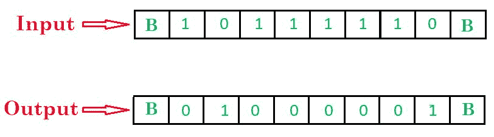
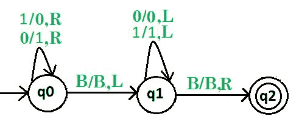
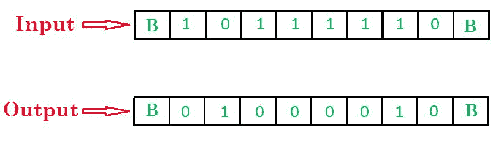
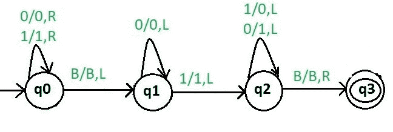

# 1 和 2 补码图灵机

> 原文:[https://www . geesforgeks . org/turing-machine-for-1s-2s-complete/](https://www.geeksforgeeks.org/turing-machine-for-1s-and-2s-complement/)

先决条件–[图灵机](https://www.geeksforgeeks.org/turing-machine/)、[二进制数的 1 和 2 补码](https://www.geeksforgeeks.org/1s-2s-complement-binary-number/)

### 问题 1:

画一个图灵机，找出二进制数的 1 的补码。

*一个二进制数的 1 的补码*是另一个二进制数，通过切换其中的所有位获得，即将 0 位转换为 1，将 1 位转换为 0。

**示例:**

**进场:**

1.  从左到右扫描输入字符串
2.  将 1 转换为 0
3.  将 0 转换为 1
4.  当到达 BLANK 时，将头部移到起点。

**步骤:**

*   **第一步。**将所有 0 转换为 1，将所有 1 转换为 0，如果发现 B，则向右，如果发现 B，则向左。
*   **第 2 步。**然后忽略 0 和 1，向左走&如果发现 B，向右走
*   **第三步。停止机器。**

这里 **q0** 表示初始状态， **q1** 表示过渡状态， **q2** 表示最终状态。
和 0，1 是使用的变量，R，L 表示左右。

**说明:**

*   状态 q0 将“1”替换为“0”，将“0”替换为“1”，并向右移动。
*   到达空白时，向左移动。
*   使用状态“q2”，我们到达字符串的开头。
*   当到达 BLANK 时，向右移动并到达最终状态 q2。

#### 问题 2:

画一个图灵机，找出二进制数的 2 的补码。

*二进制数的 2 补码*是将 1 加到二进制数的 1 补码上。

**示例:**

**进场:**

1.  从右向左扫描输入字符串
2.  通过所有连续的 0
3.  当第一个“1”到来时，什么也不要做
4.  之后，将 1 转换为 0 并将 0 转换为 1
5.  到达 BLANK 时停止。

**步骤:**

*   **第一步。**首先忽略所有 0 和 1，向右走&然后如果发现 B，向左走。
*   **第 2 步。**然后忽略所有 0，向左走，如果发现 1，向左走。
*   **第三步。**将所有 0 转换为 1，将所有 1 转换为 0，然后向左&如果发现 B，向右**停止机器。**

这里 **q0** 表示初始状态， **q1 和 q2** 表示过渡状态， **q3** 表示最终状态。
和 0，1 是使用的变量，R，L 表示左右。

**说明:**

*   使用状态“q0”，我们到达字符串的末尾。
*   到达空白时，向左移动。
*   使用状态“q1 ”,我们通过所有 0 并向左移动，直到找到第一个 1。
*   传递单个“1”并向左移动。
*   使用状态“q2”，我们对每个数字进行补码并向左移动。
*   当到达 BLANK 时，向右移动并到达最终状态 q2。