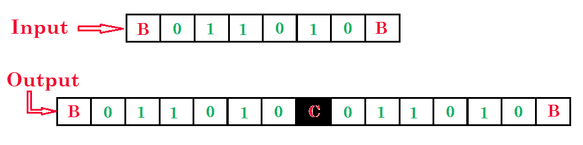
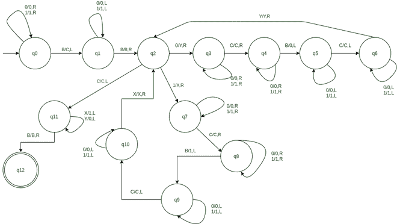

# 复制数据的图灵机

> 原文:[https://www . geesforgeks . org/图灵机复制数据/](https://www.geeksforgeeks.org/turing-machine-for-copying-data/)

先决条件–[图灵机](https://www.geeksforgeeks.org/turing-machine/)
**问题–**画一个复制数据的图灵机。

**示例–**

步骤:

*   **第一步。**首先将所有 0、1 转换成 0、1，然后向右走，然后将 B 转换成 C，再向左走

*   **第 2 步。**然后将所有 0，1 转换成 0，1，然后向左走

*   **第三步。**如果 1 把它转换成 X 然后向右走把所有 0，1 转换成 0，1 然后向右走然后把 C 转换成 C 然后向右走然后把所有 0，1 转换成 0，1 然后向右走然后把 B 转换成 1 然后向左走然后把所有 0，1 转换成 0，1 然后向左走然后把 C 转换成 C 然后向左走然后把所有 0，1 转换成 0，1 然后向左走然后把所有 X 转换成 X 和
*   **第 4 步。**如果 0，然后转换成 Y，向右走，然后将所有 0，1 转换成 0，1，向右走，然后将 C 转换成 C，向右走，然后将所有 0，1 转换成 0，1，向右走，然后将 B 转换成 0，向左走，然后将所有 0，1 转换成 0，1，向左走，然后将 C 转换成 C，向左走，然后将所有 0，1 转换成 0，1，向左走，然后将所有 Y 转换成
*   **第 5 步。**否则，如果找到 C，将其转换为 C，然后向左，将所有 X 转换为 1，将所有 Y 转换为 0，然后向左，将 B 转换为 B，然后向右，**停止机器。**

复制数据的图灵机

这里 **q0** 表示初始状态 **q1，q2，…..，q9，q11** 为过渡状态， **q12** 为最终状态。
0，1 是机器内部的数据，X，Y，C 是用于复制数据的变量，R，L 表示左右。