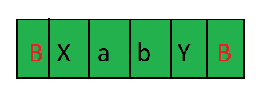
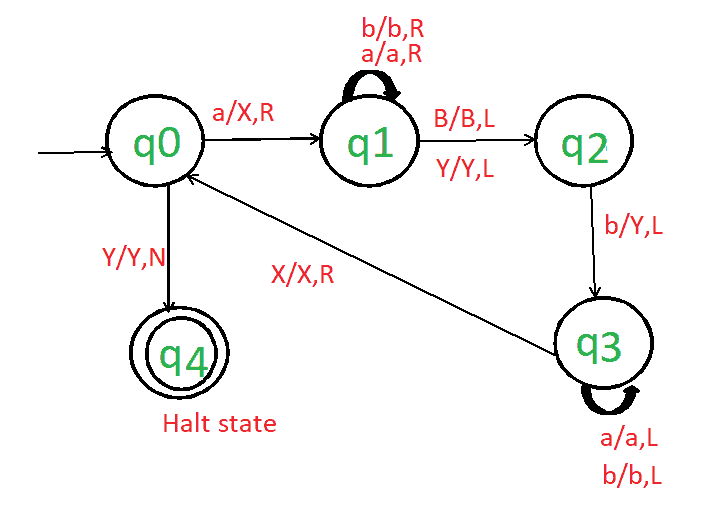

# 图灵机为 L = {a^n b^n | n > =1}

> 原文:[https://www . geesforgeks . org/turing-machine-for-l-an-bn-n1/](https://www.geeksforgeeks.org/turing-machine-for-l-an-bn-n1/)

先决条件–[图灵机](https://www.geeksforgeeks.org/turing-machine-in-toc/)

**任务:**

我们必须为 a <sup>n</sup> b <sup>n</sup> 设计图灵机，其中 n > =1。

**分析:**

我们可以分析，我们有相等数量的 a 和 b，并且按照某种顺序，即首先所有的 a 都会出现，然后所有的 b 都会出现。

**示例:**

```
Input-1:aabb
Output-1:YES

Input-2:aabbbb
Output-2:NO

Input-3:abab
Output-3:NO

```

**进场:**

让我们以“aabb”为例来理解这种方法。

*   从左侧扫描输入。
*   首先，用“X”替换“a”，然后向右移动。然后跳过所有的 a 和 b，向右移动。
*   当指针到达空白时，空白将保持空白，指针向左转动。现在，它从右侧扫描输入，并将第一个“b”替换为“Y”。我们的图灵机看起来像这样–



*   指针再次到达空白(B)或 x。它现在从左到右扫描输入。指针向前移动，并用“X”替换“a”。
*   指针再次到达空白(B)或 y。它现在从右向左扫描输入。指针向前移动，并用“y”替换“b”。
*   我们重复同样的步骤，直到我们把所有的 a 转换成 X，b 转换成 Y。
*   当所有的 a 都转换成 X，所有的 b 都转换成 Y 时，我们的机器就会停止运转。

