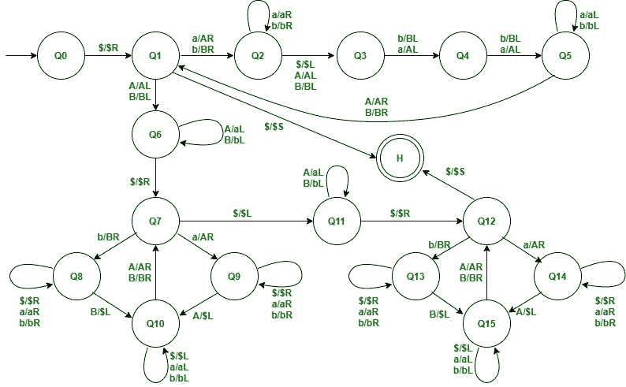

# 语言图灵机{ www | w∑{ a，b} }

> 原文:[https://www . geesforgeks . org/图灵-机器换语言-www-w-a-b/](https://www.geeksforgeeks.org/turing-machine-for-language-www-w-a-b/)

先决条件–[图灵机](https://www.geeksforgeeks.org/turing-machine-in-toc/)
为连续恰好包含 3 次 w 重复的字符串设计图灵机。

**使用的方法:**
首先，我们将找到第一个 w 和第二个 w 的分离位置。
现在，我们将匹配第一个和第二个 w。如果两者都匹配，那么第二个 w 字符串将转换为$字符串。

然后，我们将匹配第一个和第三个 w。如果两者都匹配，那么第三个 w 字符串将转换为$字符串。如果字符串达到暂停状态，那么它被接受。

**示例–**

```
Input: ababab
Output: Accepted
Input: abbabbabb
Output: Accepted
Input: ^ (Empty string)
Output: Accepted
Input: aba
Output: Not accepted 
```

**Step-1:**
如果符号为$，则替换为$并向右移动。

去 Q1 州，第二步。

**第 2 步:**
如果符号是 A，则替换为 A 并向右移动，或者

如果符号是 B，用 B 代替，然后向右移动。

去 Q2 州，第三步。

————————————————-

如果符号是 A，则用 A 替换它并向左移动，或者

如果符号是 B，用 B 替换，然后向左移动。

转到状态 Q6 和步骤 7。

————————————————-

如果符号为$，则替换为$，并且字符串被接受。

转到最终状态 h。

**第三步:**
如果符号是 a，则替换为 a 并向右移动，保持相同的状态，或者

如果符号是 b，用 b 代替，向右移动，保持相同的状态。

————————————————

如果符号是 A，将其替换为 A 并向左移动，或者

如果符号是 B，将其替换为 B 并向左移动，或者

如果符号是$请用$替换它，然后向左移动。

转至状态 Q3 和步骤 4。

**第 4 步:**
如果符号是 A，将其替换为 A 并向左移动，或者

如果符号是 B，用 B 替换它并向左移动，

转到状态 Q4 和步骤 5

**第 5 步:**
如果符号是 A，将其替换为 A 并向左移动，或者

如果符号是 B，用 B 替换它并向左移动，

转到状态 Q5 和步骤 6

**Step-6:**
如果符号是 a，将其替换为 a 并向左移动，保持相同的状态，或者

如果符号是 b，用 b 代替，向左移动，保持同样的状态。

————————————————

如果符号是 A，则将其替换为 A 并向右移动，或者

如果符号是 B，将其替换为 B 并向右移动，或者

去 Q1 州，第二步。

**Step-7:**
如果符号为 A，则替换为 A 并向左移动，保持相同状态，或者

如果符号是 B，用 B 替换它并向左移动，保持相同的状态

————————————————-

如果符号 if $，将其替换为$并向右移动。

转至状态 Q7 和步骤 8。

**Step-8:**
如果符号是 A，则替换为 A 并向右移动。

进入状态 Q9 和步骤 10。

————————————————–

如果符号是 B，用 B 代替，然后向右移动。

转至状态 Q8 和步骤 9。

————————————————–

如果符号是$，则替换为$并向左移动。

进入状态 Q11 和步骤 12。

**Step-9:**
如果符号是 a，将其替换为 a 并向右移动，保持相同的状态，或者

如果符号是 b，将其替换为 b 并向右移动，保持相同的状态，或者

如果符号是$,用$

————————————————–

如果符号是 B，则替换为$并向左移动。

进入状态 Q10 和步骤 11。

**Step-10:**
如果符号是 a，将其替换为 a 并向右移动，保持相同的状态，或者

如果符号是 b，将其替换为 b 并向右移动，保持相同的状态，或者

如果符号是$，用$替换它并向右移动，保持在相同的状态。

————————————————–

如果符号是 A，则替换为$并向左移动。

进入状态 Q10 和步骤 11。

**Step-11:**
如果符号是 a，将其替换为 a 并向左移动，保持相同的状态，或者

如果符号是 b，将其替换为 b 并向左移动，保持相同的状态，或者

如果符号是$，则替换为$并向左移动。

————————————————–

如果符号是 A，则将其替换为 A 并向右移动，或者

如果符号是 B，用 B 代替，然后向右移动。

转至状态 Q7 和步骤 8。

**Step-12:**
如果符号为 A，则替换为 A 并向左移动，保持相同状态，或者

如果符号是 B，用 B 代替，向左移动，保持同样的状态。

————————————————–

如果符号是$，则替换为$并向右移动。

转到状态 Q12 和步骤 13。

**Step-13:**
如果符号是 A，则替换为 A 并向右移动。

转到状态 Q14 和步骤 15。

————————————————–

如果符号是 B，用 B 代替，然后向右移动。

转到状态 Q13 和步骤 14。

————————————————–

如果符号为$，则替换为$，并且字符串被接受。

转到最终状态 h。

**Step-14:**
如果符号是 a，则替换为 a 并向右移动，保持相同的状态，或者

如果符号是 b，将其替换为 b 并向右移动，保持相同的状态，或者

如果符号是$，用$替换它并向右移动，保持在相同的状态。

————————————————–

如果符号是 B，则替换为$并向左移动。

转到状态 Q15 和步骤 16。

**Step-15:**
如果符号是 a，将其替换为 a 并向右移动，保持相同的状态，或者

如果符号是 b，将其替换为 b 并向右移动，保持相同的状态，或者

如果符号是$，用$替换它并向右移动，保持在相同的状态。

————————————————–

如果符号是 A，则替换为$并向左移动。

转到状态 Q15 和步骤 16。

**Step-16:**
如果符号是 a，将其替换为 a 并向左移动，保持相同的状态，或者

如果符号是 b，将其替换为 b 并向左移动，保持相同的状态，或者

如果符号是$，则替换为$并向左移动。

————————————————–

如果符号是 A，则将其替换为 A 并向右移动，或者

如果符号是 B，用 B 代替，然后向右移动。

转到状态 Q12 和步骤 13。



**符号的含义-**

```
R- move right

L- move left

a- character a

b- character b

A- character A

B- character B 
```

**例:**
我们要测试图灵机的一个字符串“ababab”。

```
-> $ababab$ 
-> $Ababab$ 
-> $AbabaB$ 
->$AbabAB$ 
-> $ABabAB$ 
-> $ABaBAB$ 
-> $ABABAB$ 
-> $AbABAB$ 
-> $abABAB$ 
-> $AbABAB$ 
-> $Ab$BAB$ 
-> $AB$BAB$ 
-> $AB$AB$ 
-> $Ab$AB$ 
-> $ab$AB$ 
-> $Ab$AB$ 
-> $Ab$$B$ 
-> $AB$$B$ 
-> $AB$$$ (Accepted) 
```