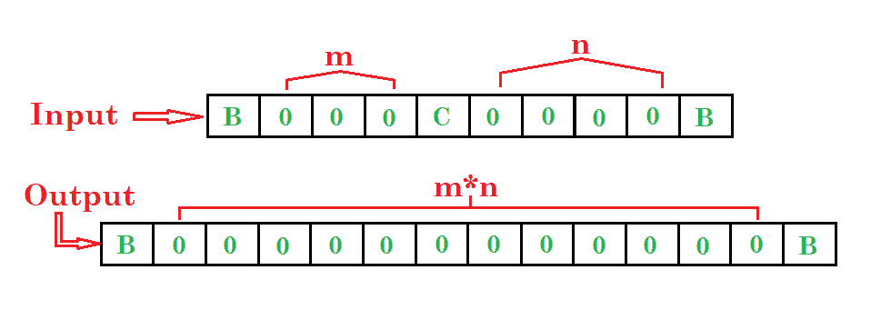
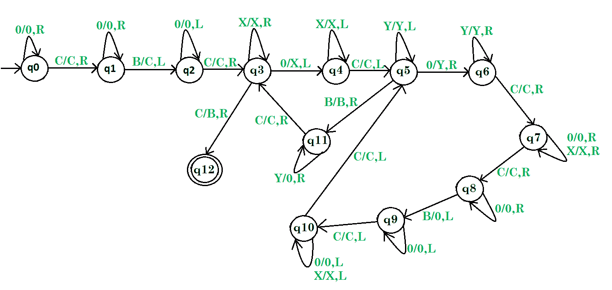

# 乘法图灵机

> 原文:[https://www . geeksforgeeks . org/图灵机换乘法/](https://www.geeksforgeeks.org/turing-machine-for-multiplication/)

先决条件–[图灵机](https://www.geeksforgeeks.org/turing-machine/)
**问题:**画一个两个数相乘的图灵机。

**示例:**

步骤:

*   **第一步。**先忽略 0，C，往右&然后如果 B 找到了就转换成 C，往左。
*   **第 2 步。**然后忽略 0 向左走&然后将 C 转换为 C 向右走。
*   **第三步。**然后把所有的 X 都转换成 X，如果找到 0 就往右，转换成 X 再往左，否则如果找到 C 就转换成 B 再往右**停机。**
*   **第 4 步。**如果找到了 X，把它转换成 X，然后向左走，然后 C 变成 C，然后向左走，然后 Y 变成 Y，然后向左走。
*   **第 5 步。**然后如果找到 B，将其转换为 B 和右，然后如果 Y 转换为 0 和右，或者如果 C 转换为 C 和右，则转到步骤 3 并重复该过程，否则如果在第 4 步后找到 0，则将其转换为 Y 和右，然后 Y 转换为 Y 和右，然后 C 转换为 C 和右，然后 0 转换为 0 或 X 转换为 X 和右，然后 C 转换为 C 和右，然后 0 转换为 0 和 右然后 B 变成 0 然后左然后 0 变成 0 然后左然后 C 变成 C 然后左然后 0 变成 0 或者 X 变成 X 然后左然后 C 变成 C 然后左。
*   **第 6 步。**然后重复第五步。

这里 **q0** 表示初始状态 **q1，q2，…..，q10，q11** 为过渡状态， **q12** 为最终状态。
和 X，Y，0，C 是用于乘法的变量，R，L 表示左右。