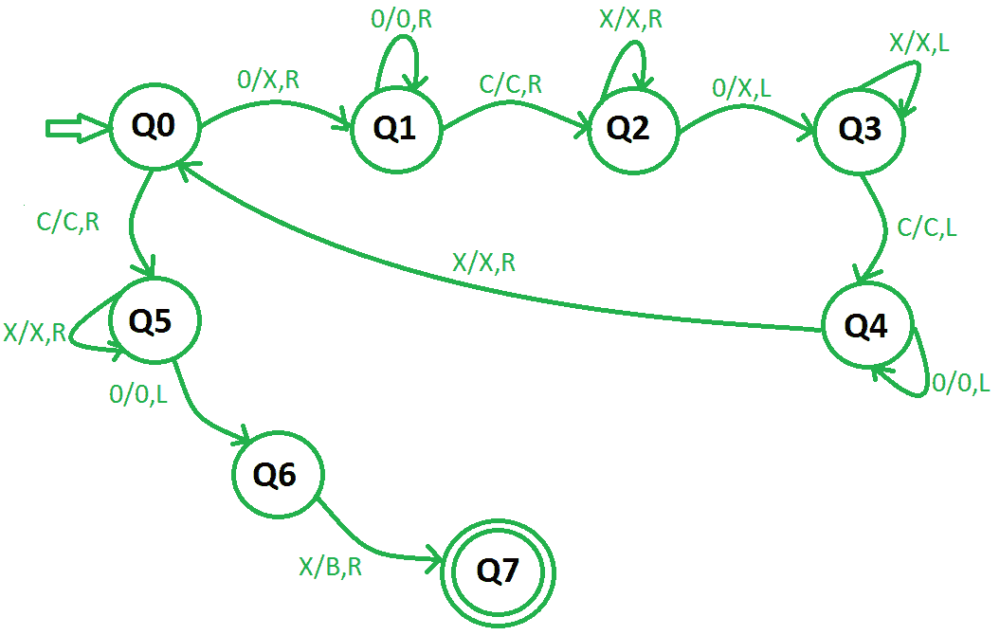

# 减法图灵机|第二套

> 原文:[https://www . geeksforgeeks . org/图灵机减法-set-2/](https://www.geeksforgeeks.org/turing-machine-for-subtraction-set-2/)

先决条件–[图灵机](https://www.geeksforgeeks.org/turing-machine/)、[用于减法的图灵机|集合 1](https://www.geeksforgeeks.org/turing-machine-for-subtraction/)
在不同的有限自动机中，数字以二进制格式表示，如 5 表示为(101)，但在减法的情况下，图灵机遵循一元格式。在一元格式中，数字由全 1 或全 0 表示。

例如，5 将由五个 1 的序列表示 5 = 1 1 1 1 1 或 0 0 0 0 0。让我们用零来表示。对于使用图灵机进行的数字减法，这两个数字都作为图灵机的输入，用“c”分隔。

**示例–**(3–4)或(4–3)将显示为 0 0 0 c 0 0 0 0

```
Input:  0 0 0 c 0 0 0 0  // (3 - 4) or (4 - 3)
Output:  0              // (1)
```

**使用的方法–**
将第一个数字中的 0 转换为 X，然后向右移动，继续忽略 0 和“c”，然后将第一个 0 作为 X 并向左移动。现在继续忽略 0、X 和“c”，在找到第二个零后，重复相同的过程，直到左手边的所有零都变成 X。现在向右移动，将遇到的最后一个 X 转换为 B(空白)。

**步骤–**

**步骤 1–**将 0 转换为 X，向右移动，然后转到步骤 2。如果符号是“c ”,则向右移动忽略它并转到步骤 6。
**第二步–**继续忽略 0，向右移动。忽略“c”，向右移动并转到步骤 3。
**第三步–**继续忽略 X，向右移动。将遇到的第一个 0 转换为 X，然后向左移动并转到步骤 4。
**第 4 步–**继续忽略左侧所有的 X 和“c”，转到第 5 步。
**步骤 5–**继续向左移动，忽略 0，当找到第一个 X 时，忽略它并向右移动，然后转到步骤 1。
**第 6 步–**继续忽略所有的 X，向右移动。忽略遇到的第一个 0，向左移动，然后转到步骤 7。
**步骤 7–**将 X 转换为 B(空白)并转到步骤 8。
**第 8 步–**结束。

