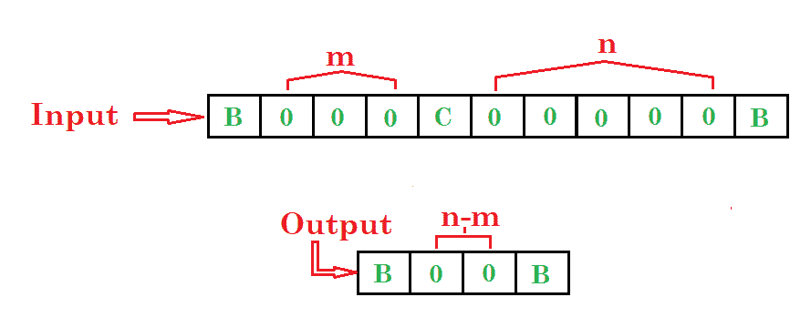
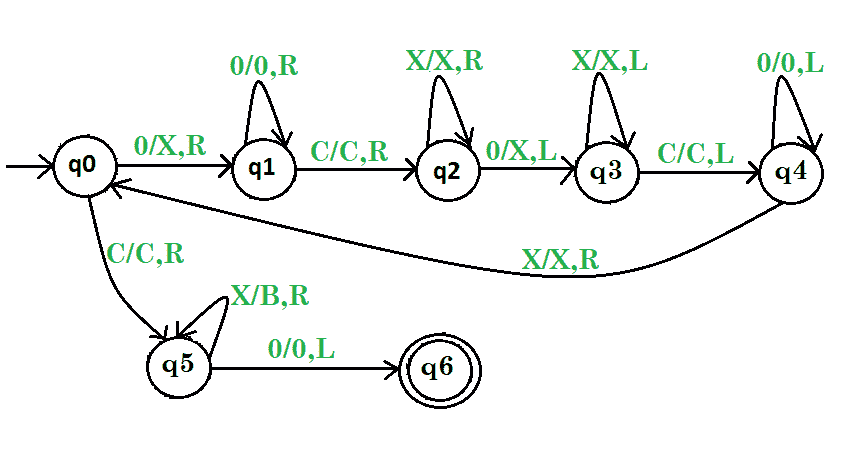
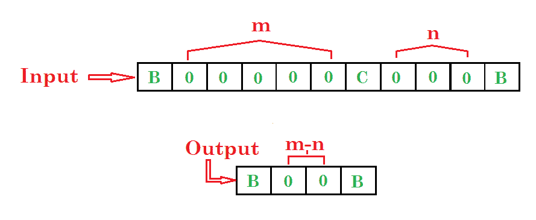
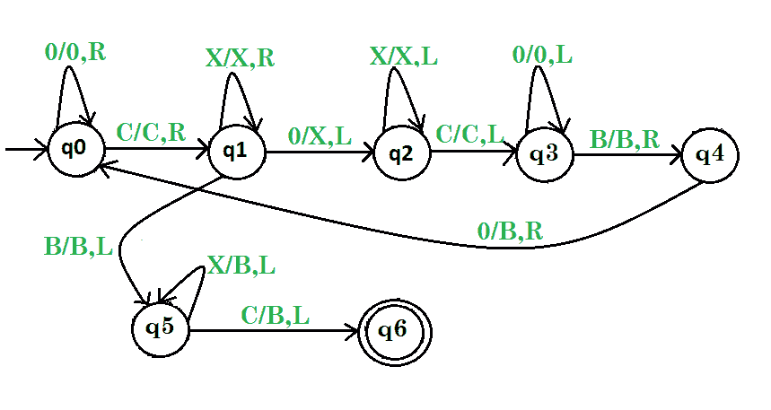

# 减法图灵机|设置 1

> 原文:[https://www . geesforgeks . org/图灵机换减法/](https://www.geeksforgeeks.org/turing-machine-for-subtraction/)

先决条件–[图灵机](https://www.geeksforgeeks.org/turing-machine/)
**问题-1:** 画一个减去两个数的图灵机。

**示例:**

步骤:

*   **第一步。**如果找到 0，将 0 转换为 X 并向右，然后将所有 0 转换为 0 并向右。
*   **第 2 步。**然后把 C 转换成 C 再往右然后把 X 全部转换成 X 再往右。
*   **第三步。**然后把 0 转换成 X 向左走，然后把所有 X 转换成 X 向左走。
*   **第 4 步。**然后把 C 转换成 C 再往左，然后把所有的 0 转换成 0 再往左，然后把所有的 X 转换成 X 再往右，重复整个过程。
*   **第 5 步。**否则如果发现 C，将 C 转换为 C，然后向右，将所有 X 转换为 B，向右，将 0 转换为 0，向左，然后**停止机器。**

这里 **q0** 为初始状态， **q1、q2、q3、q4、q5** 为过渡状态， **q6** 为最终状态。
和 X，0，C 是用于减法的变量，R，L 表示左右。

**问题-2:** 画一个图灵机，减去两个数字 m 和 n，其中 m 大于 n。

步骤:

*   **第一步。**如果找到 0，将所有 0 转换为 0，然后向右，然后将 C 转换为 C，再向右
*   **第 2 步。**如果找到 X，则将所有 X 转换为 X 并向右，或者如果找到 0，则将 0 转换为 X 并向左，进入下一步，否则进入第五步
*   **第三步。**然后把所有的 X 转换成 X 向左走，再把 C 转换成 C 向左走
*   **第 4 步。**然后把所有的 0 都转换成 0，向左走，然后把 B 转换成 B，向右走，然后把 0 转换成 B，向右走，重复整个过程
*   **第 5 步。**否则，如果发现 B，将 B 转换成 B，然后左转，将所有 X 转换成 B，然后左转，将 C 转换成 B，然后左转**停止机器。**

这里 **q0** 为初始状态， **q1、q2、q3、q4、q5** 为过渡状态， **q6** 为最终状态。
和 B，X，0，C 是用于减法的变量(m > n)和 R，L 表示左右，B 变量是输入符号。

参见–图灵机减法|第 2 集