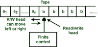
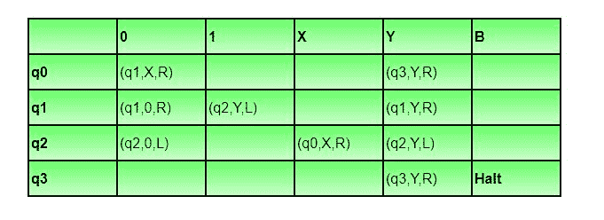
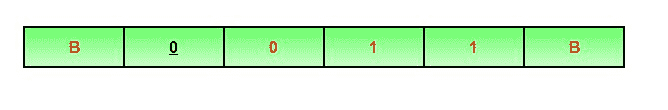
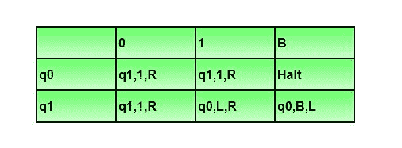
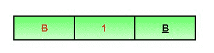
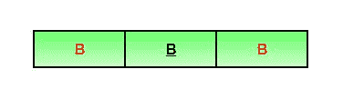

# TOC 中的图灵机

> 原文:[https://www.geeksforgeeks.org/turing-machine-in-toc/](https://www.geeksforgeeks.org/turing-machine-in-toc/)

图灵机由艾伦·图灵于 1936 年发明，用于接受递归可枚举语言(由 Type-0 语法生成)。

图灵机由无限长的磁带组成，在磁带上可以执行读写操作。磁带由无限个单元组成，每个单元包含一个输入符号或一个称为空白的特殊符号。它还包括一个指向当前正在读取的单元的头指针，并且可以双向移动。

图:图灵机

一个 TM 表示为一个 7 元组(Q，T，B，∑，δ，q0，F)，其中:

*   **Q** 是一组有限的状态
*   **T** 是磁带字母表(可以写在磁带上的符号)
*   **B** 为空符号(除初始输入字母外，每个单元格都用 B 填充)
*   **∑** 是输入字母表(属于输入字母表一部分的符号)
*   **δ** 是映射 Q × T → Q × T × {L，R}的过渡函数。根据其当前状态和当前磁带字母表(由磁头指针指向)，它将移动到新状态，更改磁带符号(可能会也可能不会)，并将磁头指针向左或向右移动。
*   **q0** 为初始状态
*   **F** 是最终状态的集合。如果达到 F 的任何状态，则接受输入字符串。

让我们为 L={0^n1^n|n>=1}构建一个图灵机

*   Q = {q0，q1，q2，q3}其中 q0 为初始状态。
*   T = {0，1，X，Y，B}其中 B 代表空白。
*   ∑ = {0,1}
*   F = {q3}

**过渡函数δ在表 1 中给出为:**

插图

让我们看看这个图灵机是如何为 0011 工作的。开始时，标题指向加下划线的 0，状态为 q0:

移动将是δ(q0，0) = (q1，X，R)。这意味着，它将进入状态 q1，用 X 替换 0，头部将向右移动，如下所示:

移动将是δ(q1，0) = (q1，0，R)，这意味着它将保持相同的状态，并且在不改变任何符号的情况下，它将向右移动如下:

移动将是δ(q1，1) = (q2，Y，L)，这意味着它将移动到 q2 状态，将 1 改为 Y，它将向左移动如下:

以同样的方式操作，机器将达到状态 q3，头部将指向 B，如图所示:

使用移动δ(q3，B) =停止，它将停止并被接受。

**注:**

*   在非确定性图灵机中，对于给定的状态和磁带符号，可以有多个可能的移动，但是非确定性 TM 不会增加任何功率。
*   每一个非确定性 TM 都可以转化为确定性 TM。
*   在多磁带图灵机中，可以有多个磁带和相应的磁头指针，但这并没有给图灵机增加任何动力。
*   每个多磁带 TM 都可以转换为单磁带 TM。

**问题:**单带图灵机 M 有两种状态 q0 和 q1，其中 q0 为起始状态。M 的磁带字母表为{0，1，B}，其输入字母表为{0，1}。符号 B 是用于指示输入字符串结束的空白符号。下表描述了 M 的转换函数。

该表解释如下。行 q0 和列 1 中的条目(q1，1，R)表示，如果 M 处于状态 q0，并且在当前磁带方块上读取 1，则它在同一磁带方块上写入 1，将其磁头向右移动一个位置，并转换到状态 q1。关于 M，以下哪种说法是正确的？

1.  m 在(0 + 1)+
2.  m 不在(00 + 1)中的任何弦上停止*
3.  m 在所有以 0 结尾的字符串上暂停
4.  m 在所有以 1 结尾的字符串上暂停

解决方案:让我们看看机器是否在字符串“1”上停止。初始状态将为 q0，头部将指向 1，如下所示:

使用δ(q0，1) = (q1，1，R)，它将移动到状态 q1，磁头将向右移动，如下所示:

使用δ(q1，B) = (q0，B，L)，它将移动到状态 q0，磁头将向左移动，如下所示:

它会以同样的方式一次又一次地运行，而不是停止。

选项 D 表示 M 在所有以 1 结尾的字符串上暂停，但它不会在 1 上暂停。所以，选项 D 是不正确的。

让我们看看机器是否在字符串“0”上停止。初始状态将为 q0，头部将指向 1，如下所示:

使用δ(q0，0) = (q1，1，R)，它将移动到状态 q1，磁头将向右移动如下:

使用δ(q1，B)=(q0，B，L)，它将移动到状态 q0，磁头将向左移动，如下所示:

它会以同样的方式一次又一次地运行，而不是停止。

选项 C 表示 M 在所有以 0 结尾的字符串上暂停，但它不会在 0 上暂停。所以，选项 C 是不正确的。

选项 B 表示 TM 不会因为任何字符串(00 + 1)*而暂停。但是空字符串是(00 + 1)*的一部分，TM 将为空字符串暂停。对于空字符串，磁带将是，

使用δ(q0，B) = halt，TM 将暂停。由于 TM 暂停为空，该选项也是不正确的。
所以，选项(A)是正确的。

本文由 **Sonal Tuteja** 供稿。如果你发现任何不正确的地方，请写评论，或者你想分享更多关于上面讨论的话题的信息