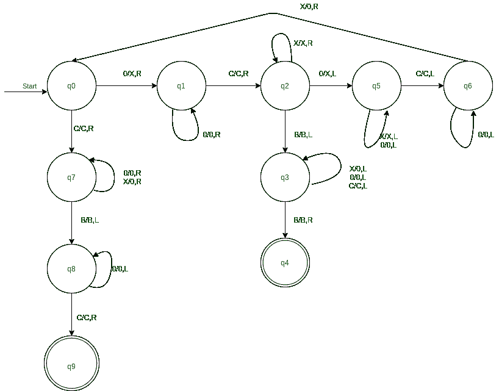

# 图灵机最多接受两个数字

> 原文:[https://www . geesforgeks . org/图灵机最多接受两个数字/](https://www.geeksforgeeks.org/turing-machine-to-accept-maximum-of-two-numbers/)

先决条件–[图灵机](https://www.geeksforgeeks.org/turing-machine/)
**问题:**
绘制图灵机以接受最大两个一元数 n1 和 n2，作为 B0n1C0n2B 给出。如果两个数字相等，那么接受两个数字中的任何一个。

**使用的逻辑:**

1.  对于左侧的每个 0，将其替换为 X，并在右侧搜索另一个 0。如果找到，将其替换为 X，并在左侧移动搜索 0。
2.  如果没有找到，则表示左侧的 0 比右侧多。那就是 **n1 > n2** 。因此，将所有 Xs 更改为 Os，并在最左侧停止。
3.  继续做第一步。如果恰好你指向 C，在最右边的转换之后(用右边的 X 代替 0 的值)，那么就意味着 **n2 > = n1** 。因此，将所有 Xs 转换为右侧的 Os 并停止。

**应遵循的步骤:**

1.  从初始状态 q0，接收到 0，替换为 X，向右移动，改变状态 q1。收到 C 时，向右移动并将状态更改为 q7。
2.  从状态 q1 开始，接收到 0 时继续向右移动。收到 C 时，向右移动，并将状态更改为 q2。
3.  从状态 q2 接收时，X 保持相同的状态，并继续向右移动。收到 0 时，将其替换为 X，向左移动，并将状态更改为 q5。收到空白(B)后，向左移动，并将状态更改为 q3。
4.  从状态 q3 开始，在接收 0 或 C 时继续向左移动，在接收 X 时，用 0 替换 X 并向左移动。最后，在接收到空格时向右移动，并将状态更改为 q4，接受 n1>n2 的状态。
5.  从状态 q5，接收到 C 时向左移动，并将状态更改为 q6。但是在接收到 X 或 0 时，保持相同的状态并继续向左移动。
6.  从状态 q6，接收到 0 时，继续向左移动，不改变状态。但是在接收到 X 时，将其替换为 0，并向右移动，将状态更改回 q0。
7.  从状态 q7 开始，接收 0 时继续向右移动，向右移动时用 0 改变每个 X。收到 B 时，向左移动，并将状态更改为 q8。
8.  在状态 q8 接收 0 时，继续向左移动，在接收 C 时向右移动，并将状态更改为 q9，接受 n2 >= n1 的状态。

此处， **q0** 显示初始状态， **q1，q2，…..，q9** 为过渡状态，**为 q4，q9** 为最终状态。
和 **0，1** 为机内数据， **X，Y，C** 为用于求最大值即比较数据的变量， **R，L** 为左右显示。