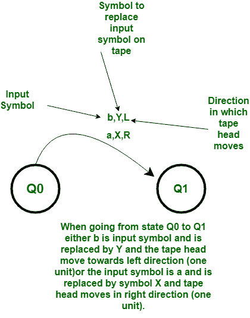
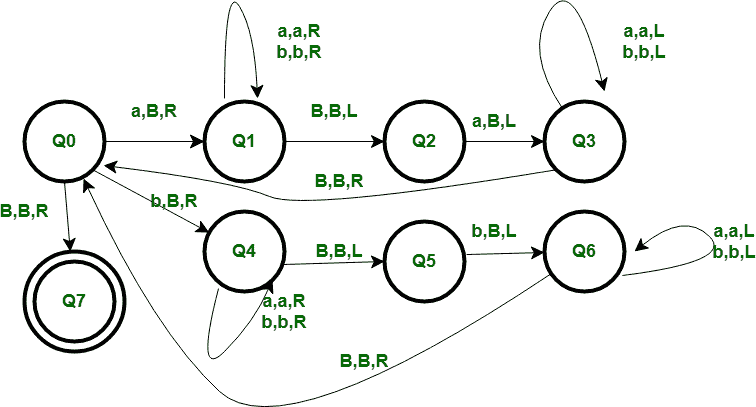

# 图灵机检查给定字符串是否为偶数回文

> 原文:[https://www . geesforgeks . org/图灵机检查给定字符串是否为偶数回文/](https://www.geeksforgeeks.org/turing-machine-to-check-whether-given-string-is-even-palindrome-or-not/)

如果从左到右读取 w 的结果与从右到左读取 w 的结果相同，则字符串 w 称为**回文**。偶数回文有偶数个符号。

**示例:**

```
Input : abaaba 
Output :YES

Input :abba
Output :YES

Input :abbaba
Output :NO

Input :Empty String or  
Output :YES 
```

**基本表示:**



**计算开始:**
磁带包含输入字符串 w，磁带头在 w 最左边的符号上，图灵机处于开始状态 Q0。

**基本思路:**
磁头读取 w 最左边的符号，删除这个符号，通过状态“记住”它。然后磁带磁头移动到最右边的符号，并测试它是否等于(已经删除的)最左边的符号。

如果它们相等，则删除最右边的符号，磁头移动到新的最左边的符号，整个过程重复进行。否则机器无法达到最终状态，字符串将被拒绝。



**所用符号的含义:**
R，L–任一侧一个单位的运动方向。
B-空白
a、B-其组合字符串将被测试的符号

**工序:**

*   **Step-1:**
    We start with Q0 state if we get a symbol “a” as input then there should also be “a” at the ending of the string then only the string is palindrome and we have to verify that. We first make the current input “a” to B blank and go to state Q1 move rightwards to traverse the string till we reach the end. Keep the input symbols a or b whichever comes in ways should be remain unchanged.

    当我们将空白作为输入符号时，我们可以到达字符串的末尾，然后我们将状态更改为 Q2，并测试之前的符号是否为“a”，然后我们更改为状态 Q3，然后只有我们将它替换为空白，我们已经成功地测试了该字符串是回文，直到此时，我们将在字符串上向后或向左遍历(保持 a 和 b 不变，这是一种方式)，直到我们获得空白，这是我们在开始时将空白变为 Q0 的符号。现在我们对作为输入的“b”重复同样的过程。

*   **步骤 2:**
    直到此时，如果字符串是回文，那么它将在所有迭代后返回到状态 Q0，如果字符串不是回文，那么我们将停留在状态 Q2 或 Q5，当停留在这些点时，我们不能到达 Q0，因此不能到达最终状态或接受状态 Q7。
*   **步骤 3:**
    如果字符串是回文，那么将只剩下空白符号，因此我们在 Q0 测试它，如果我们得到空白，因此该字符串被接受并且是回文，在这一点上，还有一个条件被包括，它是空字符串或作为空字符串也是回文，因此被接受。