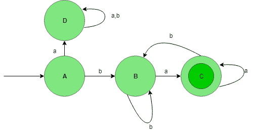
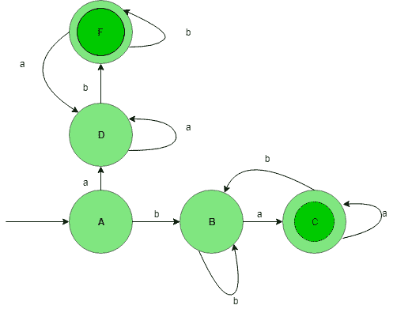

# DFA 中的联合流程

> 原文:[https://www.geeksforgeeks.org/union-process-in-dfa/](https://www.geeksforgeeks.org/union-process-in-dfa/)

先决条件–[设计有限自动机](https://www.geeksforgeeks.org/designing-finite-automata-from-regular-expression/)
让我们借助下面的例子来理解确定性有限自动机(DFA)中的并集过程。

为{a，b}上的字符串集设计一个 DFA，使语言的字符串以不同的符号开始和结束。将形成两种期望的语言:

```
L1 = {ab, aab, aabab, .......}
L2 = {ba, bba, bbaba, .......} 
```

L<sub>1</sub>= {以 a 开头，以 b 结尾} L<sub>2</sub>= {以 b 开头，以 a 结尾}。
则 L= L <sub>1</sub> ∪ L <sub>2</sub> 或 L=L <sub>1</sub> + L <sub>2</sub>

**语言 L 的状态转换图 <sub>1</sub> :**

这个 DFA 接受所有以 A 开头，以 b 结尾的字符串，这里，状态 A 是初始状态，状态 C 是最终状态。

**语言 L 的状态转换图 <sub>2</sub> :**

这个 DFA 接受所有以 b 开始，以 A 结束的字符串，这里，状态 A 是初始状态，状态 C 是最终状态。

现在，取 L <sub>1</sub> 和 L <sub>2</sub> 语言的并集，给出以不同元素开始和结束的语言的最终结果。
**L<sub>1</sub>∪L<sub>2</sub>:**

由此可见，L <sub>1</sub> 和 L <sub>2</sub> 已经通过并集过程进行了合并，最终的 DFA 接受所有包含以不同符号开始和结束的字符串的语言。
**注:**从上面的例子我们也可以推断出正则语言在并集下是闭的(即两个正则语言的并集也是正则的)。